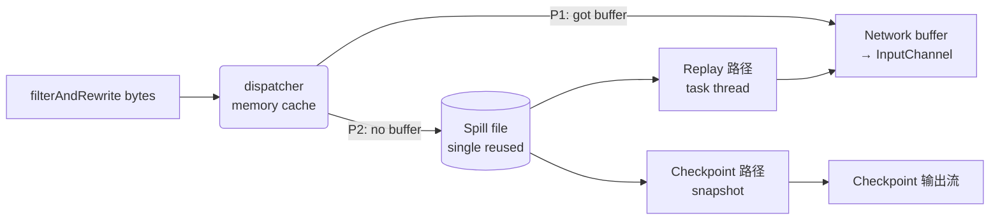

# filterAndRewrite 恢复管线 — Architecture Overview

## 目标

Recovery 期间，filterAndRewrite 产出的字节要交付给 input channel 继续消费。当 network buffer 不够时需要兜底落盘，期间还可能发生 checkpoint。

核心策略：**内存 cache → 复用单文件落盘 → 两条读路径**。

## 数据流

## 组件关系

- **dispatcher** 持有一个 Writer（lazy 创建于第一次 P2 downgrade）
- **Writer** 持有 `List<Reader>`，每个物理文件一个 Reader；rotation 时追加新 Reader
- **Reader** 被两种消费者使用：
  - 原 Reader — dispatcher 在 recovery thread 上消费（replay 链路）
  - snapshot Reader — `reader.snapshot()` 产出的独立对象，由 ChannelStateWriter 的 executor 消费（checkpoint 链路）

close 连锁：`dispatcher.close()` → `writer.close()` → 所有 Reader.close()。

## 为什么这样设计

**Cache 聚合写入**。字节到达碎、量小；dispatcher 内部留一块 `memorySegmentSize` 的 cache，攒够了才 flush。**三个 flush 触发点**：cache 满 / channel 切换 / filter 阶段结束（S3 读完，`dispatcher.flush()` 被调用）。**flush 决策**：network buffer 够用 → P1（直投给 InputChannel）；不够 → P2（落盘）。

**单文件复用，超阈值才 rotate**。每条 entry 都开新文件会造成大量小文件，metadata 和句柄开销重。做法是所有 flush 都追加到**同一个文件**；只有文件超过 64 MB 才 rotate 到下一个文件。

**两条读路径彼此独立**：

- **Replay（task thread）**：network buffer 腾空时，把下一条 entry 从磁盘读回内存，装进 buffer，投给 input channel。这是**最终消费**。
- **Checkpoint**：checkpoint 触发时对磁盘做一次 snapshot，异步写进 checkpoint 输出流。**不消费 replay 的数据**（复制语义），所以不影响 replay 进度，也允许多次 checkpoint 各自独立快照。

## Checkpoint 的 wait 机制

**前提（invariant）**：checkpoint 只允许在 **filter 阶段结束之后**发生——即 `filterAndRewrite` 产出的所有字节都已经写入 `spillFile`（cache 已 flush 完、`spillFile.finish()` 已调用），因此**所有 Reader 都已 sealed**。这是 wait-set 初始化和后续一次顺序 drain 能成立的基础。代码以 `Preconditions.checkState(reader.isSealed(), ...)` 在两个入口防御：`onChannelCheckpointStarted` 构建 wait-set 时、`drainSpillEntriesToCheckpoint` 执行 snapshot 时。违反即 `IllegalStateException`。

两个原因要求必须等：

1. **顺序**：每个 channel 的 checkpoint 数据必须是 **ready buffers 在前、disk entries 在后** — disk 上是"更晚到达的 in-flight 数据"，顺序不能颠倒。
2. **I/O 效率**：磁盘文件是跨 channel 共享的（见上文"单文件复用"）。checkpoint 希望**只顺序读一遍整个文件**，而不是按每个 channel 各读一次（会变成随机 I/O，机械盘尤其致命）。统一等齐再 drain 才能做到 one pass、sequential。

Dispatcher 维护一个 **wait-set**：

- **初始**：扫所有 reader（此时必须都已 sealed，见上文前提），拿到"此刻还有磁盘数据的 channel 集合"
- **每次 `store.checkpoint()` 完成回调**：把该 channel 从 wait-set 移除
- **wait-set 空**：所有该等的 channel 都已写完自己的 ready buffers，dispatcher 开始**一次顺序读整个磁盘文件**把 entries 复制到 checkpoint（通过对每个 reader 的 `snapshot()` 独立读，**不影响原 reader**，不影响 replay 链路继续消费）

没有磁盘数据的 channel 不需要等（初始就不在 set 里）。

## 进一步阅读

- `spill_file_single_pass_read.md` — checkpoint 侧"一文件一次读"的 I/O 策略
- `spill_reader_drain_concurrency.md` — replay 与 checkpoint 链路的并发隔离
