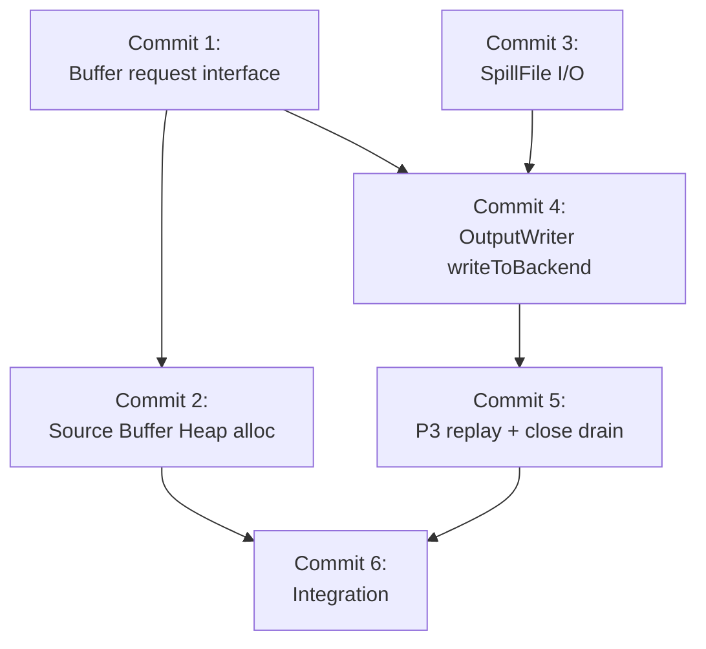

# Commit Plan — FLINK-38544 Spilling

## Design Constraints

1. **Minimal invasion to existing code** — all new logic (OutputWriter, SpillFile I/O, P3 replay, file offset management) lives in new classes. Existing files (RecoveredChannelStateHandler, ChannelStateFilteringHandler, etc.) only call `writer.write()`, no internal details leak into them.
2. **Existing commits not reusable** — the two dev commits (830ba4654b6, 1760f92ffc7) are based on a fundamentally different design (SpillingBufferManager with per-buffer metadata queue, three-path routing in RecoveredChannelStateHandler). The new design (OutputWriter with pure byte stream, file offset cursor) requires a rewrite.
3. **Spill directory from IOManager** — spill files use `IOManager.getSpillingDirectoriesPaths()`, same as SpanningWrapper. No fallback to `java.io.tmpdir`. Constructor accepts `String[]`, invalid directories throw IOException.

## Overview

| Commit | Summary | New/Modify | Key Files |
|--------|---------|------------|-----------|
| 1 | Buffer request interface: provide both blocking and non-blocking | Modify | `RecoveredInputChannel` |
| 2 | Source Buffer Heap allocation in filtering mode (max 5/gate) | Modify | `RecoveredChannelStateHandler` |
| 3 | SpillFile I/O layer: pure byte stream writer/reader | New | `SpillFileWriter`, `SpillFileReader` |
| 4 | OutputWriter: writeToBackend (buffer/file switching, downgrade) | New | `OutputWriter` |
| 5 | OutputWriter: P3 replay + close() blocking drain | Modify | `OutputWriter` |
| 6 | Integration: filterAndRewrite writes to OutputWriter | Modify | `ChannelStateFilteringHandler`, `RecoveredChannelStateHandler`, `SequentialChannelStateReaderImpl` |

Base package: `org.apache.flink.runtime.checkpoint.channel`

## Commit 1: Buffer request interface

Restore both blocking and non-blocking buffer request on `RecoveredInputChannel`.
Current code removed `requestBufferBlocking()` and made `requestBuffer()` non-blocking only. Both are needed.

**Files:**
- `RecoveredInputChannel.java` (`o.a.f.runtime.io.network.partition.consumer`)

**Interface:**
```java
// Non-blocking, returns null when pool exhausted.
// Used by OutputWriter for filtering mode.
public Buffer requestBuffer() throws IOException, InterruptedException;

// Blocking, waits until buffer available.
// Used by non-filtering mode and OutputWriter.close() drain.
public Buffer requestBufferBlocking() throws IOException, InterruptedException;
```

---

## Commit 2: Source Buffer Heap allocation

In filtering mode, `getBuffer()` allocates from Heap instead of Network Buffer Pool. Max 5 per gate.
Non-filtering mode unchanged (blocking from pool).

**Files:**
- `RecoveredChannelStateHandler.java` — `InputChannelRecoveredStateHandler.getBuffer()`

**Interface:**
```java
// Filtering mode: Heap Buffer (MemorySegmentFactory.allocateUnpooledSegment)
// Non-filtering mode: channel.requestBufferBlocking() (unchanged)
BufferWithContext<Buffer> getBuffer(InputChannelInfo channelInfo);
```

**Key constants:**
```java
static final int MAX_HEAP_BUFFERS_PER_GATE = 5;
```

---

## Commit 3: SpillFile I/O layer

Pure byte stream I/O. No metadata on disk. Writer appends raw bytes, Reader reads fixed-size chunks.

**Files (new):**
- `SpillFileWriter.java`
- `SpillFileReader.java`

**SpillFileWriter interface:**
```java
class SpillFileWriter implements Closeable {
    SpillFileWriter(File file) throws IOException;

    // Append raw bytes from buffer to file
    void writeBuffer(Buffer buffer) throws IOException;

    // Append raw bytes directly
    void write(byte[] data, int offset, int length) throws IOException;

    long getBytesWritten();
    void close() throws IOException;
}
```

**SpillFileReader interface:**
```java
class SpillFileReader implements Closeable {
    SpillFileReader(File file) throws IOException;

    // Read chunkSize bytes into target buffer. Returns false on EOF.
    boolean readNextChunk(Buffer target, int chunkSize) throws IOException;

    // Stream bytes directly to output (for checkpoint).
    void readNextTo(OutputStream out, int length) throws IOException;

    boolean hasRemaining() throws IOException;
    void close() throws IOException;
}
```

---

## Commit 4: OutputWriter — writeToBackend

Core write logic. Manages buffer/file backend switching. Downgrade only (buffer → file), never upgrade within one call.

**Files (new):**
- `OutputWriter.java`

**Depends on:** Commit 1 (requestBuffer), Commit 3 (SpillFile I/O)

**Public interface:**
```java
class OutputWriter implements Closeable {
    OutputWriter(
        RecoveredInputChannel channel,
        String[] spillDirs,
        String attemptId,
        int gateIndex);

    // Main write entry. Channel change auto-detected, triggers flush.
    void write(byte[] data, int offset, int length,
               int oldSubtaskIndex, int oldChannelIndex) throws IOException, InterruptedException;

    // Blocking drain remaining disk data, then cleanup.
    void close() throws IOException, InterruptedException;
}
```

**Internal method (not exposed):**
```java
// Pure write loop. No P3 replay, no disk awareness at runtime
// (checks disk state once at entry to decide direction).
private void writeToBackend(byte[] data, int offset, int length);
```

**Spill file management (internal):**
```java
// Single file per gate, all channels share. FIFO append.
// In-memory queue tracks each entry's metadata.
class SpillEntry {
    int oldSubtaskIndex;
    int oldChannelIndex;
    long offset;   // position in spill file
    int length;    // bytes written
}
Queue<SpillEntry> spillEntries;  // write = enqueue, replay = dequeue
```

- Spill directories from `IOManager.getSpillingDirectoriesPaths()`, no fallback.
- File rotation at 64MB. Old file deleted after all its entries replayed.

This commit implements writeToBackend only (buffer/file switching, downgrade logic).
P3 replay and close() drain are in next commit.

---

## Commit 5: OutputWriter — P3 replay + close() drain

Add P3 eager drain to `write()` and blocking drain to `close()`.

**Files:**
- `OutputWriter.java`

**Depends on:** Commit 4

**P3 replay in write():**
```java
// Before writeToBackend, eagerly drain disk data:
// while (hasDiskData && requestBuffer() != null) → replay to InputChannel
```

**close():**
```java
// 1. Flush current backend
// 2. while (hasDiskData) → requestBufferBlocking() → replay to InputChannel
// 3. Cleanup spill files
```

**Disk cursor tracking:**
```java
// "Disk has data" = unreplayed data exists (cursor not at end).
// Not physical file existence.
boolean hasDiskData();
```

---

## Commit 6: Integration

Wire OutputWriter into filterAndRewrite, replacing BufferSupplier.

**Files:**
- `ChannelStateFilteringHandler.java` — change `filterAndRewrite` to write to OutputWriter instead of returning `List<Buffer>`
- `RecoveredChannelStateHandler.java` — `InputChannelRecoveredStateHandler.recover()` uses OutputWriter
- `SequentialChannelStateReaderImpl.java` — pass OutputWriter lifecycle (create before read, close after)

**Interface change in filterAndRewrite:**
```java
// Before: returns List<Buffer>, caller routes each buffer
List<Buffer> filterAndRewrite(..., BufferSupplier bufferSupplier);

// After: writes directly to OutputWriter, caller just calls filterAndRewrite
void filterAndRewrite(..., OutputWriter writer);
```

**SequentialChannelStateReaderImpl.readInputData():**
```java
// Create OutputWriter per gate before read loop
// After read loop: writer.close() (blocking drain)
```

---

## Commit dependency graph


