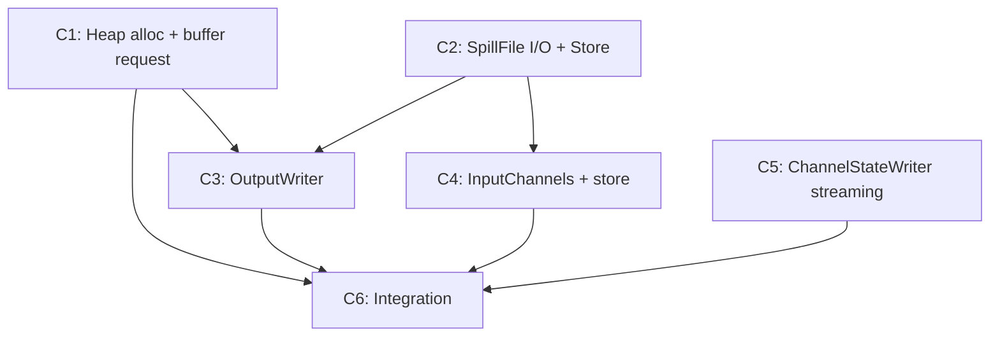

# Commit Plan — FLINK-38544 Spilling

## Overview

| Commit | Summary | Type | Key Files |
|--------|---------|------|-----------|
| 1 | Source Buffer Heap allocation + buffer request interface | Modify | `RecoveredChannelStateHandler`, `RecoveredInputChannel` |
| 2 | SpillFile I/O + RecoveredBufferStore | New | `SpillFileWriter`, `SpillFileReader`, `SpillEntry`, `RecoveredBufferStore`, `RecoveredBufferStoreImpl` |
| 3 | OutputWriter (write + P3 drain + flush + close) | New | `OutputWriter`, `OutputWriterImpl` |
| 4 | InputChannel consumes from RecoveredBufferStore | Modify | `RecoveredInputChannel`, `LocalInputChannel`, `RemoteInputChannel`, `*RecoveredInputChannel` |
| 5 | ChannelStateWriter streaming overload for checkpoint | Modify | `ChannelStateWriter`, `ChannelStateWriterImpl`, `ChannelStateWriteRequest`, `ChannelStateCheckpointWriter` |
| 6 | Integration: filterAndRewrite writes to OutputWriter | Modify | `ChannelStateFilteringHandler`, `RecoveredChannelStateHandler`, `SequentialChannelStateReaderImpl` |

Base package: `org.apache.flink.runtime.checkpoint.channel`

---

## Commit 1: Source Buffer Heap allocation + buffer request interface

Two independent changes to RecoveredInputChannel and its handler, both prerequisites for OutputWriter.

**Modify:** `RecoveredChannelStateHandler.java`, `RecoveredInputChannel.java`

**Source Buffer (REQ-NHLB, REQ-QY68):**
- In filtering mode, pre-filter `getBuffer()` allocates from Heap instead of Network Buffer Pool. Max 5 per gate. Non-filtering mode unchanged.
- AtomicInteger per-gate counter, increment on allocate, decrement when source buffer recycled.

**Buffer request (REQ-GGPR):**
- Add `requestBuffer()` — non-blocking, returns null when pool exhausted. Wraps `bufferManager.requestBuffer()`.
- Modify `requestBufferBlocking()` — remove heap fallback in filtering mode only. Non-filtering mode unchanged (original blocking allocation).

---

## Commit 2: SpillFile I/O + RecoveredBufferStore

Two new components with no dependency on each other, grouped because both are prerequisites for OutputWriter.

**New files:**

SpillFile I/O (REQ-BFSD, REQ-SFMG, REQ-SPDR, REQ-T5AJ):
- `SpillFileWriter.java` — append raw bytes via FileChannel + `FileUtils.writeCompletely()`. No fsync.
- `SpillFileReader.java` — sequential read via FileChannel positional read. `read(offset, buffer, length)` for drain loading. `openInputStream(offset, length)` returns bounded InputStream for checkpoint streaming (via ChannelStateWriter streaming overload, no Network Buffer Pool or heap buffer allocation).
- `SpillEntry.java` — `{InputChannelInfo channelInfo, long offset, int length}`. 每个 entry 最大 memorySegmentSize，与 Network Buffer 1:1 对应。多次 write() 累积到同一个 entry，满或 channel 变更时密封。

RecoveredBufferStore (REQ-7388):
- `RecoveredBufferStore.java` — public interface. See `interfaces.md`.
- `RecoveredBufferStoreImpl.java` — implementation with internal methods (addBuffer, markComplete, setNotificationCallback, addPendingSpillEntry, removePendingSpillEntry).

---

## Commit 3: OutputWriter

Complete OutputWriter implementation in one commit. See `interfaces.md` for public interface.

**New files:** `OutputWriter.java` (interface), `OutputWriterImpl.java` (implementation)

**Depends on:** C1 (buffer request), C2 (spill I/O + store)

**Constructor:**
```
OutputWriterImpl(
    Map<InputChannelInfo, RecoveredBufferStoreImpl> storesByChannel,
    String[] spillDirs,
    int memorySegmentSize,
    Supplier<Buffer> bufferSupplier,
    BlockingSupplier<Buffer> blockingBufferSupplier)
```

**Implements all three interface methods:**

- `write(data, length, channelInfo)`:
  - Channel change detection → flush active buffer to target store
  - P3 eager drain: while (spillEntryQueue non-empty AND non-blocking bufferSupplier succeeds) → load from disk → `store.addBuffer()` + `store.removePendingSpillEntry()`
  - writeToBackend: fill active buffer (P1), downgrade to file (P2) when no buffer. `downgradedToFile` flag resets per write() call
  - Full buffer → `store.addBuffer(buffer)`
  - Spill → `spillFileWriter.write()` + 累积到活跃 SpillEntry，满时密封入队 + `store.addPendingSpillEntry()`

- `flush()`: send active buffer's partial data to target store. Reject further write() calls.

- `close()`: blocking drain loop → `blockingBufferSupplier.get()` → load from disk → dispatch to store. Cleanup spill files. `store.markComplete()` for all stores. Idempotent.

---

## Commit 4: InputChannel consumes from RecoveredBufferStore

All three InputChannel types adapted in one commit.

**Depends on:** C2 (store)

**Modify:**

`RecoveredInputChannel.java` (REQ-G4KW):
- Add `RecoveredBufferStore store` field
- `getNextBuffer()` → `store.tryTake()`
- `toInputChannel()` → pass store to new physical channel (no longer extracts remainingBuffers)
- Remove `onRecoveredStateBuffer()`
- `finishReadRecoveredState()` → still completes `bufferFilteringCompleteFuture`
- `releaseAllResources()` → `store.releaseAll()`
- `getBuffersInUseCount()` → `store.size()`

`LocalRecoveredInputChannel.java` / `RemoteRecoveredInputChannel.java`:
- Pass store to physical channel constructor

`LocalInputChannel.java` (REQ-TXGD):
- Add `RecoveredBufferStore store` field (nullable)
- Remove `initialRecoveredBuffers` parameter and buffer migration logic
- `getNextBuffer()`: store → toBeConsumedBuffers → subpartitionView
- `getNextRecoveredBuffer()`: data source from `store.tryTake()`. Priority event handling unchanged
- `checkpointStarted()`: `store.checkpoint()` for recovered data (REQ-KM7C)
- `getBuffersInUseCount()` / `unsynchronizedGetNumberOfQueuedBuffers()`: add `store.size()`
- `releaseAllResources()`: `store.releaseAll()`

`RemoteInputChannel.java` (REQ-TXGD):
- Add `RecoveredBufferStore store` field (nullable)
- Remove `initialRecoveredBuffers` parameter and buffer migration logic
- `getNextBuffer()`: store → receivedBuffers
- Remove `checkReadability()` hack
- `checkpointStarted()`: `store.checkpoint()` for recovered data (REQ-KM7C)
- `getBuffersInUseCount()` / `unsynchronizedGetNumberOfQueuedBuffers()`: add `store.size()`
- `releaseAllResources()`: `store.releaseAll()`

---

## Commit 5: ChannelStateWriter Streaming Overload

Add streaming path to checkpoint writing pipeline for disk data. No modification to existing addInputData behavior.

**Depends on:** None (independent of C1-C4, can be developed in parallel)

**Modify:**

`ChannelStateWriter.java`:
- New overload: `addInputData(long checkpointId, InputChannelInfo info, int startSeqNum, InputStream data, int dataLength)` — accepts InputStream instead of CloseableIterator\<Buffer\>

`ChannelStateWriterImpl.java`:
- Implement new overload: create streaming write request, submit to executor

`ChannelStateWriteRequest.java`:
- New factory: `buildStreamingWriteRequest()` — creates request that reads from InputStream directly to DataOutputStream

`ChannelStateCheckpointWriter.java`:
- New method: `writeInputStreaming(jobVertexID, subtaskIndex, info, InputStream, dataLength)` — writes length prefix + streams data via `InputStream.transferTo(DataOutputStream)`, no Network Buffer Pool or heap buffer allocation
- Write format identical to existing: `[4 bytes length][data bytes]`. Recovery read path unchanged

---

## Commit 6: Integration

Wire OutputWriter into the filtering flow.

**Depends on:** C1, C3, C4, C5

**Modify:**

`ChannelStateFilteringHandler.java`:
- `filterAndRewrite()`: accept OutputWriter, return void
- `serializeElement()`: write length prefix + record bytes to `outputWriter.write(data, length, channelInfo)`
- Remove `writeDataToBuffer`, `BufferSupplier`

`RecoveredChannelStateHandler.java`:
- `recoverWithFiltering()`: pass OutputWriter and target channelInfo (post-rescaling) to `filterAndRewrite()`. Remove `List<Buffer>` return value handling and `onRecoveredStateBuffer()` loop. filterAndRewrite 内部通过 outputWriter.write() 投递数据，不再返回 buffer 列表

`SequentialChannelStateReaderImpl.java`:
- `readInputData()`: create OutputWriter (per-task) + RecoveredBufferStores (per-channel)
- Pass OutputWriter through stateHandler
- After both `read()` calls: `outputWriter.flush()` → `stateHandler.close()` (finishReadRecoveredState) → `outputWriter.close()` (blocking drain)

---

## Commit Dependency Graph


