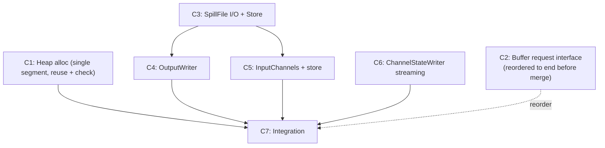

# Commit Plan — FLINK-38544 Spilling

## Overview

| Commit | JIRA | Summary | Type | Key Files |
|--------|------|---------|------|-----------|
| 1 | FLINK-39519 | Source Buffer Heap allocation (single reusable segment per task, with invariant check) | Modify | `RecoveredChannelStateHandler` |
| 2 | FLINK-39524 | Buffer request interface: add `requestBuffer()`, remove heap fallback from `requestBufferBlocking()`. **Kept here for code preservation; will be reordered to the end of the sequence and logically merged into the Integration step.** | Modify | `RecoveredInputChannel` |
| 3 | FLINK-39520 | SpillFile I/O + RecoveredBufferStore | New | `SpillFileWriter`, `SpillFileReader`, `SpillEntry`, `RecoveredBufferStore`, `RecoveredBufferStoreImpl` |
| 4 | FLINK-39521 | OutputWriter (write + P3 drain + flush + close) | New | `OutputWriter`, `OutputWriterImpl` |
| 5 | FLINK-39522 | InputChannel consumes from RecoveredBufferStore | Modify | `RecoveredInputChannel`, `LocalInputChannel`, `RemoteInputChannel`, `*RecoveredInputChannel` |
| 6 | FLINK-39523 | ChannelStateWriter streaming overload for checkpoint | Modify | `ChannelStateWriter`, `ChannelStateWriterImpl`, `ChannelStateWriteRequest`, `ChannelStateCheckpointWriter` |
| 7 | FLINK-39524 | Integration: filterAndRewrite writes to OutputWriter | Modify | `ChannelStateFilteringHandler`, `RecoveredChannelStateHandler`, `SequentialChannelStateReaderImpl` |

Base package: `org.apache.flink.runtime.checkpoint.channel`

**Note on JIRA assignment.** Commit 1 keeps FLINK-39519 (the original C1 ticket for "Allocate pre-filter source buffers from heap"). Commit 2 is assigned to **FLINK-39524 (Integration)**: the heap fallback in `requestBufferBlocking()` can only be safely removed after OutputWriter is wired, so the change logically belongs to the Integration step even though the code lives in a separate commit for reviewability. During development Commit 2 stays at position 2 for code preservation, but before merge it will be reordered to sit adjacent to Commit 7 (same ticket, same logical step).

---

## Commit 1: Source Buffer Heap allocation

Single-segment heap allocation for pre-filter source buffer, with runtime invariant check.

**Modify:** `RecoveredChannelStateHandler.java`

**Source Buffer (REQ-NHLB, REQ-QY68):**
- In filtering mode, `getBuffer()` returns a `NetworkBuffer` wrapping a reusable heap `MemorySegment`. Non-filtering mode unchanged.
- Reuse: one `MemorySegment` per task, lazily allocated on first `getBuffer()` call, freed in `close()`.
- Runtime check: custom recycler flips an `inUse` flag. `getBuffer()` asserts `!inUse` before issuing the next buffer. Violation → `IllegalStateException`. This enforces the one-at-a-time invariant at runtime; any future code change that breaks the invariant fails loudly instead of silently corrupting memory.
- No semaphore, no per-gate limit, no counter. Memory is bounded-by-construction (see REQ-NHLB invariant proof).

**Tests:**
- Keep `testHeapBufferIsolation` (heap vs. pool isolation) and `testNonFilteringUnchanged`.
- Remove the `testHeapBufferLimit` / `testSequentialChannelProcessing` tests (the 5-limit they asserted no longer exists).
- Add `testLargeRecordSpansMultipleSourceBuffers`: feeds a record spanning several source buffers through a real `ChannelStateChunkReader` + filtering pipeline, asserts `maxOutstanding == 1` and that the same `MemorySegment` instance is reused across calls.
- Add `testCheckFailsWhenPriorBufferNotRecycled`: allocates a buffer, does not recycle, calls `getBuffer()` again, expects `IllegalStateException`.

---

## Commit 2: Buffer request interface

**Status:** Kept in current position for code preservation. Will be reordered to the end of the sequence before merge, since removing the heap fallback is only safe once commit 7 has wired OutputWriter into the post-filter path.

**Modify:** `RecoveredInputChannel.java`

**Buffer request (REQ-GGPR):**
- Add `requestBuffer()` — non-blocking, returns null when pool exhausted. Wraps `bufferManager.requestBuffer()`.
- Modify `requestBufferBlocking()` — remove heap fallback in filtering mode only. Non-filtering mode unchanged (original blocking allocation).

---

## Commit 3: SpillFile I/O + RecoveredBufferStore

Two new components with no dependency on each other, grouped because both are prerequisites for OutputWriter.

**New files:**

SpillFile I/O (REQ-BFSD, REQ-SFMG, REQ-SPDR, REQ-T5AJ):
- `SpillFileWriter.java` — append raw bytes via FileChannel + `FileUtils.writeCompletely()`. Constructor takes `String[] spillDirs` only (no memorySegmentSize). Throws IllegalStateException on write after close. No fsync.
- `SpillFileReader.java` — sequential read via FileChannel positional read. `read(offset, buffer, length)` for drain loading. `openInputStream(offset, length)` returns bounded InputStream for checkpoint streaming (via ChannelStateWriter streaming overload, no Network Buffer Pool or heap buffer allocation).
- `SpillEntry.java` — `{InputChannelInfo channelInfo, long offset, int length}`. Pure metadata, no file reference (file association managed by OutputWriter). 每个 entry 最大 memorySegmentSize，与 Network Buffer 1:1 对应。多次 write() 累积到同一个 entry，满或 channel 变更时密封。

RecoveredBufferStore (REQ-7388):
- `RecoveredBufferStore.java` — public interface. See `interfaces.md`.
- `RecoveredBufferStoreImpl.java` — implementation with internal methods (addBuffer, markComplete, setNotificationCallback (synchronized), incrementPending, decrementPending). Store tracks pending disk entries by count only — SpillEntry objects are owned by OutputWriter. Checkpoint of disk data delegated to OutputWriter (batch all channels, one sequential pass).

---

## Commit 4: OutputWriter

Complete OutputWriter implementation in one commit. See `interfaces.md` for public interface.

**New files:** `OutputWriter.java` (interface), `OutputWriterImpl.java` (implementation)

**Depends on:** C2 (buffer request), C3 (spill I/O + store)

**Constructor:**
```
OutputWriterImpl(
    Map<InputChannelInfo, RecoveredBufferStoreImpl> storesByChannel,
    String[] spillDirs,
    int memorySegmentSize,
    Supplier<Buffer> bufferSupplier,
    BlockingSupplier<Buffer> blockingBufferSupplier)
```

**Implements all three interface methods:**

- `write(data, length, channelInfo)`:
  - Channel change detection → flush active buffer to target store
  - P3 eager drain: while (spillEntryQueue non-empty AND non-blocking bufferSupplier succeeds) → load from disk → `store.addBuffer()` + `store.decrementPending()`
  - writeToBackend: fill active buffer (P1), downgrade to file (P2) when no buffer. `downgradedToFile` flag resets per write() call
  - Full buffer → `store.addBuffer(buffer)`
  - Spill → `spillFileWriter.write()` + 累积到活跃 SpillEntry，满时密封入队 + `store.incrementPending()`

- `flush()`: send active buffer's partial data to target store. Reject further write() calls.

- `close()`: blocking drain loop → `blockingBufferSupplier.get()` → load from disk → dispatch to store. Cleanup spill files. `store.markComplete()` for all stores. Idempotent.

- `checkpointPendingEntries(writer, checkpointId)`: 等所有 channel 触发 checkpoint 后，一次性顺序遍历 spillEntryQueue，对每个 entry 流式写入 checkpoint（顺序 I/O，一次读取覆盖全部 entries）。

---

## Commit 5: InputChannel consumes from RecoveredBufferStore

All three InputChannel types adapted in one commit.

**Depends on:** C3 (store)

**Modify:**

`RecoveredInputChannel.java` (REQ-G4KW):
- Add `RecoveredBufferStore store` field
- `getNextBuffer()` → `store.tryTake()`
- `toInputChannel()` → pass store to new physical channel (no longer extracts remainingBuffers)
- Remove `onRecoveredStateBuffer()`
- `finishReadRecoveredState()` → still completes `bufferFilteringCompleteFuture`
- `releaseAllResources()` → `store.releaseAll()`
- `getBuffersInUseCount()` → `store.size()`

`LocalRecoveredInputChannel.java` / `RemoteRecoveredInputChannel.java`:
- Pass store to physical channel constructor

`LocalInputChannel.java` (REQ-TXGD):
- Add `RecoveredBufferStore store` field (nullable)
- Remove `initialRecoveredBuffers` parameter and buffer migration logic
- `getNextBuffer()`: store → toBeConsumedBuffers → subpartitionView
- `getNextRecoveredBuffer()`: data source from `store.tryTake()`. Priority event handling unchanged
- `checkpointStarted()`: `store.checkpoint()` for recovered data (REQ-KM7C)
- `getBuffersInUseCount()` / `unsynchronizedGetNumberOfQueuedBuffers()`: add `store.size()`
- `releaseAllResources()`: `store.releaseAll()`

`RemoteInputChannel.java` (REQ-TXGD):
- Add `RecoveredBufferStore store` field (nullable)
- Remove `initialRecoveredBuffers` parameter and buffer migration logic
- `getNextBuffer()`: store → receivedBuffers
- Remove `checkReadability()` hack
- `checkpointStarted()`: `store.checkpoint()` for recovered data (REQ-KM7C)
- `getBuffersInUseCount()` / `unsynchronizedGetNumberOfQueuedBuffers()`: add `store.size()`
- `releaseAllResources()`: `store.releaseAll()`

---

## Commit 6: ChannelStateWriter Streaming Overload

Add streaming path to checkpoint writing pipeline for disk data. No modification to existing addInputData behavior.

**Depends on:** None (independent of C1-C5, can be developed in parallel)

**Modify:**

`ChannelStateWriter.java`:
- New overload: `addInputData(long checkpointId, InputChannelInfo info, int startSeqNum, InputStream data, int dataLength)` — accepts InputStream instead of CloseableIterator\<Buffer\>

`ChannelStateWriterImpl.java`:
- Implement new overload: create streaming write request, submit to executor

`ChannelStateWriteRequest.java`:
- New factory: `buildStreamingWriteRequest()` — creates request that reads from InputStream directly to DataOutputStream

`ChannelStateCheckpointWriter.java`:
- New method: `writeInputStreaming(jobVertexID, subtaskIndex, info, InputStream, dataLength)` — writes length prefix + streams data via `InputStream.transferTo(DataOutputStream)`, no Network Buffer Pool or heap buffer allocation
- Write format identical to existing: `[4 bytes length][data bytes]`. Recovery read path unchanged

---

## Commit 7: Integration

Wire OutputWriter into the filtering flow. **Commit 2 (buffer request interface changes) is reordered to run immediately before or as part of this commit**, so that the heap fallback in `requestBufferBlocking()` is only removed once OutputWriter provides the disk-spilling replacement for the post-filter path.

**Depends on:** C1, C4, C5, C6 (and C2 is reordered into this step)

**Modify:**

`ChannelStateFilteringHandler.java`:
- `filterAndRewrite()`: accept OutputWriter, return void
- `serializeElement()`: write length prefix + record bytes to `outputWriter.write(data, length, channelInfo)`
- Remove `writeDataToBuffer`, `BufferSupplier`

`RecoveredChannelStateHandler.java`:
- `recoverWithFiltering()`: pass OutputWriter and target channelInfo (post-rescaling) to `filterAndRewrite()`. Remove `List<Buffer>` return value handling and `onRecoveredStateBuffer()` loop. filterAndRewrite 内部通过 outputWriter.write() 投递数据，不再返回 buffer 列表

`SequentialChannelStateReaderImpl.java`:
- `readInputData()`: create OutputWriter (per-task) + RecoveredBufferStores (per-channel)
- Pass OutputWriter through stateHandler
- After both `read()` calls: `outputWriter.flush()` → `stateHandler.close()` (finishReadRecoveredState) → `outputWriter.close()` (blocking drain)

---

## Commit Dependency Graph


