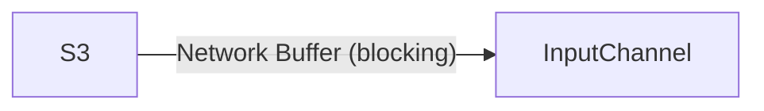
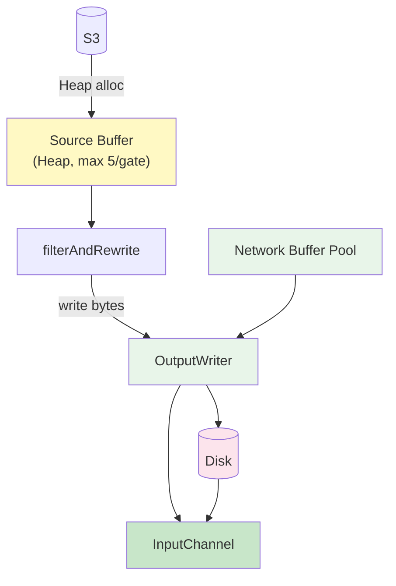
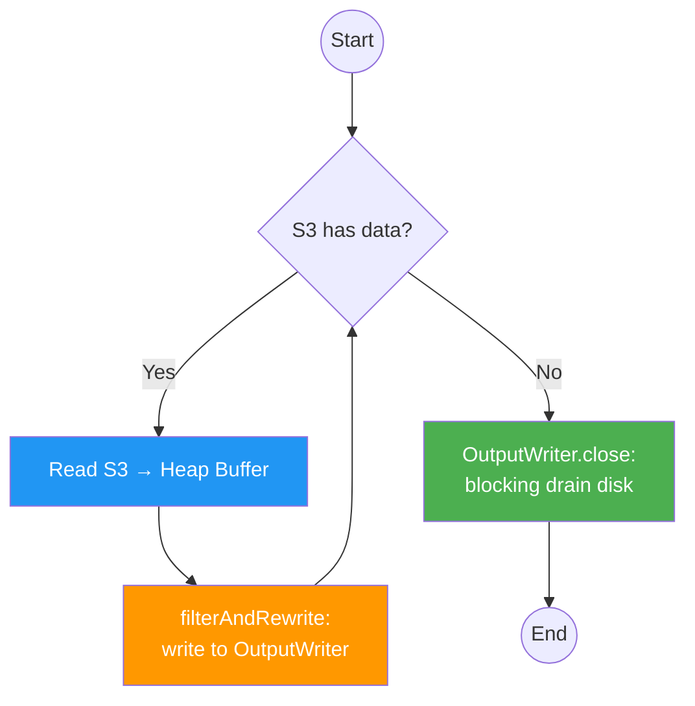
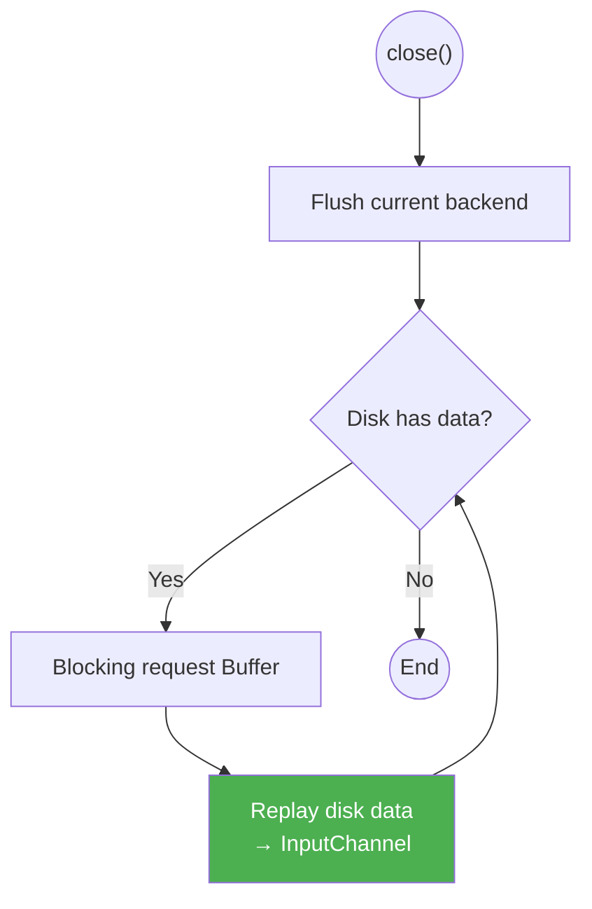

# Buffer Data Flow

## Non-Filtering Mode (channel-state-unspilling thread)



## Filtering Mode

### Data Flow

Source Buffer uses Heap memory, isolated from Network Buffer Pool.
Filter writes to a unified `OutputWriter` interface — it does not know whether the backend is a Network Buffer or a File.



### Control Loop



### OutputWriter Internal Logic

#### Diagram Convention

When a branch is `if (condition) execute action` with no else (both paths converge to the same next step), it is drawn as a single inline annotation on the edge, not as two separate branches.

#### Design Principles

1. **Disk stores raw bytes only** — no metadata (record boundaries, channel context, etc.) in spill files. All metadata lives in in-memory objects. Spill files are pure byte streams, replayed as 32KB chunks to InputChannel.
2. **OutputWriter can switch between buffer and file at any byte position** — a record's first half can be in a Network Buffer, second half in a File. Task Thread's SpanningWrapper handles cross-buffer record reassembly transparently.
3. **Disk replay reads 32KB chunks** — no need to know record boundaries. Each chunk becomes a Network Buffer delivered to InputChannel, SpanningWrapper on the consumer side reassembles spanning records.
4. **P3 replay drains eagerly** — on each write, replay as many disk entries as possible (loop until no buffer available or disk empty), not just one. This maximizes throughput when buffers become available after a period of memory pressure.
5. **Backend can change dynamically** — early writes may go to file (memory pressure), later writes may go to Network Buffer (pressure relieved). OutputWriter adapts per flush cycle, not per filterAndRewrite call.
6. **"Disk has data" means unreplayed data** — tracked by a cursor, not by physical file existence. If all disk data has been replayed to InputChannel, "disk has data" is false even if spill files still exist on disk. Once the cursor reaches the end, subsequent writes can go to Network Buffer (pure memory path).
7. **Spill directory from IOManager** — spill files are written to directories from `IOManager.getSpillingDirectoriesPaths()` (same as SpanningWrapper). No fallback to `java.io.tmpdir`. Invalid directories throw IOException directly.
8. **OutputWriter is per-gate** — one OutputWriter per gate, all channels within the gate write to the same OutputWriter. Channel identity is passed via `write(bytes, channelInfo)`.

#### Spill File Management

All channels within a gate share a single spill file. Data is appended sequentially (FIFO), and an in-memory queue tracks each entry's metadata.

```
File: [ch_A 32KB][ch_A 32KB][ch_B 30KB][ch_A 32KB]...
       ^                                          ^
       read cursor                                write cursor
```

**In-memory queue:**
```
Queue<SpillEntry>:
  {channelInfo, offset, length}
  {channelInfo, offset, length}
  ...
```

- **Write**: append bytes to file tail, enqueue entry (channelInfo + offset + length)
- **Replay**: dequeue head entry, read from file at offset/length, deliver to the entry's channel
- **"Disk has data"**: queue is non-empty
- **File rotation**: when file exceeds 64MB, create a new file. Old file is deleted after all its entries are replayed.
- Both read cursor and write cursor are monotonically increasing — no random access needed.

#### write(bytes, channelInfo)

Channel change is detected automatically: if `channelInfo` differs from the previous call, flush current backend before writing.


#### writeToBackend(bytes)

Pure write loop. If there is an active buffer with space, write directly. Otherwise check disk state to decide direction. Can only downgrade (buffer → file), never upgrade — because downgrading to file creates disk data, and disk data at entry forces file path.


#### close()


