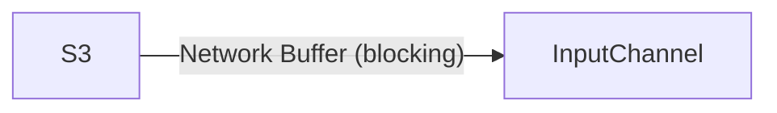
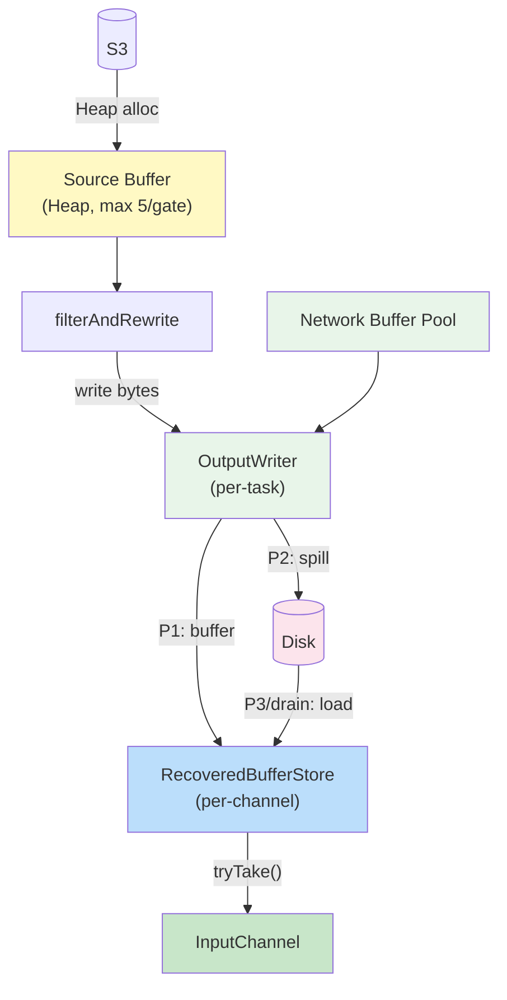
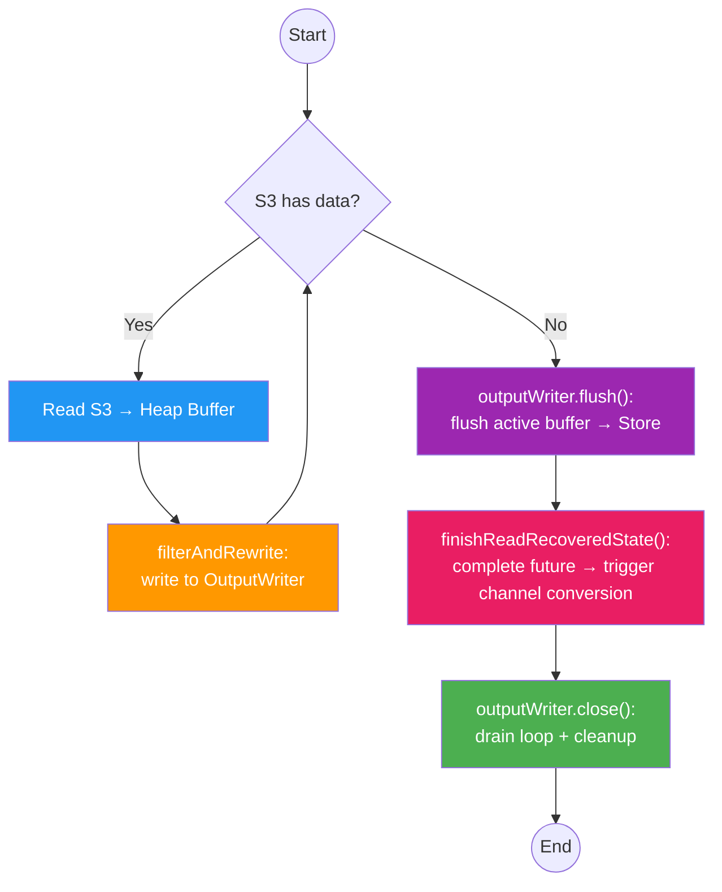
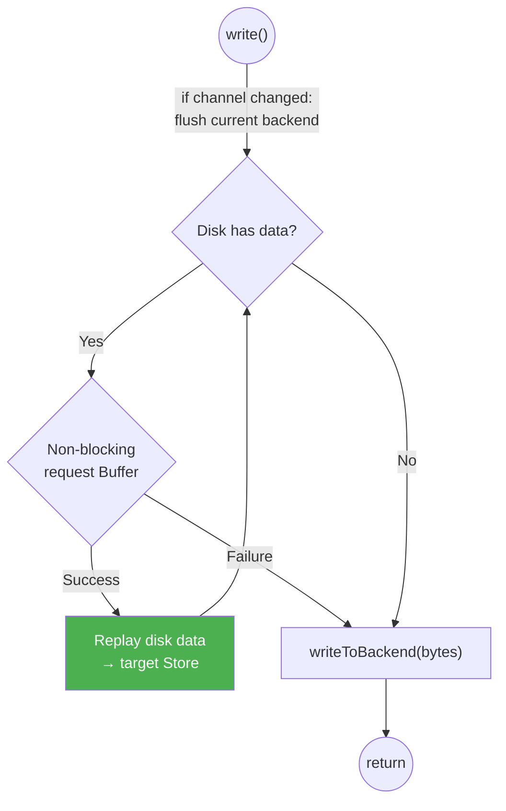
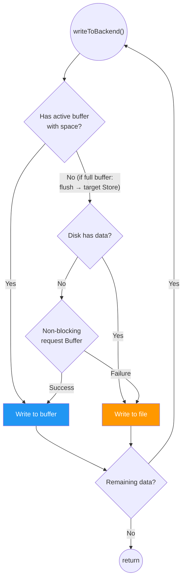
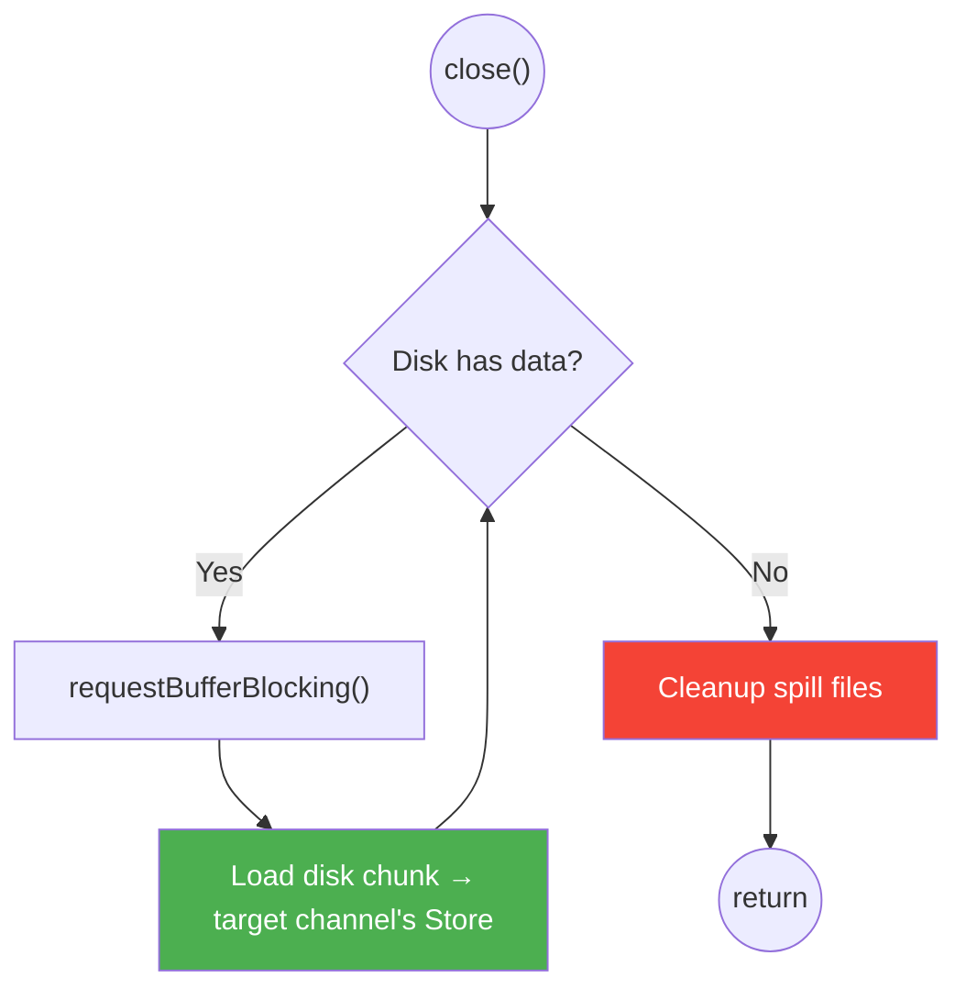

# Buffer Data Flow

## Core Architecture

OutputWriter and RecoveredBufferStore are the core components. They decouple filtering from InputChannel:

- **filterAndRewrite** writes bytes to `OutputWriter.write(bytes, gateIdx, channelInfo)`. It does not care about buffer allocation, disk spilling, or delivery to InputChannel.
- **OutputWriter** manages buffer allocation and disk spilling internally. It delivers ready buffers to the target channel's RecoveredBufferStore.
- **RecoveredBufferStore** provides ready buffers to InputChannel via `tryTake()` and supports checkpoint via `checkpoint()`. It does not know about OutputWriter or disk files.

## Non-Filtering Mode (channel-state-unspilling thread)



## Filtering Mode

### Data Flow

Source Buffer uses Heap memory, isolated from Network Buffer Pool.
Filter writes to a unified `OutputWriter` interface — it does not know whether the backend is a Network Buffer or a File.
OutputWriter delivers buffers to per-channel `RecoveredBufferStore`. InputChannel consumes from the store.



### Control Loop (recovery thread)



Time sequence:
1. **outputWriter.flush()** — flush active buffer's partial data to target Store. No more writes after this.
2. **finishReadRecoveredState()** — complete `bufferFilteringCompleteFuture` per channel. Task thread detects this and triggers `convertRecoveredInputChannels()` (Store reference transfers from RecoveredInputChannel to LocalInputChannel/RemoteInputChannel).
3. **outputWriter.close()** — blocking drain loop: `while (hasDiskData) → requestBufferBlocking() → load from disk → dispatch to target Store → cleanup spill files`. Runs concurrently with Task thread consumption and checkpoint on converted InputChannels.

### OutputWriter Internal Logic

#### Diagram Convention

When a branch is `if (condition) execute action` with no else (both paths converge to the same next step), it is drawn as a single inline annotation on the edge, not as two separate branches.

#### Design Principles

1. **Disk stores raw bytes only** — no metadata (record boundaries, channel context, etc.) in spill files. All metadata lives in in-memory objects. Spill files are pure byte streams, replayed as memory-segment-sized chunks.
2. **OutputWriter can switch between buffer and file at any byte position** — a record's first half can be in a Network Buffer, second half in a File. Task Thread's SpanningWrapper handles cross-buffer record reassembly transparently.
3. **Disk replay reads memory-segment-sized chunks** (`taskmanager.memory.segment-size`, default 32KB) — no need to know record boundaries. Each chunk fills exactly one Network Buffer, delivered to the target channel's RecoveredBufferStore. SpanningWrapper on the consumer side reassembles spanning records.
4. **P3 replay drains eagerly** — on each write, replay as many disk entries as possible (loop until no buffer available or disk empty), not just one. This maximizes throughput when buffers become available after a period of memory pressure.
5. **Backend can change dynamically** — early writes may go to file (memory pressure), later writes may go to Network Buffer (pressure relieved). OutputWriter adapts per flush cycle, not per filterAndRewrite call.
6. **"Disk has data" means unreplayed data** — tracked by a cursor, not by physical file existence. If all disk data has been replayed, "disk has data" is false even if spill files still exist on disk. Once the cursor reaches the end, subsequent writes can go to Network Buffer (pure memory path).
7. **Spill directory from IOManager** — spill files are written to directories from `IOManager.getSpillingDirectoriesPaths()` (same as SpanningWrapper). No fallback to `java.io.tmpdir`. Invalid directories throw IOException directly.
8. **OutputWriter is per-task** — one OutputWriter per task, all gates and channels within the task write to the same OutputWriter. The filtering thread is per-task, so one thread maps to one OutputWriter. Channel identity is passed via `write(bytes, gateIndex, channelInfo)`.

#### Spill File Management

All channels across all gates within a task share a single spill file. Data is appended sequentially (FIFO), and an in-memory queue tracks each entry's metadata.

```
File: [gate0_chA 32KB][gate0_chA 32KB][gate1_chC 30KB][gate0_chB 32KB]...
       ^                                                             ^
       read cursor                                                   write cursor
```

**In-memory queue:**
```
Queue<SpillEntry>:
  {gateIndex, channelInfo, offset, length}
  {gateIndex, channelInfo, offset, length}
  ...
```

Each SpillEntry corresponds to one memory-segment-sized chunk.

- **Write**: append bytes to file tail, enqueue entry (gateIndex + channelInfo + offset + length)
- **Replay**: dequeue head entry, read from file at offset/length, deliver to the entry's channel's RecoveredBufferStore
- **"Disk has data"**: queue is non-empty
- **File rotation**: when file exceeds 64MB, create a new file. Old file is deleted after all its entries are replayed.
- Both read cursor and write cursor are monotonically increasing — no random access needed.

#### RecoveredBufferStore (per-channel)

Each channel has its own RecoveredBufferStore. OutputWriter holds references to all stores and dispatches buffers to the correct store based on (gateIndex, channelInfo).

The store provides:
- **tryTake()** — non-blocking consume of a ready buffer
- **checkpoint()** — snapshot ready buffers + remaining disk data for this channel
- **isEmpty()** / **isComplete()** — state queries

The store is created in RecoveredInputChannel, then transferred to LocalInputChannel/RemoteInputChannel on channel conversion. InputChannel consumes via `store.tryTake()` in `getNextBuffer()`.

#### write(bytes, gateIndex, channelInfo)

Channel change is detected automatically: if `channelInfo` differs from the previous call, flush current backend before writing.



#### writeToBackend(bytes)

Pure write loop. If there is an active buffer with space, write directly. Otherwise check disk state to decide direction. Can only downgrade (buffer → file), never upgrade — because downgrading to file creates disk data, and disk data at entry forces file path.

When a buffer is full, it is flushed to the target channel's RecoveredBufferStore.



#### close()

OutputWriter.close() runs the blocking drain loop to load all remaining disk data into target stores, then cleans up spill files. Active buffer must already be flushed before close() (done by `outputWriter.flush()` prior to `finishReadRecoveredState()`).


