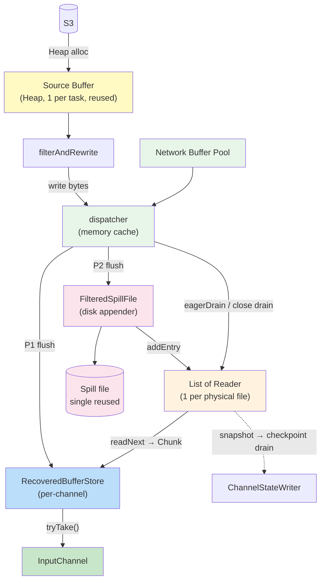
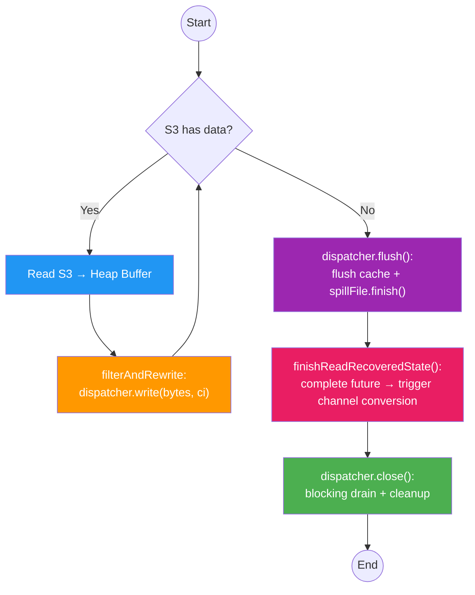
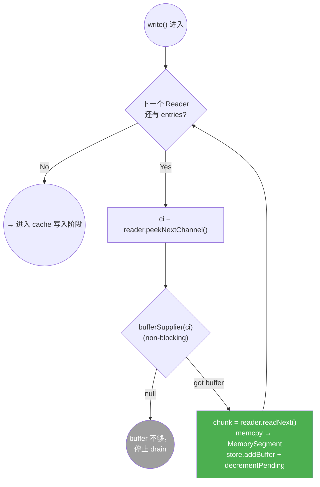
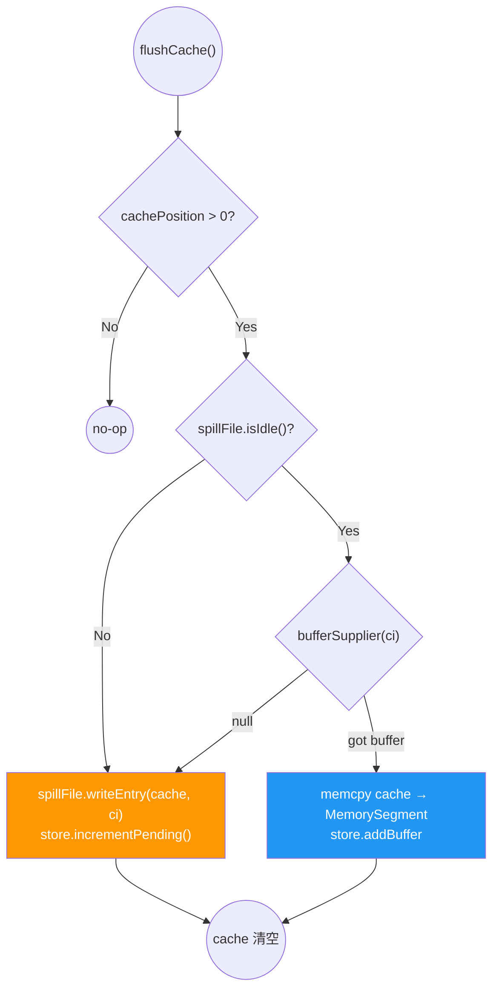
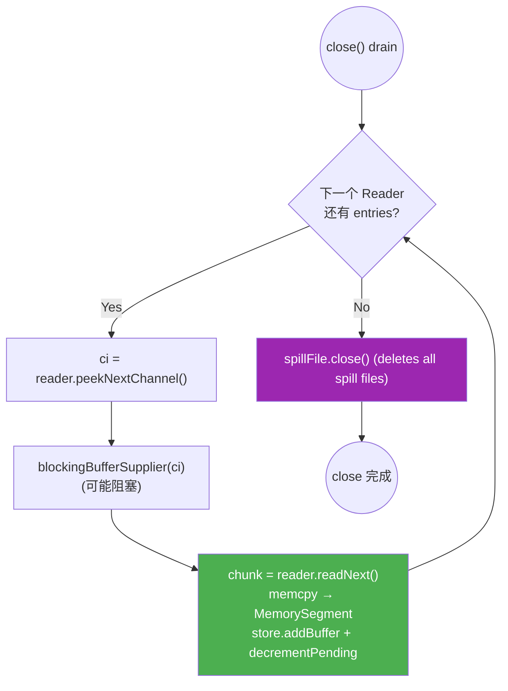
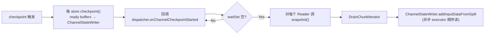

# Buffer Data Flow

## Core Architecture

四个协作者，职责分明：

- **filterAndRewrite** — recovery thread 上运行；产出字节，调 `dispatcher.write(bytes, length, channelInfo)`
- **FilteredBufferDispatcher**（dispatcher） — 持有一块 `memorySegmentSize` 的**内存 cache**；cache 满或 channel 切换时做 P1/P2 决策；lazy 创建 `FilteredSpillFile` 做 P2 落盘
- **FilteredSpillFile** — 纯落盘：收到 `writeEntry(bytes, ci)` 就追加到当前文件 + 在对应 Reader 上登记一条 entry；文件超过 64 MB 时内部 rotate 开新文件 + 新 Reader
- **FilteredSpillFile.Reader** — 每物理文件一个；持 entries deque；`readNext()` 出 `Chunk` 给回放链路；`snapshot()` 出独立 Reader 给 checkpoint 链路
- **RecoveredBufferStore**（每 channel 一个） — 持有 ready buffers；`tryTake()` 给 InputChannel 消费；`checkpoint()` 把自己的 ready buffers 入 checkpoint

dispatcher 持有 `FilteredSpillFile`；`FilteredSpillFile` 持有 `List<Reader>`；Reader 的消费者有 replay（原 Reader）+ checkpoint（snapshot Reader）。关闭连锁：`dispatcher.close()` → `spillFile.close()` → 所有 Reader.close() + 删除物理文件。

---

## Non-Filtering Mode

---

## Filtering Mode

### 静态架构图（谁连到谁）

（只画"谁可能发生往谁的动作"，不体现时序。下面三张图分别画三个独立场景的时序。）

### 控制循环（recovery thread）

时序：
1. **dispatcher.flush()** — flush cache 的残留数据到 P1 或 P2；`spillFile.finish()` seal 最后一个 Reader。此后不再接受 write。
2. **finishReadRecoveredState()** — 完成 per-channel `bufferFilteringCompleteFuture`；Task thread 感知后触发 `convertRecoveredInputChannels()`（Store 引用从 RecoveredInputChannel 移交到 LocalInputChannel/RemoteInputChannel）。
3. **dispatcher.close()** — 阻塞 drain（下方单独画），把 Reader 里剩下的每条 entry 都投到 Store，然后清理 spill 文件。

---

## 三个独立场景

> **统一不变式**：cache capacity = FilteredSpillFile 产生的 entry 最大长度 = network buffer 容量 = `memorySegmentSize`。
> 所有 "payload → network buffer" 的写入点都有 `Preconditions.checkState(buffer.getMaxCapacity() >= payload.length)`，违反即 `IllegalStateException`（假设成立，fail fast）。
> 下面的流程图不再画这个分支。

### 场景 1：`write()` 里的 eagerDrain（P3：disk → buffer → store）

dispatcher 每次 `write(bytes, ci)` **第一步**就是 eagerDrain — 尽可能把现存磁盘数据拉回 buffer 投给 Store，**然后才处理新字节**。非阻塞：拿不到 buffer 立刻停。

FIFO 靠遍历顺序保证（readers 按创建顺序；reader 内 entries 按插入顺序）。

### 场景 2：`flushCache()` — P1 or P2 决策

cache 满 / channel 切换 / `finish()` 时触发。

P2 两条触发路径：
1. **writer 已不 idle**：磁盘上还有 pending，走 P2 保 FIFO（downgrade-only）
2. **没拿到 buffer**：pool 耗尽

### 场景 3：`close()` 的 blocking drain

recovery 结束后把所有剩余磁盘数据 drain 回 Store。和 eagerDrain 同结构，只是 **bufferSupplier 换成 blocking 版本**（会阻塞直到拿到 buffer）：

---

## FilteredSpillFile 内部（纯落盘）

无 cache、无回调。`writeEntry(bytes, len, ci)` 流程：

- 第一次调用：lazy `openNewFile()`，顺便创建对应 Reader 加入 `readers` list
- 当前文件 > 64 MB：`rotateFile()` — seal 旧 Reader + 关旧 channel + 开新文件 + 新 Reader
- 追加 bytes 到当前文件
- 在当前 Reader 上 `addEntry(ci, fileOffset, length)`

`finish()` 只 seal 最后一个 Reader；`close()` 在 `finish()` 基础上关写 channel + 连锁关所有 Reader。

---

## 设计不变式

1. **磁盘只存字节**，无 metadata（record 边界、channel 信息都在内存 Entry 里）。spill 文件是纯 byte stream，回放时以 memorySegment 大小的 chunk 为单位。
2. **dispatcher 可随意在 buffer 和文件间切换** — 一条 record 的前半段可在 Network Buffer、后半段可在 File。Task thread 的 SpanningWrapper 透明重组跨 buffer record。
3. **每条 entry 最大 memorySegmentSize** — 和 Network Buffer 1:1 对齐。回放时一条 entry 正好填一个 buffer。
4. **eager drain on each write** — 每次 write 前尽可能多拉磁盘数据回 buffer（loop until no buffer available or disk empty），最大化 buffer 腾空后的吞吐。
5. **backend 动态切换** — 同一次 recovery 内，早期 write 可能落盘（memory pressure），后期 write 可能直投 buffer（压力消散）；downgrade-only 规则由 `spillFile.isIdle()` 管控。
6. **"磁盘有数据"的判定** — 看 `spillFile.isIdle()`，本质是 cache 为空 AND 所有 Reader 的 entries 为空。不看物理文件是否存在。
7. **Spill 目录来自 IOManager** — `IOManager.getSpillingDirectoriesPaths()`，不回退到 `java.io.tmpdir`；目录无效直接抛 IOException。
8. **dispatcher 和 FilteredSpillFile 都是 per-task** — 一个 task 一个 dispatcher、一个 FilteredSpillFile；所有 gate/channel 共用。channel 身份通过 `write(bytes, length, channelInfo)` 传入。
9. **Checkpoint 只允许发生在 recovery 结束后** — `spillFile.finish()` 已调用、所有 Reader 已 sealed 才允许 snapshot。两层 `checkState` 防御：dispatcher 在 drain 入口检查 `spillFile.isFinished()`；`Reader.snapshot()` 内部检查 `isSealed()`。违反 → `IllegalStateException`。

## 生命周期 Assertions

设计上的状态机约束，违反即 `IllegalStateException`（fail fast）。

| 调用点 | 检查 |
|---|---|
| `dispatcher.write()` | `!flushed && !closed` |
| `FilteredSpillFile.writeEntry()` | `!finished` |
| `Reader.addEntry()` | `!sealed` |
| `dispatcher.drainSpillEntriesToCheckpoint()` | `spillFile.isFinished()` |
| `Reader.snapshot()` | `sealed` |

Buffer size check（`buffer.getMaxCapacity() >= payload.length`）在所有"payload → network buffer"写入点也以 `checkState` 形式存在，但属于纯代码层面的防御性断言，不在这里重复；开头的 preamble 已声明。

---

## Checkpoint 数据流

要点：
- 每个 channel 的 ready buffers 先写入 checkpoint（各自 `store.checkpoint()`）
- wait-set 收敛后，dispatcher 对 readers 调 `snapshot()`，拿独立 Reader 给 checkpoint executor 异步 `readNext` 消费 — 不影响 replay 链路
- 详细的 wait 机制和 snapshot 并发语义分别见 `architecture_overview.md` 的"Checkpoint 的 wait 机制"小节 和 `spill_reader_drain_concurrency.md`。
