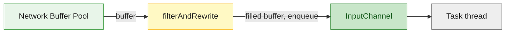
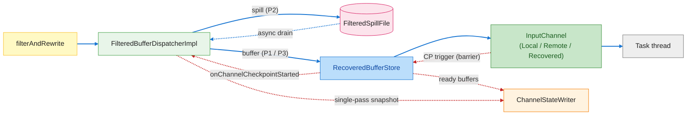
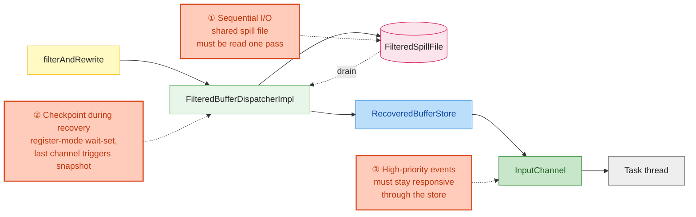

# FLINK-38544 — Why the Spilling Change Is Bigger Than V1

Shortly, the code change of spilling logic is even bigger than checkpointing during recovery V1:

1. The checkpoint trigger had to change — from per-InputChannel snapshots to a single shared pass triggered by the last channel — to preserve cross-channel ordering and avoid random IO on the shared spill file.
2. Unifying the three data sources (recovered-network / recovered-disk / live) behind the InputChannel forced an async loader + state store — which requires priority events to stay responsive through the store and every new buffer to coordinate FIFO with the async drain thread.

Most of the effort lands in `FilteredBufferDispatcherImpl` and `FilteredSpillFile`. The dispatcher hosts the register-mode wait-set for #1 and the dynamic "spill idle" + priority coordination for #2; the spill file makes the single shared pass coexist with the async drain. Neither class has a direct predecessor in V1, so this part is largely new implementation.

## V1 baseline (for comparison)

- `filterAndRewrite` requests a buffer from the Network Buffer Pool
- Writes filtered bytes into the buffer
- Hands the buffer directly to the InputChannel
- No dispatcher, no spill file, no intermediate store

## V2 component overview

- Blue lines = data consumption (replay path)
- Red lines = checkpoint (trigger propagation + snapshot write)

## Why V2 is hard — three new constraints (none applied in V1)

Each red box is a requirement V1 didn't have:

- ① → shared cross-channel spill file + register-mode checkpoint trigger (last channel fires the snapshot)
- ② → wait-set + single-pass snapshot coexisting with async drain
- ③ → dispatcher keeps priority events responsive while routing every buffer through the store

Behind that simplicity:

- Interfaces of `FilteredBufferDispatcherImpl` / `FilteredSpillFile` reshaped 10+ times as invariants landed
- Credit-gating `releaseHeldCredit` → deleted; upstream-no-replay invariant makes it unnecessary
- Source-buffer `Semaphore(5)` → 1 reused buffer; serial `readChunk` structurally guarantees at-most-one
- `onChannelCheckpointStarted` set-remove → 3-case state machine (late / current / new checkpointId)
