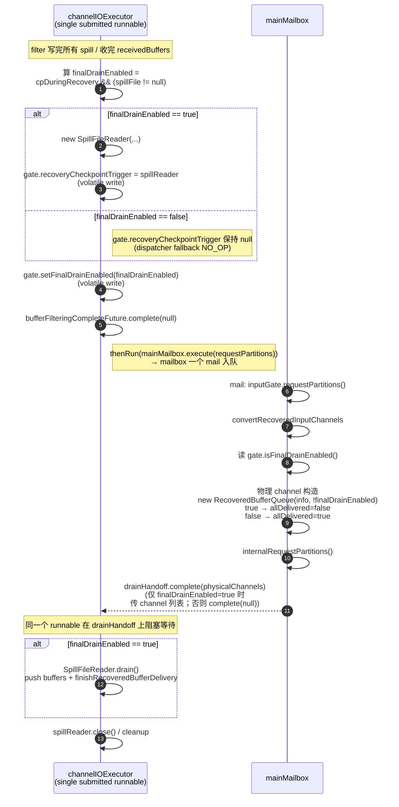

# Recovery in-recovery 信号源统一：引入 `finalDrainEnabled` flag

> 关联：[end_of_input_event_missing_fix.md](./end_of_input_event_missing_fix.md)（§4 的 sentinel 修复在 cpDuringRecovery=false 路径上的过度扩散）、[missing_recovery_checkpoint_barrier_fix.md](./missing_recovery_checkpoint_barrier_fix.md)（per-channel `isInRecovery()` 修了 Step 1/Step 2 谓词、但没修信号源不一致）。本文档**只描述方案**，不改代码。

## 1. 当前 `Missing RecoveryCheckpointBarrier` race 的根因（实证）

`loop.sh 20260524_134921` 的 `[HANG-DIAG]` 日志直接定位：抛 Missing 时 channel 状态是 `allDelivered=true, buffers=[#0:EVENT(EndOfInputChannelStateEvent)]` —— **队列里只有 sentinel、没有任何 `RecoveryCheckpointBarrier`**，Step 1 从来没插过。该 task 同时跑了 `finishPhysicalRecoveredChannels (fresh-job fallback)` 全程 4786 次（即 `spillFile == null`、根本没装 SpillFileReader）。

不变量被破坏在两个独立信号上：

| 信号 | 取值规则 | 当前判定来源 |
| --- | --- | --- |
| **Step 1 是否插 barrier** | trigger 是真 SpillFileReader → 按 channel 逐个判 isInRecovery；trigger 是 NO_OP → 永不插 | `StreamTask.recoveryCheckpointTrigger` 字段（null/SpillFileReader），dispatcher 经 supplier 取，null 时 fallback NO_OP |
| **Step 2 是否找 barrier** | `recoveredQueue.isInRecovery() = !allDelivered \|\| !buffers.isEmpty()` | channel 自家的 `RecoveredBufferQueue` 状态 |

两侧目前没有约束，能交叉出三种组合（"路径"对应另一个 agent 的术语）：

- **路径 1（feature off，cpDuringRecovery=false）**：trigger 永远 NO_OP；channel 构造时 §7.3 修过 `allDelivered=true` → isInRecovery=false。两侧一致、安全。**不在本方案修复范围**。
- **路径 2（feature on + fresh job，spillFile==null）**：trigger 仍 NO_OP（`StreamTask` 走 `finishPhysicalRecoveredChannels` fallback、根本不装 SpillFileReader）；但 channel 构造时按 `!cpDuringRecovery` → `allDelivered=false`，又被 fallback 推一个 sentinel + 翻 `allDelivered=true`，**isInRecovery 由 buffers 非空仍判 true**。Step 2 找 barrier → Missing。**本方案修复目标**。
- **路径 3（feature on + 真有 spillFile，startup race）**：cp barrier 在 `handoffSpillReaderToDrain` mail 跑完之前到达，trigger 字段仍 null → dispatcher fallback NO_OP；channel 已构造、`allDelivered=false`、Step 2 找 barrier → Missing。**本方案同步修复**。

## 2. 不一致的根因：两件事被拆到两个 mailbox tick

`StreamTask` 当前在 cpDuringRecovery=true 路径的时序：

```
filter 完成 (channelIOExecutor)
   ↓ complete bufferFilteringCompleteFuture
   ↓
mail #A: requestPartitions ← thenRun(mainMailbox.execute(...))
   - convertRecoveredInputChannels
       - 物理 channel 构造：new RecoveredBufferQueue(channelInfo, !cpDuringRecovery)
         ← 此时 spillFile 是否为 null 是 *已知的*（filter 已经决定了）
           但 channel 构造拿不到这条信息，只能拿 cpDuringRecovery flag 作为代理 ← 不一致来源
   - internalRequestPartitions
   ↓ conversionDoneFutures 全部 complete
   ↓ allConverted.whenComplete
   ↓
mail #B: handoffSpillReaderToDrain ← mainMailbox.execute(...)
   - reader.getProducedSpillFile()  ← 这才查 spillFile==null 与否
   - spillFile == null  → finishPhysicalRecoveredChannels (fresh-job fallback)
   - spillFile != null  → 装 recoveryCheckpointTrigger = spillReader; 触发 drain
```

mail #A 决定 channel 的 `allDelivered`（基于 cpDuringRecovery flag），mail #B 才查实际 spillFile 状态 + 装 trigger。这中间的窗口里：
- cp barrier 一旦到达 → dispatcher 拿到 null trigger → fallback NO_OP → Step 1 不插
- 但 channel 已 in-recovery → Step 2 要找 barrier → Missing

filter 阶段已经产出 spillFile（或确认为 null），所以**"是否真要 drain"这个信号在 filter 完成那一刻就已经确定**——只是当前代码没把它传给 channel 构造，channel 只能用 cpDuringRecovery flag 代理。

## 3. 设计：引入 `finalDrainEnabled` 单一 flag

定义一个**组合 flag**作为 "in-recovery 信号" 的唯一权威源：

```
finalDrainEnabled = isCheckpointingDuringRecoveryEnabled()  // feature 是否开启
                    AND  (filterProducedSpillFile != null)  // filter 是否真产出 spill state
```

语义：**该 task 是否真的需要走 SpillFileReader-driven drain 阶段**。

`finalDrainEnabled` 一旦在 filter 完成时算出，**整个 task 生命周期单调不变**，作为 Step 1 / Step 2 两侧判定的共同输入：

| 信号 | 旧来源 | 新来源 |
| --- | --- | --- |
| trigger 字段值 | null（直到 mail #B 装 SpillFileReader） | `finalDrainEnabled` 时构造 SpillFileReader 实例；否则保持 NO_OP（不再依赖 mail #B 异步设置） |
| channel `RecoveredBufferQueue.allDelivered` 初值 | `!cpDuringRecovery` | `!finalDrainEnabled`（真要 drain → false；其他都 true） |

约束：**channel 构造（包括 allDelivered 初值的写入）必须晚于 `finalDrainEnabled` 算出 + trigger 字段设置**。详见 §4 时序重排。

## 4. 新时序：filter 收尾原地完成、不引入新 mail

修复思路是**把"算 flag + 装 trigger 字段"塞进 filter 当前的 channelIOExecutor runnable 里**，作为 filter 的同步收尾步骤——**不**额外起 mailbox 任务。`bufferFilteringCompleteFuture.complete(null)` 是 filter runnable 的最后一个动作，前置步骤同步完成意味着：任何 `thenRun(mainMailbox.execute(...))` 触发的下游 mail（如现有的 `requestPartitions`）跑起来时，trigger 字段和 `finalDrainEnabled` 都已经是稳态。



要点（与图对应）：

- **只有两个 actor**：`channelIOExecutor`（单个 submitted runnable，从头到尾就这一个）和 `mainMailbox`。runnable 内顺序是 `filter → 算 flag + 装 trigger → complete future → 阻塞等 drainHandoff → drain → close`（对应 `StreamTask:909` 注释 "Single submit to channelIOExecutor: filter → wait for drain handoff → drain → close"）。
- **filter 收尾的所有"算 flag / 装 trigger / set gate.finalDrainEnabled"全部在 filter 结束的同一个时点同步完成**（图中步骤 1–6），不引入任何新 mail；`bufferFilteringCompleteFuture.complete(null)` 是这段收尾的最后一步，保证下游 thenRun 触发的 mail 一定能看到稳态值（`volatile` 写 + `CompletableFuture.complete` 内存语义共同保证 happens-before）。
- **mailbox 端也只一个 mail**（原来的 `requestPartitions`，时序里不变），完成 convert + requestSubpartitions 之后 `drainHandoff.complete(...)` 把控制权传回 channelIOExecutor 继续 drain；`finalDrainEnabled=false` 时也 `complete(null)`，让 runnable 跳过 drain 直接走 close。
- **`finshPhysicalRecoveredChannels` fresh-job fallback 整段删除**——`finalDrainEnabled=false` 时 channel 一开始就 allDelivered=true，没有 sentinel 需要推、没有 wake 需要触发。

要点：

- **不引入新 mail**——原本的"算 spillFile / 装 trigger" 这件事就是 filter 产物的紧接动作，逻辑上属于 filter，不该跨 mailbox tick
- channelIOExecutor 在写 `recoveryCheckpointTrigger` 字段时**必须先于** `bufferFilteringCompleteFuture.complete(null)`；happens-before 由 `volatile` 字段的写 + `CompletableFuture.complete` 的内存语义保证（后续读 future 的下游观察到 trigger 写）
- `finalDrainEnabled=false` 的分支彻底不再调 `finishPhysicalRecoveredChannels` fallback push sentinel——channel 一开始就 allDelivered=true，没必要

### 4.1 把 `finalDrainEnabled` 暴露给 channel 构造

mail #A 里 channel 构造时需要拿到这个 flag。两个选项：

- **(a)** 在 `SingleInputGate` 加一个字段 `private volatile boolean finalDrainEnabled`，channelIOExecutor 在 filter 收尾时 `gate.setFinalDrainEnabled(...)` 写、channel 构造时 `inputGate.isFinalDrainEnabled()` 读，取代当前 `inputGate.isCheckpointingDuringRecoveryEnabled()` 那一处
- **(b)** 把 flag 通过参数链路传到 `convertRecoveredInputChannels` 内部，再传给 `RecoveredBufferQueue`

倾向 **(a)**——跟现有 `setCheckpointingDuringRecoveryEnabled` 的字段访问语义对称，改动局限在 `SingleInputGate` 字段 + 一处构造调用。`volatile` 保证 mail #A 读到收尾阶段写入的值。

### 4.2 SpillFileReader 实例化

SpillFileReader 的 drain 路径需要"每个物理 channel 的引用"才能 push buffer——但**实例化本身**不需要 channel 在场。filter 收尾时实例化 SpillFileReader（暂不绑定 channels）、写进 trigger 字段；drain handoff 阶段（mail #B）再 inject 物理 channel list 完成绑定。也可以让 SpillFileReader 实例化继续推迟到 mail #B、filter 收尾只写一个"占位 SpillFileReader / 标记"——实现层 trade-off，但必须保证 **trigger 字段在 `bufferFilteringCompleteFuture.complete` 之前已经写好**，否则 mail #A channel 构造时仍可能拿到 stale null。

## 5. 两侧一致性保证

定义不变量：**`recoveryCheckpointTrigger` 字段最终值 ⇔ task 所有 channel 的 `recoveredQueue` 初始 `allDelivered` 值**。具体：

| `finalDrainEnabled` | trigger 字段最终值 | channel `allDelivered` 初值 | Step 1 行为 | Step 2 行为 | 结果 |
| --- | --- | --- | --- | --- | --- |
| `false` | null（fallback NO_OP） | `true` | NO_OP 不插任何 barrier | `isInRecovery=false` → 跳过 collect | **一致** |
| `true` | SpillFileReader 实例 | `false` | 真 trigger 按 per-channel `isInRecovery()` 决定插（drain 期间为 true 必插） | `isInRecovery=true` 时去 collect、必能找到 barrier | **一致** |

两个交叉态（`false × in-recovery` 或 `true × not-in-recovery`）在新方案下都不能出现——因为 channel 构造**晚于** trigger 字段 publish，两者读的是同一个 `finalDrainEnabled` 源、单调一致。

## 6. 路径 2 / 路径 3 验证

### 路径 2（feature on + fresh job）

- filter 完成 → mail #A' 算出 `finalDrainEnabled = true && (null != null) = false`
- trigger 字段保持 null
- mail #B' channel 构造：`new RecoveredBufferQueue(_, !false) = (_, true)` → `allDelivered=true`
- 任何 cp 触发：Step 1 NO_OP 不插；Step 2 `isInRecovery=false` 跳过 collect → **不抛 Missing**

### 路径 3（feature on + 真有 spillFile + startup race）

- filter 完成 → mail #A' 算出 `finalDrainEnabled = true && (non-null != null) = true`，立即装 trigger 字段为 SpillFileReader
- mail #B' channel 构造：`allDelivered=false`
- 任何 cp 触发**必发生在 mail #A' 完成之后**（mail 顺序保证）：trigger 已是 SpillFileReader；Step 1 per-channel 插 barrier；Step 2 找到 → **不抛 Missing**

### 路径 1（feature off）

- mail #A' 不跑（`if (checkpointingDuringRecoveryEnabled)` 外面那条路径完全不变）
- channel 构造继续按现行 `!cpDuringRecovery=true` 设 `allDelivered=true`（与 `finalDrainEnabled=false` 等价）
- 行为不变

## 7. fresh-job fallback 的命运

新方案下 `finishPhysicalRecoveredChannels` 这条 fresh-job fallback **完全不需要**：

- 它的目的本来是给"没有 SpillFileReader-driven drain"的 channel 一个 wake-up（push sentinel + 翻 allDelivered=true）
- 但在新方案里这条路径下 channel 一开始就 `allDelivered=true`，不需要被翻
- 也不需要 sentinel——`isInRecovery` 一直 false，不存在"跨越 in-recovery 阻塞期"的 wake 需求

可以直接删除 `finishPhysicalRecoveredChannels` 这个方法 + 调用点；或保留作为 defensive no-op。

## 8. 跟之前 fix 的关系

- **§7.3 `RecoveredBufferQueue` 加 `initiallyDelivered` 构造参数**：保留，本方案在此基础上把 caller 从 `!isCheckpointingDuringRecoveryEnabled()` 换成 `!finalDrainEnabled`
- **§7.4 conditional wake (`subpartitionView != null` / `partitionRequestClient != null`)**：保留，本方案不动 wake 逻辑；新方案让"真 drain 路径"下的 sentinel 仍由 `SpillFileReader.drain()` 末尾的 `finishRecoveredBufferDelivery` 推（保留跨阻塞期 wake 的设计），但路径 2/3 这种"没有 drain"的场景下根本不再调 `finishRecoveredBufferDelivery`，也就不会触发那个 wake 路径
- **per-channel `isInRecovery()` (`f6fb3b95fff`)**：保留，Step 1 持 SpillFileReader.lock 期间 per-channel 判定仍然必要（drain 中途某些 channel 已经把队列消费空，跳过插 barrier 是正确的）

## 9. 选定方案：per-channel `upstreamReady` future

### 9.0 为什么必须等：两类 race 的根因

`deliverRecoveredInternal` 入口先 await `upstreamReady` 这条同步**不是性能优化、是正确性必需**。如果不等、buffer / sentinel 可以在 upstream 还没 publish 时就进 `recoveredQueue`，会撞两类 race（即 §1 表格中归类为路径 2 / 路径 3 的 case，下面把根因再列一遍方便后续 reviewer）：

**路径 2 — fresh job + cpDuringRecovery=true（`spillFile==null` fresh-job fallback）**：
- channel 构造按 `!cpDuringRecovery` → `allDelivered=false` 进 in-recovery 态
- task 没装 SpillFileReader（spillFile==null），`recoveryCheckpointTrigger` 字段保持 null → dispatcher fallback NO_OP
- fresh-job fallback `finishPhysicalRecoveredChannels` 给每 channel push 一个 sentinel + 翻 `allDelivered=true`
- sentinel 入队 → `isInRecovery=true`（`!allDelivered=false || buffers 非空=true`）→ Step 2 走 collect → 队列里只有 sentinel、没有 RecoveryCheckpointBarrier → 抛 `Missing RecoveryCheckpointBarrier`
- task 消费完 sentinel → `isInRecovery=false` → normal path 读 `subpartitionView==null`（PartitionNotFoundException Timer retrigger 中）→ 抛 `Queried for a buffer before requesting the subpartition.`

**路径 3 — cpDuringRecovery=true + 真有 spill + startup race**：
- physical channel 已构造、`allDelivered=false`、task 进 RUNNING 开始接 cp barrier
- 但 `handoffSpillReaderToDrain` mailbox 任务还没跑完、`recoveryCheckpointTrigger` 字段仍 null → dispatcher fallback NO_OP
- Step 1 NO_OP 不插 barrier；Step 2 看 `isInRecovery=true` → 找 barrier → 抛 Missing

两类 race 的共同根因是 **channel 的 in-recovery 状态跟 upstream 是否 publish 之间没有 happens-before 约束**，让两个独立信号能交叉出冲突态。Per-channel `upstreamReady` future 把这条约束显式建立成 "**任何 buffer / sentinel 入 `recoveredQueue` ⇒ upstream 已 publish**" —— 路径 2 / 路径 3 同时消失。

### 9.1 设计

每个物理 channel 内部持有一个 `CompletableFuture<Void> upstreamReady`：

- **Local**：`LocalInputChannel.requestSubpartitions()` 成功把 `subpartitionView` 写上去（line 250 `this.subpartitionView = subpartitionView;` 之后、释放 requestLock 之前）→ `upstreamReady.complete(null)`。如果走 PartitionNotFoundException 的 Timer retrigger 路径，future 保持未完成，直到某次 retrigger 真正成功才 complete。
- **Remote**：对称做法——`partitionRequestClient` 真正设上的那一刻 complete。

`onRecoveredStateBuffer(buffer)` 和 `finishRecoveredBufferDelivery()` 在入口先 `upstreamReady` 阻塞等。后者只 `recoveredQueue.finish()` 翻 `allDelivered=true`、**不再 push `EndOfInputChannelStateEvent` sentinel**，然后**无条件**调 `notifyChannelNonEmpty()` 给 task 一次"drain 完成"的 wake-up（详见 §9.2 为什么这一 wake 必须保留、为什么 sentinel 可以删）。

```java
public void onRecoveredStateBuffer(Buffer buffer) {
    upstreamReady.join();                          // unchecked; release surfaces upstream   // 阻塞直到 subpartitionView publish
    // 原有 push 逻辑：synchronized (recoveredQueue) { offer; }; notify if was empty
}

public void finishRecoveredBufferDelivery() {
    upstreamReady.join();                          // unchecked; release surfaces upstream
    synchronized (recoveredQueue) {        // Remote: receivedBuffers
        recoveredQueue.finish();           // 翻 allDelivered=true；不 push sentinel
    }
    notifyChannelNonEmpty();               // 无条件 drain-end wake
}
```

drain 在 channelIOExecutor 上 per-channel 调这些方法——慢 channel（PartitionNotFoundException retrigger 中）会阻塞它自己的 push、不影响其他 channel；快 channel push 完立刻进 recoveredQueue、task 可立即消费。

### 9.2 一致性论证 + 为什么 sentinel 可以删

**不变量**：任何 buffer 进入 `recoveredQueue` 时，subpartitionView/partitionRequestClient **必然**已 publish。所以 `isInRecovery` 从 true 翻 false 那一刻（task 消费完所有 recovered buffer）走 normal path 读上游 handle 必非 null、永远不撞 ISE。

**为什么 sentinel 可以彻底删**：原 §4 的 sentinel 唯一价值不是"翻 isInRecovery"，而是**给 task 一次 drain-end 的 wake**——`subpartitionView.notifyDataAvailable` 是 edge-trigger（数据从无到有时触发一次），上游在 in-recovery 阻塞期投递的 wake 全被消化掉（task wake → poll → `isInRecovery=true` 空队列 → return empty 退队），drain 完成后 subpartitionView 里可能仍堆着上游已投递的数据但没人来读 → hang。

这次 wake **跟 sentinel 是否进队无关**——直接 `notifyChannelNonEmpty()` 就够：

| 旧（push sentinel） | 新（只 finish + 无条件 wake） |
| --- | --- |
| `buffers=[sentinel] && allDelivered=true → isInRecovery=true`（假性 in-recovery） | `buffers=[] && allDelivered=true → isInRecovery=false`（正确反映"已退出 recovery"） |
| task wake → poll sentinel → recovery 分支拿到 sentinel → buffers 空 → 下次 `isInRecovery=false` → normal path | task wake → poll → 直接 normal path 读 `subpartitionView` |
| Step 2 进 collect 找 barrier（fresh-job 路径 trigger=NO_OP 时找不到 → Missing） | Step 2 看 `isInRecovery=false` 跳过 collect → 没有 Missing |
| 偶尔白 wake 一次（sentinel 到 task 之间的延迟） | 同样偶尔白 wake 一次（drain-end → task 之间）；代价相同 |

**Missing race 同时消失**：fresh-job fallback (`spillFile==null` + cpDuringRecovery=true) 路径上 trigger 永远 NO_OP，旧设计下 sentinel 进队让 `isInRecovery=true` → Step 2 误进 collect → 抛 Missing；新设计下 `finishRecoveredBufferDelivery` 不 push sentinel、`isInRecovery=false` → Step 2 跳过 collect → 不抛。`collectPreRecoveryBarrier` 维持严格契约（找不到 barrier 一律抛），不需要 `retained.isEmpty()` corner-case 补丁。

### 9.3 两个机制并存：finalDrainEnabled 跟 upstreamReady 解决不同 race

更正之前对 §3 与 §9 的"二选一"叙述——这两个机制**解决不同的 race**、不能互相替代、最终方案**两个都要保留**：

| 维度 | A. filter 收尾原地装 trigger + `finalDrainEnabled` flag（§3 / §4 思路） | B. per-channel `upstreamReady` future（本 §9 主体） |
| --- | --- | --- |
| 解决的 race | **trigger 字段晚装的窗口**：channel 一构造就 `allDelivered=false` 进 in-recovery、但 mailbox 端 `recoveryCheckpointTrigger = spillReader` 还在后续 mail 才写，dispatcher 拿 NO_OP → Step 1 不插 + Step 2 看 in-recovery 找 barrier → Missing | **`requestSubpartitions` 异步 retrigger 窗口**：subpartitionView / partitionRequestClient 因 PartitionNotFoundException 走 Timer retrigger，方法返回时仍 null，buffer 进队消费完 → `isInRecovery=false` → normal path → ISE |
| 一致性约束 | "channel 进 in-recovery" ⇔ "trigger 字段是 SpillFileReader 实例"：filter 收尾把 `算 finalDrainEnabled + 装 trigger + setFinalDrainEnabled + complete future` **原地同步**做完，channel 构造时基于 `!finalDrainEnabled` 设 `allDelivered`、跟 trigger 字段稳态一致 | "buffer 进 `recoveredQueue`" ⇒ "上游 handle 已 publish"：channel 在 push 入口 `upstreamReady.join()`，`requestSubpartitions` 真正成功才 complete future |
| 阻塞粒度 | task 级一致性（filter 收尾同步完成、不引入新 mail） | per-channel join（慢 channel 自己阻塞自己） |
| 改动面 | `SingleInputGate` 加 `finalDrainEnabled` 字段 + setter；`StreamTask` 把原 `handoffSpillReaderToDrain` mail 的工作前移到 channelIOExecutor filter runnable 内同步做（删 mail #B）；channel 构造改读 `!finalDrainEnabled` | channel 加 `upstreamReady` future + push 入口 join + release 时 completeExceptionally；`SpillFileReader.drain` push site catch release-time `CompletionException` |
| sentinel | 不需要（§9.2 已论证） | 不需要（同上） |
| §7.4 条件 wake | 不需要 | 不需要 |
| fresh-job fallback (`finishPhysicalRecoveredChannels`) | 保留：调 `finishRecoveredBufferDelivery`（只 finish + 无条件 wake、无 sentinel） | 同 A |

**两个机制是正交的、缺一不可**：删 A 留 B → trigger 晚装窗口仍可撞 Missing；删 B 留 A → PartitionNotFoundException 重试期间 buffer 消费完仍可撞 ISE。文档接下来的 §9.4 / §9.5 描述同时落地两个机制后的最终代码与风险点。

### 9.4 实施细节

#### 9.4.1 主流程（机制 A）—— 两线程的两次通信

##### 9.4.1.1 参与方与术语

启动阶段两条参与线程：

- **A 线程 = `channelIOExecutor`**：单条提交的 filter runnable，串行做 `readInputData` → 构造 `SpillFileReader` 并写 trigger → F1 → `drain` → `close`
- **B 线程 = mailbox**：task 主线程的 mailbox loop，处理 per-gate mail #A（`convertRecoveredInputChannels` + `internalRequestPartitions`）

两线程被两次通信分成**三个阶段**：

```
阶段 1 (A 线程独占)  ──通信 1 (F1)──►  阶段 2 (B 线程独占)  ──通信 2 (F2)──►  阶段 3 (A 线程独占)
```

##### 9.4.1.2 通信原则

**两条线程总共只通信两次，方向相反，各对应一个 future。两次通信都不只是"信号"，都顺带交付下游阶段需要的实体；不引入第三个 future。**

| # | Future | 方向 | 交付内容 |
| --- | --- | --- | --- |
| 通信 1 | `bufferFilteringCompleteFuture` (F1) | A → B | 信号 + 共享态：`finalDrainEnabled` 已设到 gate；`recoveryCheckpointTrigger` 字段已写好 |
| 通信 2 | `physicalChannelsFuture` (F2) | B → A | 物理 channel 集合（`Map<InputChannelInfo, RecoverableInputChannel>`），直接交付给阶段 1 已构造好的 `SpillFileReader` 内部 |

> F2 不再用旧的 `conversionDoneFutures + allOf` 表达"全部 convert 完了"这个抽象信号——直接用 `CompletableFuture<Map<InputChannelInfo, RecoverableInputChannel>>` 当通信通道、F2.complete 的 payload 就是 channels 集合本身。这样 F2 既是同步原语、也是数据交付。

##### 9.4.1.3 阶段 1：A 线程独占

A 线程在 F1 complete 之前**全部做完**：

1. `readInputData()`——filter 数据到 spillFile
2. 算 `finalDrainEnabled = cpDuringRecovery && spillFile != null`
3. 对每个 gate: `gate.setFinalDrainEnabled(finalDrainEnabled)`
4. 如果 `finalDrainEnabled`：
   - 构造 `SpillFileReader(spillFile, sourceChannels, physicalChannelsFuture)`——`physicalChannelsFuture` 是阶段 2 末才 complete 的 future，SpillFileReader 内部持有
   - 写 `this.recoveryCheckpointTrigger = spillReader`
5. `F1.complete()`

这一步完成后，**trigger 字段已经稳态**——后续 task 进 RUNNING、cp barrier handler 读这个字段都看到正确值。

##### 9.4.1.4 通信 1：A → B（`bufferFilteringCompleteFuture`）

**A 在 complete 之前已写好的共享态**：

| 共享态 | 接收方在阶段 2 怎么用 |
| --- | --- |
| 每个 gate 的 `finalDrainEnabled` | mail #A 内 channel 构造时调 `inputGate.isFinalDrainEnabled()` 决定 `RecoveredBufferQueue.allDelivered` 初值 |
| `recoveryCheckpointTrigger` 字段 | task 进 RUNNING 后 cp barrier handler 读 |

##### 9.4.1.5 阶段 2：B 线程独占

per-gate mail #A 串行跑：

```
mail #A (gate[i]):
   convertRecoveredInputChannels(gate[i])
       └─ new RecoveredBufferQueue(!gate.isFinalDrainEnabled())  ← 读阶段 1 写的共享态
   internalRequestPartitions(gate[i])
   collect gate[i] 物理 channels → 累积到 task 字段 collectedPhysicalChannels
```

最后一个 gate 跑完时：`physicalChannelsFuture.complete(collectedPhysicalChannels)`——通信 2 的 payload 装好、发出。

##### 9.4.1.6 通信 2：B → A（`physicalChannelsFuture`）

**这次通信只交付一件东西：物理 channel 集合本身**——不再有"全部 convert 完了"的中间抽象信号。SpillFileReader 在阶段 1 构造时已经持有了这个 future、在阶段 3 的 drain 内部消费。

##### 9.4.1.7 阶段 3：A 线程独占

```
spillReader.drain()        ← drain 内部 await physicalChannelsFuture
                              拿到 channels 后按 InputChannelInfo 路由 push
close()
```

A 线程**不需要 explicit `allConverted.get()`**——drain 入口处内部 await 那个 future 就好。

##### 9.4.1.8 完整时序图

```
A 线程 (channelIOExecutor)              B 线程 (mailbox)
─────────────────────────────           ─────────────────────────────
readInputData()
算 finalDrainEnabled
gate.setFinalDrainEnabled(...)
if (finalDrainEnabled):
  spillReader = new SpillFileReader(
      spillFile, src, physicalChannelsFuture)
  recoveryCheckpointTrigger = spillReader
F1.complete()  ────────────────────►  mail #A (per gate):
                                        convertRecoveredInputChannels
                                          └─ new RecoveredBufferQueue(
                                               !gate.isFinalDrainEnabled())
                                        internalRequestPartitions
                                        accumulate channels
                                      (last gate):
                                        physicalChannelsFuture.complete(channels)
if (finalDrainEnabled):              ◄──── (F2 由阶段 1 构造时已传入 spillReader)
  spillReader.drain()
    └─ 内部 await physicalChannelsFuture
       push buffers to channels
close()
```

##### 9.4.1.9 为什么 trigger 字段在阶段 1 写、不在阶段 2 写

`recoveryCheckpointTrigger` 必须在 task 进 RUNNING 之前写好（否则 cp barrier handler 读到 null fallback NO_OP，路径 3 race）。task 进 RUNNING 的触发链：

```
F1.complete() 时挂两条 callback：
  ├─ mainMailbox.execute(mail #A)        ← 入队
  └─ mailboxProcessor::suspend            ← 入队（在 mail #A 之后）
mailbox 串行：mail #A → suspend → task 进 RUNNING
```

阶段 1（A 线程上）写 trigger → F1.complete()——`CompletableFuture.complete` 提供 happens-before，A 写的 trigger 字段对所有 F1 之后触发的 callback（mail #A 跟 suspend mail）可见。volatile 二保。**所以阶段 1 写 trigger 是最稳的选择，跨线程语义最干净**。

##### 9.4.1.10 落地清单

新增/改动：
- A 线程 filter runnable 内 inline：算 `finalDrainEnabled` + `gate.setFinalDrainEnabled` + 构造 `SpillFileReader`（带 `physicalChannelsFuture`）+ 写 `recoveryCheckpointTrigger` + `F1.complete()` + `drain()` + `close()`
- mail #A 末尾累积 `physicalChannels`，最后一个 gate 跑完时 `physicalChannelsFuture.complete(channels)`
- `SpillFileReader` 构造签名改成接收 `CompletableFuture<Map<InputChannelInfo, RecoverableInputChannel>>`，drain 入口内部 await

删除：
- `drainHandoff` 字段
- `handoffSpillReaderToDrain` 方法跟它派生的 mail #B
- `conversionDoneFutures` 数组 + `allConverted = allOf(...)` 链（被 `physicalChannelsFuture` 单 future 取代）
- 旧的"channel 构造时按 `!cpDuringRecovery` 设 allDelivered" → 改成 `!inputGate.isFinalDrainEnabled()`

#### 9.4.2 channel 端（机制 B）—— upstreamReady future、双入口、不抽 helper

接口保持双入口（`onRecoveredStateBuffer` + `finishRecoveredBufferDelivery`）。两条入口的逻辑已经足够短小独立、不再有共用的"buffer-push 内部"——`finishRecoveredBufferDelivery` 现在不带 buffer 参数（无 sentinel push），跟 `onRecoveredStateBuffer` 没有签名层面的可共享形状，所以**不再抽 `deliverRecoveredInternal`**、两个方法直接落地：

```java
// onRecoveredStateBuffer: push data buffer / RecoveryCheckpointBarrier
public void onRecoveredStateBuffer(Buffer buffer) {
    upstreamReady.join();                          // unchecked; release surfaces upstream
    boolean wasEmpty;
    synchronized (recoveredQueue) {                // Remote: receivedBuffers
        if (isReleased) { buffer.recycleBuffer(); return; }
        wasEmpty = recoveredQueue.offer(buffer);
    }
    if (wasEmpty) notifyChannelNonEmpty();
}

// finishRecoveredBufferDelivery: NO sentinel; only flip + unconditional wake
public void finishRecoveredBufferDelivery() {
    upstreamReady.join();                          // unchecked; release surfaces upstream
    synchronized (recoveredQueue) {                // Remote: receivedBuffers
        recoveredQueue.finish();
    }
    notifyChannelNonEmpty();
}
```

Remote 完全对称——只是锁对象（`receivedBuffers`）和 `isReleased.get()` 写法不同。**Release 时** `releaseAllResources` 调 `upstreamReady.completeExceptionally(new CancelTaskException(...))` unblock awaiter、让 `join()` 抛 `CompletionException`；调用方（`SpillFileReader.drain`）在 push site 单独 try-catch `CompletionException | CancellationException`、recycle 当前 buffer、清晰退出 drain——channel push 方法本身无 try-catch、无 helper。

这一设计的好处：

- 单接口、单语义入口；不再需要 `markRecoveredBufferDeliveryDone` 之类的二号方法
- `collectPreRecoveryBarrier` 维持严格契约"找不到 barrier 抛 Missing"，不引入 corner-case 容忍补丁
- channel push 方法无 try-catch、无 sentinel；release 路径的异常处理集中在 `SpillFileReader.drain` 那一层（buffer ownership 在那里最清楚）
- §7.3 / §7.4 散落在两处的条件 wake 残留全部清掉

#### 9.4.3 为什么机制 A 落地后 channel `upstreamReady` 仍然必要

机制 A 让 channel 构造时 `allDelivered` 跟 trigger 字段一致：

- `finalDrainEnabled=false` → channel `allDelivered=true`、`isInRecovery=false`、trigger=NO_OP → 两侧对齐，path 2 路径 race 消失
- `finalDrainEnabled=true` → channel `allDelivered=false` 进 in-recovery、trigger=SpillFileReader → 两侧对齐，trigger 晚装窗口的 path 3 race 消失

但 `requestSubpartitions` 真正成功跟 channel 进 in-recovery **依然不同步**——`requestSubpartitions` 可能因 PartitionNotFoundException 走 Timer retrigger、`subpartitionView`/`partitionRequestClient` 在 mail #A 返回时仍 null。drain 推 buffer 进 channel、task 消费完所有 recovered buffer 之后 `isInRecovery=false` → normal path 读 `subpartitionView==null` → ISE。机制 B 的 `upstreamReady.join()` 就是堵住这条窗口——push 在 channel 端阻塞直到上游 handle 真正 publish。

所以两个机制都要保留，分别守住"trigger 装上"与"上游连接真正建好"两条独立约束。

#### 9.4.4 `RecoveredInputChannel.receivedBuffers` 不变式：toInputChannel 时永远为空

之前的 `toInputChannel` 实现里有一段"把 `receivedBuffers` 里剩余的 buffer 迁移到 physical channel"的代码：

```java
// 旧实现
final ArrayDeque<Buffer> remainingBuffers;
synchronized (receivedBuffers) {
    remainingBuffers = new ArrayDeque<>(receivedBuffers);
    receivedBuffers.clear();
}
final InputChannel inputChannel = toInputChannelInternal();
inputChannel.checkpointStopped(lastStoppedCheckpointId);
if (inputChannel instanceof RecoverableInputChannel) {
    for (Buffer buf : remainingBuffers) {
        ((RecoverableInputChannel) inputChannel).onRecoveredStateBuffer(buf);
    }
}
```

跟机制 B 的 `upstreamReady` 直接死锁：mail #A 上跑的 `toInputChannel` 在迁移循环里调 physical channel 的 `onRecoveredStateBuffer` → `upstreamReady.join()` → 等 `requestSubpartitions` 真正建好 partitionRequestClient/subpartitionView；但 `requestSubpartitions` 是 mail #A 内 `internalRequestPartitions` 才跑，被 `toInputChannel` 的迁移卡住——循环依赖、mailbox 永远不返回。

**修法**：把迁移循环整段删掉、改成断言 `Preconditions.checkState(receivedBuffers.isEmpty(), ...)`，因为这个不变式**两条路径下都必然成立**：

| 路径 | 谁会写 `receivedBuffers` | toInputChannel 时为何为空 |
| --- | --- | --- |
| cpDuringRecovery=false | `RecoveredChannelStateHandler.recover` 在 `filteringHandler == null` 分支直接 push（含 `SubtaskConnectionDescriptor` + buffer 本身）；旧路径里 `finishReadRecoveredState` 还会 push 一个 `EndOfInputChannelStateEvent` sentinel | 数据走 RecoveredInputChannel 的 mailbox 内 inner-loop 消费（`getNextRecoveredStateBuffer`），消费完最后一个 buffer 才 `stateConsumedFuture.complete`；mail #A 的 trigger 是 `stateConsumedFuture` 自身，所以 mail #A 跑时 `receivedBuffers` 一定已经被消费空 |
| cpDuringRecovery=true | `RecoveredChannelStateHandler.recover` 在 `filteringHandler != null` 分支走 `recoverWithFiltering` → 过滤后写 `SpillFile`（accumulator），**完全不写** `receivedBuffers`；旧路径里 `finishReadRecoveredState` 的 sentinel push 也已通过 `!isCheckpointingDuringRecoveryEnabled()` 跳过 | filter 期间没有任何代码路径写入 `receivedBuffers`，所以从初始化到 toInputChannel 一直空 |

两条路径的"为空"原因不同，但结论一致：**`toInputChannel` 时 `receivedBuffers` 必须为空**。

附带清理：
- 删 `RecoveredInputChannel.finishReadRecoveredState` 内的 sentinel push 整段——cpDuringRecovery=false 路径下 sentinel 的唯一用途是触发 `stateConsumedFuture.complete`（消费 sentinel 的分支），但 sentinel 不 push 也不影响 task 在 RUNNING 之前消费完所有真实 buffer 后退出 inner-loop。
- `EndOfInputChannelStateEvent` 类本身保留——`getNextRecoveredStateBuffer` 内的"如果读到 sentinel 就 complete stateConsumedFuture"的识别分支保留作为防御代码，不再有 caller 主动 push（不影响行为）。

### 9.5 风险点 / 待 verify

- `upstreamReady.join()` 在 channelIOExecutor 上阻塞——确认 channelIOExecutor 这条线程上阻塞不会拖死别的 task（每个 task 有自己的 channelIOExecutor？还是全局共享？要 verify）。
- fresh-job fallback (`spillFile==null` 时 `finishPhysicalRecoveredChannels` 给每 channel 调 `finishRecoveredBufferDelivery`) 跟 per-channel future 的交互：fallback 也走 await，等 `requestSubpartitions` 真正成功才返回——fresh-job 路径在 task 启动早期跑、`upstreamReady` 大概率未 complete、要等几秒；但因为 fallback 本来就是给 fresh-job、慢一点不影响正确性。
- Local `subpartitionView==null` + `isReleased=true` 释放路径：要确保 `upstreamReady` 在 release 时也被 completeExceptionally / cancel，否则 channelIOExecutor 死等（已实现）。
- "drain 完成后总是 wake 一次但 channel 没东西"的白 wake：task 来 poll 拿 empty 退队，跟旧设计下 sentinel wake 之后 poll sentinel 的开销基本等价，可接受。

## 10. 不在本次范围

- 跨 task / cross-gate 的 in-recovery 协调（本方案只解决 single-task 内的不一致）
- `SpillFileReader.drain()` 内部 `finishRecoveredBufferDelivery` 在 lock 外调的 wake 时序（§7.4 已修，不动）
- master 路径（cpDuringRecovery=false）的任何改动
