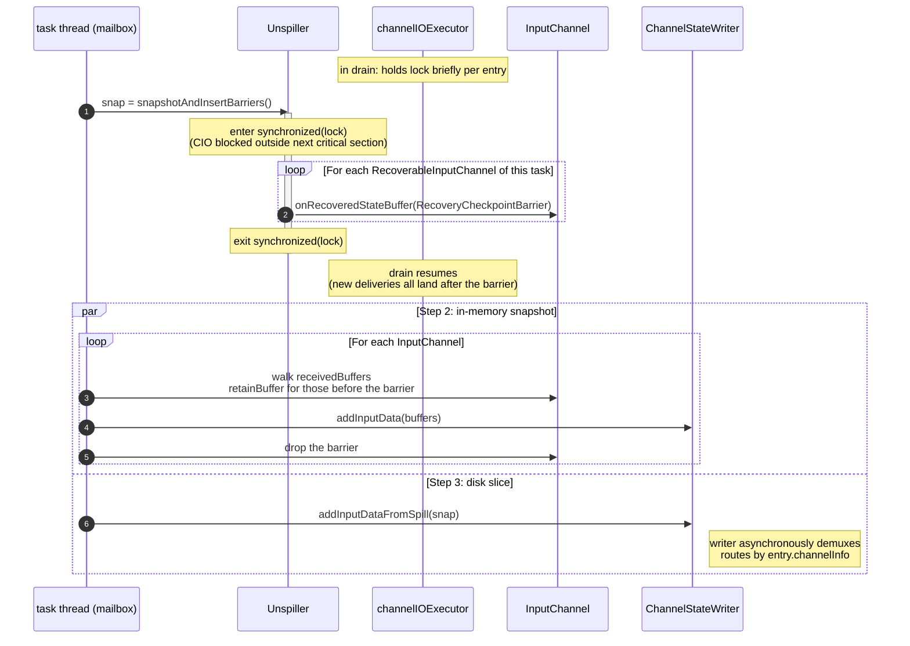

# Cross-thread cooperation: lock principles and the checkpoint protocol

> Scope: the cooperation mechanism between `channelIOExecutor` (the async thread, described in [`unspiller.md`](./unspiller.md)) and the task thread (mailbox; the consumer side is described in [`input_channel.md`](./input_channel.md)). This doc is the contract that the other two docs both adhere to.

## 1. The lock

There is exactly one lock in this design: a private `Object lock` field on `Unspiller`, taken via plain `synchronized (lock)` blocks. It is deliberately not the implicit `this` monitor of `Unspiller`, so the lock is a named, grep-able, `@GuardedBy`-annotated field.

### What the lock guards

| Resource | Why it is guarded by this lock |
|---|---|
| Each `RecoverableInputChannel`'s `recoveredBuffers` write path during recovery (delegated through `onRecoveredStateBuffer` / `finishReadRecoveredState`) | Recovery delivery and the task-thread checkpoint barrier insertion must observe a single cut per channel; that cut is deterministic only if all writes funnel through one lock. |
| `Unspiller.currentSegmentIndex` and `Unspiller.currentOffset` | Their advance must be observed as one atomic action together with the matching channel add-buffer; otherwise the task thread snapshot can see a half-applied entry. |
| The Step 1 barrier-insertion sequence (snapshot disk + add a `RecoveryCheckpointBarrier` to every channel) | The task thread must take the disk cut and insert all per-channel barriers in one atomic interval, so that the recovered-data set is disjoint between "before barrier" and "after barrier". |

The lock does NOT guard: any upstream-side state (`receivedBuffers` on `RemoteInputChannel`, `subpartitionView` on `LocalInputChannel`, `toBeConsumedBuffers`, `hasPendingPriorityEvent`). Those keep their master semantics and their existing per-channel locks.

### Two strong principles

**Principle 1.** Every recovery-side mutation on a `RecoverableInputChannel` happens inside `synchronized (Unspiller.lock)`. Targets (no exceptions):

- drain calling `ch.onRecoveredStateBuffer(buf)` to deliver a recovered buffer;
- drain calling `ch.finishReadRecoveredState()` after the last entry is delivered;
- task thread inserting `RecoveryCheckpointBarrier` into each channel at Step 1 (also performed via `ch.onRecoveredStateBuffer(barrier)` — the barrier is just a sentinel `Buffer`).

**Principle 2.** Advancing `currentSegmentIndex` / `currentOffset` happens in the **same** `synchronized (Unspiller.lock)` block as the matching `ch.onRecoveredStateBuffer(buf)`. They are inseparable; if the lock is split, the task thread can observe a half-applied state and either drop or double-count an entry.

### What each thread does while holding the lock

| Thread | Frequency | Body of the critical section |
|---|---|---|
| `channelIOExecutor` (drain phase) | High — once per spill entry | **Exactly two actions, both pure in-memory** (see [`unspiller.md`](./unspiller.md) §4 step (C)): (1) `ch.onRecoveredStateBuffer(buf)`; (2) `seg.pollNextEntry()` + update `(currentSegmentIndex, currentOffset)`. Microsecond scale. |
| `channelIOExecutor` (drain finish) | Once at end of drain | `ch.finishReadRecoveredState()` on every channel ([`unspiller.md`](./unspiller.md) §4 step (D)). |
| task thread | Exactly once at the moment a checkpoint fires | (1) snapshot every `SpillFileSegment` and capture `(currentSegmentIndex, currentOffset)` as the `DiskSnapshot.startPos`; (2) call `ch.onRecoveredStateBuffer(new RecoveryCheckpointBarrier())` on every channel. Body is fully in-memory; the disk read for Step 3 happens **after** the lock is released, on the writer thread. |

### What happens outside the lock

Drain's slow steps are deliberately kept outside the lock so the critical section stays microsecond-scale and task-thread Step 1 never waits on I/O:

- `ch.requestBufferBlocking()` parks inside `BufferManager.requestBufferBlocking` on the channel's own `bufferQueue` (Java `Object.wait/notifyAll`, woken by `BufferPool`'s `BufferListener` callback). Unspiller never sees the parking primitive directly.
- `seg.readBytesAt(...)` runs on the buf in hand (local to this drain iteration; not yet visible to anyone else).

### Lock order

There are exactly **two** locks involved in any drain or checkpoint path:

| Lock | Scope |
|---|---|
| `Unspiller.lock` | outer; held by drain (per entry) and by task thread (Step 1 only) |
| channel-internal queue monitor | inner; `synchronized(receivedBuffers)` on `RemoteInputChannel` (reused from master — it now guards both `receivedBuffers` and the new `recoveredBuffers`); `synchronized(recoveredBuffers)` on `LocalInputChannel` (Local has no `receivedBuffers` field on master, so the new field's identity serves as its own monitor) |

Global lock order:

```
Unspiller.lock → channel-internal queue monitor
```

All paths obey this order:

| Path | Holds |
|---|---|
| drain delivery (`Unspiller.drain` → `onRecoveredStateBuffer`) | `Unspiller.lock` → channel monitor |
| Step 1 barrier insert (`snapshotAndInsertBarriers` → `onRecoveredStateBuffer`) | `Unspiller.lock` → channel monitor |
| Step 2 in-memory snapshot | channel monitor only |
| `getNextBuffer()` (consumer) | channel monitor only |
| network `onBuffer` (Remote) | channel monitor only (this *is* `receivedBuffers`) |

No third lock is introduced, no path takes the locks in reverse → no cycle, no deadlock.

## 2. Cross-thread interface surface

All three Java interfaces are declared in full in [`overview.md`](./overview.md#6-cross-thread-java-interfaces) §6. This section is a per-method **lock-and-purpose quick reference** for reasoning about coordination semantics; it does not re-declare the interfaces.

### 2.1 `RecoveryCheckpointTrigger` — task thread → unspilling thread

Implemented by `Unspiller`; task thread holds the reference typed as the interface. Declaration: [`overview.md`](./overview.md#61-recoverycheckpointtrigger--task-thread--unspilling-thread) §6.1.

| Method | Lock precondition | Purpose |
|---|---|---|
| `snapshotAndInsertBarriers()` | Caller MUST NOT hold `Unspiller.lock`. Method takes the lock itself. | Atomically (1) snapshot every `SpillFileSegment` + capture `(currentSegmentIndex, currentOffset)` as `DiskSnapshot.startPos`; (2) call `onRecoveredStateBuffer(new RecoveryCheckpointBarrier())` on every channel. Returns the `DiskSnapshot` for Step 3. |

### 2.2 `RecoverableInputChannel` — unspilling thread → physical channels

Implemented by `RecoveredInputChannel`, `LocalInputChannel`, `RemoteInputChannel`. Drain holds references typed as the interface. Declaration: [`overview.md`](./overview.md#62-recoverableinputchannel--unspilling-thread--physical-channels) §6.2.

| Method | Lock precondition | Purpose |
|---|---|---|
| `onRecoveredStateBuffer(Buffer buffer)` | Caller MUST hold `Unspiller.lock`. | Append `buffer` to the channel's `recoveredBuffers`. Used for both real recovered data and the `RecoveryCheckpointBarrier` sentinel (channel impl does not distinguish). |
| `finishReadRecoveredState()` | Caller MUST hold `Unspiller.lock`. | Flip `recoveredStateFinished` to true. The channel completes `stateConsumedFuture` once both this flag is set and `recoveredBuffers` has been fully consumed. |

### 2.3 `BufferRequester` — unspilling thread → buffer pool

A two-method interface; lives in the same package as `Unspiller` so the cross-package access to `RecoveredInputChannel.releaseAllResources()` is hidden inside the single implementation `RecoveredChannelBufferRequester`. Declaration: [`overview.md`](./overview.md#63-bufferrequester--unspilling-thread--buffer-pool) §6.3.

| Method | Lock precondition | Purpose |
|---|---|---|
| `requestBufferBlocking(InputChannelInfo)` | Caller MUST NOT hold `Unspiller.lock`. | Block until a buffer is available from the source channel's pool. Implementation delegates to `RecoveredInputChannel.requestBufferBlocking()` (master existing, with the heap fallback removed). Internally parks on the per-channel `BufferManager.bufferQueue` (`Object.wait`), woken by `BufferPool`'s `BufferListener` callback. |
| `releaseExclusiveBuffers()` | Called once at end of drain, single-threaded (no lock contention). | Release the exclusive buffers held by every source channel served by this requester. Implementation iterates the source channels and calls `RecoveredInputChannel.releaseAllResources()` — master existing method, access modifier promoted from package-private to public. |

## 3. The checkpoint 3-step protocol

Executed by the task thread on the mailbox.



### Step 1 — a single atomic call

```
snap = unspiller.snapshotAndInsertBarriers();
```

Internal behavior in [`unspiller.md`](./unspiller.md) §3. Inside `synchronized (lock)`, Unspiller takes a `DiskSnapshot` and calls `ch.onRecoveredStateBuffer(barrier)` on every channel in `allChannels` (the barrier is a sentinel `Buffer`; from the channel's perspective it is just another append to `recoveredBuffers`).

After releasing the lock:

- `channelIOExecutor` can resume drain; every subsequent add-buffer lands after the barrier in its channel, so Step 2 cannot see them;
- `channelIOExecutor`'s subsequently advanced `currentOffset` is strictly greater than `snap.startPos`; the Step 3 iterator skips entries with `entryPos < startPos`.

### Step 2 — in-memory snapshot

```
for (InputChannel ch : allChannels) {
  List<Buffer> retained = new ArrayList<>();
  synchronized (ch.receivedBuffers) {
    Iterator<Buffer> it = ch.receivedBuffers.iterator();
    while (it.hasNext()) {
      Buffer b = it.next();
      if (b instanceof RecoveryCheckpointBarrier) { it.remove(); break; }
      retained.add(b.retainBuffer());                 // refcount +1
    }
  }
  channelStateWriter.addInputData(
      checkpointId, ch.channelInfo, SEQUENCE_NUMBER_RESTORED,
      CloseableIterator.fromList(retained, Buffer::recycleBuffer));
}
```

- Use `retainBuffer` + iteration, not `poll`: these buffers in the channel still need to be consumed by the task itself.
- The barrier sentinel is removed by `it.remove()`; subsequent task consumption does not see it.

### Step 3 — disk slice

```
channelStateWriter.addInputDataFromSpill(checkpointId, snap);
```

`addInputDataFromSpill` is a new method on `ChannelStateWriter` with signature:

```java
void addInputDataFromSpill(long checkpointId, CloseableIterator<DiskSnapshot.Chunk> chunks);
```

The writer, on its async thread, demuxes by `chunk.channelInfo` into each channel's checkpoint output stream.

### Ordering between Step 2 and Step 3

- Both must run after Step 1;
- There is no ordering dependency between the two (one runs synchronously on the task thread, the other is an async task → writer-thread submission). The recommendation is to keep code linear: do Step 2 first, then Step 3.

## 4. The `RecoveryCheckpointBarrier` sentinel

```java
public final class RecoveryCheckpointBarrier implements Buffer { /* sentinel marker */ }
```

Constraints:

- Only the task thread `add`s it into `receivedBuffers` in Step 1;
- Only the task thread recognizes and `remove`s it in Step 2;
- The operator layer never sees it, because Step 2 always completes before the channel's next task consumption loop (same mailbox tick);
- At the implementation level, this can be a marker field on an existing `Buffer` subclass or a brand-new sentinel type; the final encoding form will be decided during landing, but **the semantics will not change**.

## 5. Correctness proof

Suppose the task thread finishes Step 1 at some moment T. Prove this checkpoint is complete and contains no duplicates:

- **Complete**: at moment T, all unconsumed recovery data falls into two parts —
  - the portion already drained into some channel but not yet consumed by the task → before the barrier in that channel's `receivedBuffers` → captured by Step 2;
  - the portion still on disk (in entry granularity, `entryPos >= snap.startPos`) → captured by Step 3.

- **No duplicates**: inside `synchronized (lock)` at moment T, `currentOffset` and each channel's barrier position are observed at the same time; Principle 2 guarantees that "advance disk offset" and "channel add-buffer" are the same atomic action, so the two positions are a snapshot of the same physical instant — it is impossible for some entry to be before `currentOffset` (i.e. "already delivered") and at the same time after the barrier (i.e. "not yet delivered").

- **drain resuming does not contaminate this checkpoint**: Principle 1 guarantees that before the lock is released, `channelIOExecutor` cannot enter any channel's `recoveredBuffers`; after the lock is released, its next add-buffer is guaranteed to happen-after the already-inserted barrier, so all new deliveries land after the barrier.

## 6. Relationship to the FLINK-39519 class of races

On master, listener switching on `RecoveredInputChannel` (the channel reference changes after `stateConsumedFuture` triggers conversion) once caused a stale-enqueue race. Under this design:

- conversion completes **before** drain starts (filter → conversion → drain is strictly serial; see [`overview.md`](./overview.md) §2);
- `Unspiller.allChannels` is captured with physical channel references at construction time and is never switched again during drain;
- there is no listener-switching window; no possibility of stale-enqueue.
