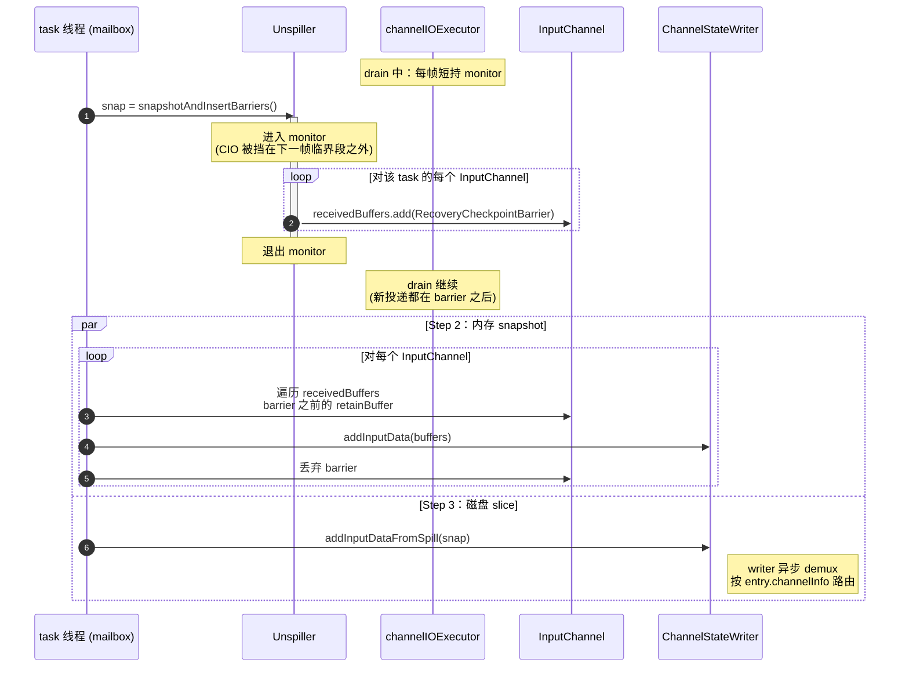

# 跨线程协作：锁原则与 checkpoint 协议

> 范围：`channelIOExecutor`（async 线程，由 [`unspiller.md`](./unspiller.md) 描述）与 task 线程（mailbox，由 [`input_channel.md`](./input_channel.md) 描述消费侧）之间的协作机制。本文是上面两份文档共同遵守的契约。

## 1. 两条强原则

**原则 1：所有写入 `LocalInputChannel` / `RemoteInputChannel` 的动作必须在 `Unspiller.monitor` 内完成。**

适用对象（无一例外）：

- drain 阶段 `channelIOExecutor` 把 recovered buffer 投到 channel；
- drain 完成后 `channelIOExecutor` 投递 `EndOfInputChannelStateEvent` 到 channel；
- checkpoint Step 1 由 task 线程把 `RecoveryCheckpointBarrier` 插到每个 channel。

理由：channel 的 `receivedBuffers` 是 FIFO，task 线程拍盘需要在某一刻把「channel 之前到达的 buffer」与「channel 之后到达的 buffer」一刀切开。所有写者都通过同一把锁才能让这一刀切的位置是确定的。

**原则 2：`Unspiller` 内部 `(currentSegmentIndex, currentOffset)` 的推进，必须与对应的 channel add-buffer 在同一个临界段内。**

理由：task 线程拍盘时同时取「磁盘消费进度 = `(currentSegmentIndex, currentOffset)`」与「channel 内存数据 = `receivedBuffers` 到 barrier 为止」。如果 `offset` 推进与 add-buffer 不在同一临界段，task 线程可能拍到：

- offset 已推进但 buffer 还没进 channel → 这条 entry 既不在 disk snapshot 也不在 memory snapshot，**丢数据**；
- 或反过来 buffer 已进 channel 但 offset 未推进 → 这条 entry 同时落在两边，**重复**。

两条原则共同保证 task 线程拍盘时 (内存 + 磁盘) 集合完整且 disjoint，是整个 3-step 协议正确性的基础。

## 2. 锁的使用画像

| 持有者 | 频次 | 时长 | 在临界段内做什么 |
|---|---|---|---|
| `channelIOExecutor`（drain 阶段） | 高频，每条 entry 一次 | 毫秒级（一次盘读 + 投递 channel + 更新 offset） | (读盘 → add-buffer → 推进 offset)，三件事强绑定 |
| task 线程 | 极低频，**只在 checkpoint 触发的瞬间一次** | 毫秒级（拍盘 + N 个 channel 各插一条 barrier） | 见下方 Step 1 |

锁序固定 `Unspiller.monitor → InputChannel.receivedBuffers`，两个持有者都同向，无环、无死锁。

`channelIOExecutor` 的 buffer 申请 park（`LocalBufferPool.getAvailableFuture()`）**必须在 monitor 外**进行 —— 否则 buffer pool 抖动会顺带阻塞 task 线程 Step 1。

## 3. Checkpoint 3-step 协议

由 task 线程在 mailbox 上执行。



### Step 1 —— 一次原子调用

```
snap = unspiller.snapshotAndInsertBarriers();
```

内部行为见 [`unspiller.md`](./unspiller.md) §3。Unspiller 在 monitor 内完成：拍 `DiskSnapshot` + 给 `allChannels` 每个 channel 末尾 `add(RecoveryCheckpointBarrier)`。

退出 monitor 后：

- `channelIOExecutor` 可继续 drain；其后续 add-buffer 在每个 channel 都落在 barrier 之后，Step 2 看不到；
- `channelIOExecutor` 后续推进的 `currentOffset` 一定 > `snap.startPos`，Step 3 的 iterator 会跳过 `entryPos < startPos` 的 entry。

### Step 2 —— 内存 snapshot

```
for (InputChannel ch : allChannels) {
  List<Buffer> retained = new ArrayList<>();
  synchronized (ch.receivedBuffers) {
    Iterator<Buffer> it = ch.receivedBuffers.iterator();
    while (it.hasNext()) {
      Buffer b = it.next();
      if (b instanceof RecoveryCheckpointBarrier) { it.remove(); break; }
      retained.add(b.retainBuffer());                 // 引用计数 +1
    }
  }
  channelStateWriter.addInputData(
      checkpointId, ch.channelInfo, SEQUENCE_NUMBER_RESTORED,
      CloseableIterator.fromList(retained, Buffer::recycleBuffer));
}
```

- 用 `retainBuffer` + 遍历，不 `poll`：channel 里这些 buffer 还要被 task 自己消费。
- barrier sentinel 用 `it.remove()` 抹掉，task 后续消费看不到它。

### Step 3 —— 磁盘 slice

```
channelStateWriter.addInputDataFromSpill(checkpointId, snap);
```

`addInputDataFromSpill` 是 `ChannelStateWriter` 的新方法，签名：

```java
void addInputDataFromSpill(long checkpointId, CloseableIterator<DiskSnapshot.Chunk> chunks);
```

writer 在 async 线程上按 `chunk.channelInfo` demux 到各 channel 的 checkpoint output stream。

### Step 2 与 Step 3 的顺序

- 都必须在 Step 1 之后；
- 二者之间无顺序依赖（一个是 task 线程同步执行，一个是 task → writer 线程的异步投递）。落地建议代码上线性：先 Step 2 后 Step 3。

## 4. `RecoveryCheckpointBarrier` Sentinel

```java
public final class RecoveryCheckpointBarrier implements Buffer { /* sentinel marker */ }
```

约束：

- 仅 task 线程在 Step 1 内 `add` 进 `receivedBuffers`；
- 仅 task 线程在 Step 2 内识别并 `remove`；
- 算子层不会看到它，因为 Step 2 一定在 channel 的下一次 task 消费循环之前完成（同一 mailbox tick）；
- 实现层面可继承现有 `Buffer` 子类加 marker 字段，或新建 sentinel 类型；最终编码方式落地时定，**语义不会再变**。

## 5. 正确性论证

设 task 线程在某一时刻 T 完成 Step 1。证明本次 checkpoint 完整且无重复：

- **完整**：T 时刻所有未消费的 recovery 数据由两部分组成 ——
  - 已被 drain 投到某个 channel 但 task 尚未消费的部分 → 在该 channel `receivedBuffers` 的 barrier 之前 → Step 2 捕获；
  - 还在磁盘上的部分（按 entry 维度 = `entryPos >= snap.startPos`）→ Step 3 捕获。

- **不重复**：在 monitor 内 T 时刻同时观察 `currentOffset` 与每个 channel 的 barrier 位置；原则 2 保证「磁盘 offset 推进」与「channel add-buffer」是同一原子动作，所以这两套位置是同一物理时刻的快照 —— 不可能某条 entry 在 `currentOffset` 之前（属于「已投递」）的同时又出现在 barrier 之后（属于「未投递」）。

- **drain 继续后不污染本次 checkpoint**：原则 1 保证 monitor 释放前 `channelIOExecutor` 进不了任何 channel 的 `receivedBuffers`；monitor 释放后它的下一次 add-buffer 一定 happen-after 已插入的 barrier，所以新投递都在 barrier 之后。

## 6. 与 FLINK-39519 类 race 的关系

master 上 `RecoveredInputChannel` 上的 listener 切换（`stateConsumedFuture` 触发 conversion 后 channel 引用变化）曾导致 stale-enqueue race。本设计下：

- conversion 完成在 drain 启动**之前**（filter → conversion → drain 严格串行，见 [`overview.md`](./overview.md) §2）；
- `Unspiller.allChannels` 在构造时一次性获得物理 channel 引用，drain 阶段不会再切换；
- 没有 listener 切换窗口，无 stale-enqueue 可能。
