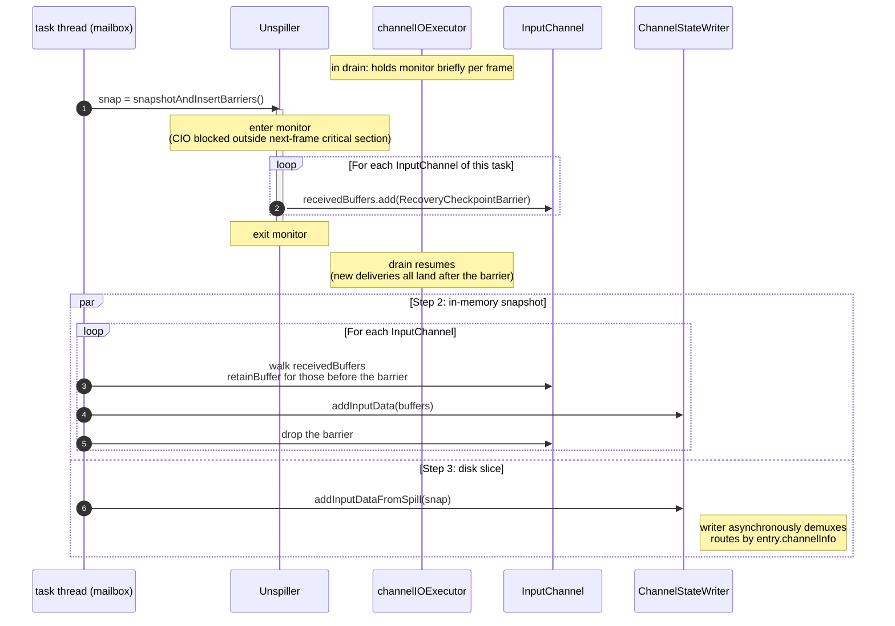

# Cross-thread cooperation: lock principles and the checkpoint protocol

> Scope: the cooperation mechanism between `channelIOExecutor` (the async thread, described in [`unspiller.md`](./unspiller.md)) and the task thread (mailbox; the consumer side is described in [`input_channel.md`](./input_channel.md)). This doc is the contract that the other two docs both adhere to.

## 1. Two strong principles

**Principle 1: every write into `LocalInputChannel` / `RemoteInputChannel` must happen inside `Unspiller.monitor`.**

Targets (no exceptions):

- the drain phase `channelIOExecutor` delivering a recovered buffer into a channel;
- after drain finishes, `channelIOExecutor` delivering `EndOfInputChannelStateEvent` into a channel;
- checkpoint Step 1, the task thread inserting `RecoveryCheckpointBarrier` into each channel.

Reason: a channel's `receivedBuffers` is a FIFO. At snapshot time the task thread needs to draw a single cut separating "buffers that arrived before" from "buffers that arrived after" in the channel. Only when all writers go through the same lock is the position of that cut deterministic.

**Principle 2: advancing `Unspiller`'s internal `(currentSegmentIndex, currentOffset)` must happen in the same critical section as the corresponding channel add-buffer.**

Reason: at snapshot time the task thread simultaneously takes "disk consumption progress = `(currentSegmentIndex, currentOffset)`" and "channel in-memory data = `receivedBuffers` up to the barrier". If `offset` advance and add-buffer were not in the same critical section, the task thread could observe:

- offset already advanced but the buffer has not yet entered the channel → this entry is in neither the disk snapshot nor the memory snapshot, **data lost**;
- or, conversely, the buffer is already in the channel but the offset hasn't advanced → this entry lands in both sides, **duplicated**.

Together the two principles guarantee that at snapshot time the (memory + disk) sets are complete and disjoint — this is the foundation of the entire 3-step protocol's correctness.

## 2. Usage profile of the lock

| Holder | Frequency | Duration | What happens inside the critical section |
|---|---|---|---|
| `channelIOExecutor` (drain phase) | High, once per entry | Millisecond scale (one disk read + delivery + offset update) | (disk read → add-buffer → advance offset), the three tightly bound |
| Task thread | Extremely low, **exactly once at the moment a checkpoint fires** | Millisecond scale (snapshot + insert one barrier into each of N channels) | See Step 1 below |

The lock order is fixed at `Unspiller.monitor → InputChannel.receivedBuffers`; both holders go in the same direction; no cycle, no deadlock.

The `channelIOExecutor`'s buffer-allocation parking (`LocalBufferPool.getAvailableFuture()`) **must happen outside the monitor** — otherwise buffer-pool jitter would in turn block task-thread Step 1.

## 3. The checkpoint 3-step protocol

Executed by the task thread on the mailbox.



### Step 1 — a single atomic call

```
snap = unspiller.snapshotAndInsertBarriers();
```

Internal behavior in [`unspiller.md`](./unspiller.md) §3. Inside the monitor, Unspiller takes a `DiskSnapshot` + `add(RecoveryCheckpointBarrier)` to the tail of each channel in `allChannels`.

After leaving the monitor:

- `channelIOExecutor` can resume drain; every subsequent add-buffer lands after the barrier in its channel, so Step 2 cannot see them;
- `channelIOExecutor`'s subsequently advanced `currentOffset` is strictly greater than `snap.startPos`; the Step 3 iterator skips entries with `entryPos < startPos`.

### Step 2 — in-memory snapshot

```
for (InputChannel ch : allChannels) {
  List<Buffer> retained = new ArrayList<>();
  synchronized (ch.receivedBuffers) {
    Iterator<Buffer> it = ch.receivedBuffers.iterator();
    while (it.hasNext()) {
      Buffer b = it.next();
      if (b instanceof RecoveryCheckpointBarrier) { it.remove(); break; }
      retained.add(b.retainBuffer());                 // refcount +1
    }
  }
  channelStateWriter.addInputData(
      checkpointId, ch.channelInfo, SEQUENCE_NUMBER_RESTORED,
      CloseableIterator.fromList(retained, Buffer::recycleBuffer));
}
```

- Use `retainBuffer` + iteration, not `poll`: these buffers in the channel still need to be consumed by the task itself.
- The barrier sentinel is removed by `it.remove()`; subsequent task consumption does not see it.

### Step 3 — disk slice

```
channelStateWriter.addInputDataFromSpill(checkpointId, snap);
```

`addInputDataFromSpill` is a new method on `ChannelStateWriter` with signature:

```java
void addInputDataFromSpill(long checkpointId, CloseableIterator<DiskSnapshot.Chunk> chunks);
```

The writer, on its async thread, demuxes by `chunk.channelInfo` into each channel's checkpoint output stream.

### Ordering between Step 2 and Step 3

- Both must run after Step 1;
- There is no ordering dependency between the two (one runs synchronously on the task thread, the other is an async task → writer-thread submission). The recommendation is to keep code linear: do Step 2 first, then Step 3.

## 4. The `RecoveryCheckpointBarrier` sentinel

```java
public final class RecoveryCheckpointBarrier implements Buffer { /* sentinel marker */ }
```

Constraints:

- Only the task thread `add`s it into `receivedBuffers` in Step 1;
- Only the task thread recognizes and `remove`s it in Step 2;
- The operator layer never sees it, because Step 2 always completes before the channel's next task consumption loop (same mailbox tick);
- At the implementation level, this can be a marker field on an existing `Buffer` subclass or a brand-new sentinel type; the final encoding form will be decided during landing, but **the semantics will not change**.

## 5. Correctness proof

Suppose the task thread finishes Step 1 at some moment T. Prove this checkpoint is complete and contains no duplicates:

- **Complete**: at moment T, all unconsumed recovery data falls into two parts —
  - the portion already drained into some channel but not yet consumed by the task → before the barrier in that channel's `receivedBuffers` → captured by Step 2;
  - the portion still on disk (in entry granularity, `entryPos >= snap.startPos`) → captured by Step 3.

- **No duplicates**: inside the monitor at moment T, `currentOffset` and each channel's barrier position are observed at the same time; Principle 2 guarantees that "advance disk offset" and "channel add-buffer" are the same atomic action, so the two positions are a snapshot of the same physical instant — it is impossible for some entry to be before `currentOffset` (i.e. "already delivered") and at the same time after the barrier (i.e. "not yet delivered").

- **drain resuming does not contaminate this checkpoint**: Principle 1 guarantees that before the monitor is released, `channelIOExecutor` cannot enter any channel's `receivedBuffers`; after the monitor is released, its next add-buffer is guaranteed to happen-after the already-inserted barrier, so all new deliveries land after the barrier.

## 6. Relationship to the FLINK-39519 class of races

On master, listener switching on `RecoveredInputChannel` (the channel reference changes after `stateConsumedFuture` triggers conversion) once caused a stale-enqueue race. Under this design:

- conversion completes **before** drain starts (filter → conversion → drain is strictly serial; see [`overview.md`](./overview.md) §2);
- `Unspiller.allChannels` is captured with physical channel references at construction time and is never switched again during drain;
- there is no listener-switching window; no possibility of stale-enqueue.
