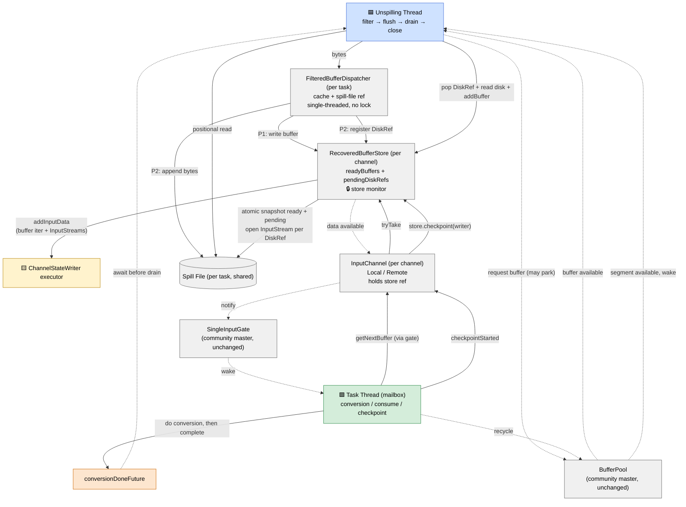
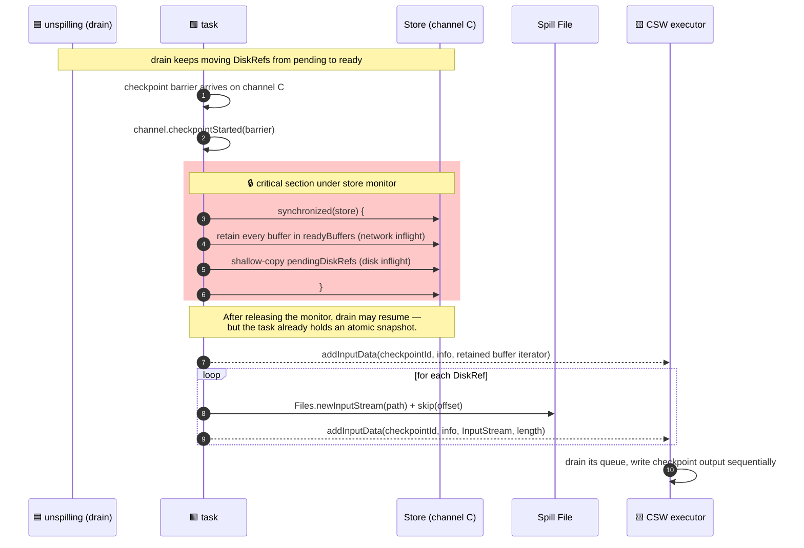

# Runtime Overview

> Target state after Tradeoff 1 = B and Tradeoff 6 = B. Current implementation is not depicted.

## Legend

- Solid arrow → main data flow
- Dashed arrow ⤳ wake-up / notification
- Colors: 🟦 unspilling thread ｜ 🟩 task thread ｜ 🟨 ChannelStateWriter executor ｜ ⬜ shared object

## The Diagram

## Threads

| Thread | Lifecycle | What it does |
|---|---|---|
| 🟦 unspilling-`<task>` | Single-thread executor, lives from task setup until recovery completes | filter → flush → await `conversionDoneFuture` → drain → close. Exclusive owner of dispatcher state and spill-file writes. |
| 🟩 task main thread (mailbox) | Whole task lifetime | Triggers conversion, consumes buffers from store, recycles them, handles checkpoint barriers. |
| 🟨 ChannelStateWriter executor | Single thread, async | Consumes the `addInputData` queue and writes checkpoint output. Does not touch dispatcher or store. |

## Objects

| Object | Scope | Key state |
|---|---|---|
| Dispatcher | per task | byte cache, spill-file reference, readers list. All fields owned by the unspilling thread; no lock. |
| Spill File | per task, shared across channels | `FileChannel` + `Path`, append-only by unspilling, positional read by everyone. |
| Store | per channel | `readyBuffers`, `pendingDiskRefs`, `dataAvailableListener` — all guarded by the store's intrinsic monitor (the only extra lock this branch adds). |
| SingleInputGate | per gate | Untouched community-master behaviour (`inputChannelsWithData` monitor, `channels[]`, etc.). |
| BufferPool | per task | Untouched community-master behaviour. |

## Phases at a Glance

1. **Filter** — unspilling thread feeds bytes through the dispatcher. The dispatcher chooses **P1** (network buffer → `store.readyBuffers`) when the pool has capacity, otherwise **P2** (spill bytes to disk + register `DiskRef` in `store.pendingDiskRefs`). Task thread does nothing yet (Tradeoff 1 = B).
2. **Conversion** — once filter finishes, task thread does the standard `RecoveredInputChannel → Local/Remote` swap inside the gate's `inputChannelsWithData` monitor and completes `conversionDoneFuture`.
3. **Drain** — unspilling thread, blocked on `conversionDoneFuture` until conversion is done, then loops over channels round-robin: pop next `DiskRef`, request a buffer (may park), positional read disk → buffer, `store.addBuffer`.
4. **Consume** — task thread reads buffers via `gate → store.tryTake`. Each `buffer.recycle` returns a segment to `BufferPool`, which wakes the unspilling thread blocked on `requestBufferBlocking`.
5. **Checkpoint** — see the dedicated diagram below.

## Checkpoint: Atomic Snapshot of Ready + Pending

The invariant that makes this design correct: **at checkpoint time the store monitor is taken once, and both `readyBuffers` (network inflight) and `pendingDiskRefs` (disk inflight) are snapshotted inside the same critical section.** A two-pass scheme would let drain move an entry from pending to ready in between, losing it from both snapshots.

### Why the snapshot must be atomic

Drain's atomic step inside the store monitor is `pendingDiskRefs.pollFirst()` + `readyBuffers.add(buffer)`. Therefore at any instant a given `DiskRef e` is in **exactly one** of `pendingDiskRefs` or `readyBuffers` — never neither, never both. Snapshotting both queues under one monitor lock captures `e` exactly once.

If checkpoint instead locked twice (first for ready, then for pending), drain could slip in between the two locks, pop `e` from pending, and add the buffer to ready **after** the ready snapshot was already taken. `e` would then be absent from both snapshots and lost from the checkpoint.

### Channels are independent

Each channel snapshots its own store on its own thread path, with no cross-channel coordination. Dispatcher is not involved. The price is that the per-channel disk reads (`InputStream` per `DiskRef`) end up as random I/O on the shared spill file — accepted under Tradeoff 6 = B because seek cost is negligible on SSD/NVMe.

## Locks Introduced by This Branch (Summary)

Only one: the `RecoveredBufferStore` intrinsic monitor.

Everything else (gate's `inputChannelsWithData` monitor, channel-side `receivedBuffers` monitors, `BufferPool` internals, `requestLock`) is community-master behaviour and is reused unchanged.

Non-lock coordination: `conversionDoneFuture` (a `CompletableFuture`) to serialise filter → conversion → drain.
