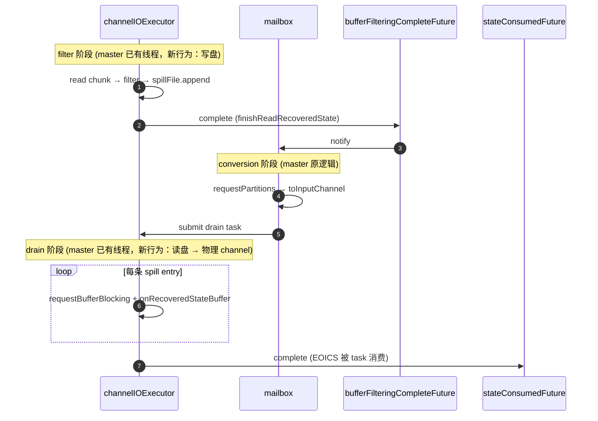

# 新方案落地设计

> 本文给基于 **master 分支** 的落地细节。上层思路、线程协作、锁策略、公共接口见 [`overview.md`](./overview.md)。本文不引用任何当前分支遗留的类名（如已废弃的协调器、buffer store 等），所有新逻辑直接在 master 上增量开发。
>
> 适用范围：`checkpointing during recovery + filter` 功能开启。功能关闭时走 master 原逻辑，本文不涉及。

---

## 0. Master 上的现状

下列模块本方案直接复用、零改动或仅做小扩展，记录下来避免重复发明：

- `StreamTask` 持有 `channelIOExecutor`（单线程 executor），用于跑 recovery 主体。
- `SequentialChannelStateReaderImpl.readInputData` 从 state handle 顺序读 chunk；每个 chunk 通过 `ChannelStateChunkReader` 解出 → 调 `InputChannelRecoveredStateHandler.recover`。
- `RecoveredChannelStateHandler.recover` 在 master 上：filter 开启时调 `ChannelStateFilteringHandler.filterAndRewrite` 拿到过滤后 buffer list，对每个 buffer 调 `RecoveredInputChannel.onRecoveredStateBuffer`；filter 关闭时直接走 `onRecoveredStateBuffer`。**本方案在 filter 开启路径上把「调 `onRecoveredStateBuffer`」改成「写盘」**，其余不变。
- `ChannelStateFilteringHandler.filterAndRewrite` 内部走 `bufferSupplier` 拿 buffer 完成重新序列化。master 上 `bufferSupplier` 是 `channel::requestBufferBlocking`；**本方案改成从一个 task 全局的可复用 buffer 提供**。
- `RecoveredInputChannel.bufferFilteringCompleteFuture` / `stateConsumedFuture` 两个 future：本方案完全沿用，作为 filter→conversion 和 drain→requestPartitions 的衔接点（详见 §2）。
- `SingleInputGate.requestPartitions` → `convertRecoveredInputChannels` → `RecoveredInputChannel.toInputChannel(ArrayDeque<Buffer>)`：conversion 链路，零改动；本方案下移交的 `ArrayDeque<Buffer>` 永远是空的（因为 filter 不再写 RecoveredInputChannel）。
- `RecoveredInputChannel.checkpointStarted` throw `CHECKPOINT_DECLINED_TASK_NOT_READY`：保持。Conversion 由 `bufferFilteringCompleteFuture` 提前触发，barrier 到达时 channel 已是物理 channel。
- `ChannelStatePersister.startPersisting / maybePersist` → `ChannelStateWriter.addInputData`：在 task 线程消费 channel buffer 时记账 checkpoint，保持。
- `ChannelStateWriter` 已有 `addInputData(checkpointId, channelInfo, sequenceNumber, CloseableIterator<Buffer>)`；新增一个 `addInputDataFromSpill`（§6）。

---

## 1. 三阶段时序

filter / conversion / drain 三段全部基于 master 已有的两条线程，只在 filter 开启时改造 `channelIOExecutor` 的内部行为：



- filter / drain 都在 `channelIOExecutor` 单线程上跑，二者天然互斥；conversion 在 mailbox 上，落在 filter 完成与 drain 启动之间。
- `channelIOExecutor` 是 master 已有的线程，本方案没有引入新线程。filter 开启时它的内部任务从「读 chunk → filter → 写 channel」变成「读 chunk → filter → 写盘」（filter 阶段）以及「读盘 → 写 channel」（drain 阶段）。filter 关闭时这条线程沿用 master 原行为，本文档不涉及。
- 与 task 线程并发的只有 §5 的 checkpoint 触发那一瞬间。

---

## 2. Filter 阶段

### 2.1 数据流改动

master `RecoveredChannelStateHandler.recover` 的逻辑改为：

```
if (filteringHandler != null) {
    List<Buffer> filtered = filteringHandler.filterAndRewrite(
        gateIdx, oldSubtaskIdx, channelIdx, retainedBuffer, sharedBufferSupplier);
    for (Buffer b : filtered) {
        filteredBufferWriter.write(b.getMemorySegment(), b.readableBytes(),
                                   channelInfo);
        b.recycleBuffer();
    }
} else {
    // unchanged: 仍然 channel.onRecoveredStateBuffer(...)
}
```

要点：

- filter 输出的每个 buffer 一律走 `filteredBufferWriter.write(...)` 写盘；**不再调 `channel.onRecoveredStateBuffer`**。
- `bufferSupplier`（filter 内部用来重新序列化的 buffer 来源）从 `channel::requestBufferBlocking` 切换到全局共享的可复用 buffer（见 §2.2）—— filter 不再受 buffer pool 限制。
- 写完 buffer 立刻 `recycleBuffer`：filter 阶段总内存占用 = `prefilter + postfilter`，与 channel 数量无关。

### 2.2 `FilteredBufferWriter` 接口

新增的核心写盘接口（`channelIOExecutor`内部使用，task 线程不直接调用）：

```java
@Internal
public interface FilteredBufferWriter extends Closeable {
    /** Appends a filtered, fully serialized chunk for the given destination channel. */
    void write(byte[] data, int length, InputChannelInfo channelInfo) throws IOException;

    /** Flushes any in-memory accumulator to disk; called at finishReadRecoveredState. */
    void flush() throws IOException;
}
```

`FilteredBufferWriterImpl` 内部状态（同一 task 共享，与 master 上 heap 兜底的潜在无界堆分配相比，内存占用上限固定为 `prefilter + postfilter` 两段常数大小）：

| 字段 | 说明 |
|---|---|
| `prefilterBuffer: byte[]` | task 全局一份。filter 通过 `bufferSupplier` 拿这块内存；filter 完成一次拷贝后即可复用 |
| `postfilterBuffer: byte[]` | task 全局一份。filter 输出累积到这里；满了 `flush` 到 spill 文件；同一 entry 对应同一 `channelInfo` |
| `currentChannel: InputChannelInfo` | postfilterBuffer 当前累积的 channel；遇到新 channel 时先刷盘 |
| `spillFile: SpillFile` | 实际落盘对象（§3） |

写盘策略（`write` 方法）：

```
if (postfilterBuffer 不空 && currentChannel != incoming channel)
    spillFile.append(postfilterBuffer, currentChannel) → 清零
if (data 直接放不下)
    spillFile.append(postfilterBuffer, currentChannel) → 清零
postfilterBuffer 追加 data
currentChannel = incoming channel
if (postfilterBuffer 满)
    spillFile.append(postfilterBuffer, currentChannel) → 清零
```

`flush` 在 `finishReadRecoveredState` 调用：把残留 postfilterBuffer 刷盘 → `spillFile.finishWriting()` 把当前文件 freeze。然后 `RecoveredInputChannel.finishReadRecoveredState` 走 master 已有路径，往每个 RecoveredInputChannel 投递一个 EOICS-占位（在本方案下队列本来就空，这只是触发后续 future）→ 完成 `bufferFilteringCompleteFuture`。

---

## 3. `SpillFile`

新类，整个 task 一份；不与具体 channel 绑定，所有 channel 的 entry 混合写在同一组文件里。

```java
public final class SpillFile implements Closeable {
    SpillFile(String[] tempDirs, int maxEntryBytes);

    /** Appends one entry. Lazily opens first file; rotates to a new file when current
     *  exceeds threshold (e.g. 64 MB). Returns immediately after fsync-less write. */
    void append(byte[] data, int length, InputChannelInfo channelInfo) throws IOException;

    /** Called at end of filter; freezes the last file so no further append is allowed. */
    void finishWriting();

    /** Live view of all files (frozen + currently written). Used by drain + snapshot. */
    List<SpillFileSegment> segments();
}
```

`SpillFileSegment` 抽象一个物理 spill 文件：

```java
public final class SpillFileSegment implements Closeable {
    int segmentIndex;          // monotonic; 全局 FIFO 排序键
    Path filePath;
    Deque<Entry> entries;      // 每条 entry 的元数据；写 freeze 之前可追加
    boolean frozen;

    Entry pollNextEntry();     // drain 推进读指针时调
    Entry peekNextEntry();
    SpillFileSegment snapshot();// 克隆 entries 的当前快照（freeze 与否都允许）
    void readBytesAt(long offset, int length, byte[] dest) throws IOException;
}

public static final class Entry {
    InputChannelInfo channelInfo;
    long offset;     // 绝对偏移（在该 segment 文件内）
    int  length;     // 字节数
}
```

要点：

- 文件内容只是 raw bytes，不写元数据头。每条 entry 的 `(channelInfo, offset, length)` 仅在 `entries` 队列里，filter 阶段写盘的同时维护。
- 多文件支持：超过单文件阈值（如 64MB）开新文件；`segments()` 按写入顺序返回；`segmentIndex` 给跨文件全局 FIFO。
- `snapshot()` 克隆 entries 队列（不依赖 frozen 状态），用于 §5 的 disk snapshot；底层 `FileChannel` 通过新的只读 handle 打开，与 drain 端互不影响。
- 关闭语义：所有 segment 全部 drain 完后由 `Unspiller` 调 `close()` 删文件。

---

## 4. `Unspiller`

新类，**跑在 master 已有的 `channelIOExecutor` 上**（不是新线程，只是 drain 阶段的工作对象），承接 filter 完成后到 drain 完成之间的全部职责，是公共接口的提供者。

```java
@Internal
public final class Unspiller implements Closeable {
    private final SpillFile spillFile;
    private final List<InputChannel> allChannels;                       // task 的全部 channel
    private final Map<InputChannelInfo, InputChannel> channelByInfo;    // 由 allChannels 派生
    private final Object monitor = new Object();   // overview.md 中的「全局锁」

    // Drain 进度，写在 monitor 内
    private int  currentSegmentIndex;
    private long currentOffset;

    /** allChannels 是该 task 的 InputChannel 全集（rescale 后已稳定，recovery 期间不变）。
     *  drain 阶段从 channelByInfo 按 channelInfo 路由；checkpoint Step 1 直接迭代 allChannels
     *  给每个 channel 插 barrier，无需调用方再传一遍。 */
    public Unspiller(SpillFile spillFile, List<InputChannel> allChannels);

    /** Called by channelIOExecutor after conversion completes. Sequentially drains
     *  every segment into its target physical channel. Returns when all entries
     *  are delivered. Then submits EndOfInputChannelStateEvent to each physical
     *  channel (or caller does — see §4.3). */
    public void drain() throws IOException, InterruptedException;

    /** Called by task thread at checkpoint trigger. Atomically captures the current
     *  on-disk pending data AND inserts a RecoveryCheckpointBarrier into every
     *  channel's receivedBuffers (iterating allChannels), so that buffers delivered
     *  after this call land past the barrier in each channel. */
    public DiskSnapshot snapshotAndInsertBarriers();
}
```

### 4.1 `drain()` 主循环

```
drain() {
    for (SpillFileSegment seg : spillFile.segments()) {
        while (true) {
            Entry e = seg.peekNextEntry();
            if (e == null) break;
            InputChannel ch = channelByInfo.get(e.channelInfo);

            // (A) 申请 buffer —— 在 monitor 之外 park 在 BufferPool.getAvailableFuture
            Buffer buf = ch.requestBufferBlocking();

            // (B) 短临界段：读盘 + 投递 + 推进读指针
            synchronized (monitor) {
                seg.readBytesAt(e.offset, e.length, buf.getMemorySegment().asByteArray());
                buf.setSize(e.length);                  // 视实际 Buffer API 调整
                ch.onRecoveredStateBuffer(buf);         // §4.4 提到的物理 channel 新方法
                seg.pollNextEntry();                    // 从 entries 队列移除
                currentSegmentIndex = seg.segmentIndex;
                currentOffset = e.offset + e.length;
            }
        }
        seg.close();    // 该 segment 已经 drain 完，关闭并删文件
    }
}
```

不变量：

- (A) 是唯一可能 park 的点，park 在已有的 `LocalBufferPool.getAvailableFuture()` 上（master 已实现，不引入新机制）。
- (B) 是短临界段，**不在 monitor 内做任何 park / 网络 / Future 等待**。`readBytesAt` 是同步顺序读，单条 entry 大小受 §3 约束，耗时确定。
- 锁序固定 `Unspiller.monitor → InputChannel.receivedBuffers`；`onRecoveredStateBuffer` 内部进入 `synchronized(receivedBuffers)`，是嵌套但同向，无环。

### 4.2 `snapshotAndInsertBarriers()`

```
snapshotAndInsertBarriers() {
    synchronized (monitor) {
        List<SpillFileSegment> snaps = new ArrayList<>();
        for (SpillFileSegment seg : spillFile.segments()) snaps.add(seg.snapshot());
        DiskSnapshot snap = new DiskSnapshot(
            snaps,
            new SnapshotStartPos(currentSegmentIndex, currentOffset)
        );
        for (InputChannel ch : allChannels) {   // 来自构造时传入的全集，外部无需再传
            synchronized (ch.receivedBuffers) {
                ch.receivedBuffers.add(new RecoveryCheckpointBarrier());
            }
        }
        return snap;
    }
}
```

正确性：

- 调用在 task 线程，进 `monitor` 时 `channelIOExecutor`必然处于 (A) 等 buffer 或 (B) 临界段之间，二者都不会持 monitor，task 线程几个 ns 内即可拿到锁。
- 拍 snapshot 时 `channelIOExecutor`不可能更新 `currentOffset` 或 `seg.entries`，所以「磁盘已交付 vs 未交付」的边界清晰。
- 插 barrier 时 `channelIOExecutor`不可能进入 `receivedBuffers`（它要先经过 monitor），所以每个 channel 的「barrier 之前 vs 之后」边界清晰。
- 退出 monitor 后 `channelIOExecutor`恢复；它后续投递的 buffer 在 barrier 之后（§5 Step 2 看不到），它后续推进的 `currentOffset` 比 snapshot 的 `startPos` 大（§5 Step 3 跳过）。

### 4.3 drain 结束语义

`drain()` 跑完所有 segment 之后，由 `channelIOExecutor` 紧接着调用：

```
for (InputChannel ch : allChannels) {
    Buffer eoics = EventSerializer.toBuffer(EndOfInputChannelStateEvent.INSTANCE, false);
    synchronized (unspiller.monitor) {
        synchronized (ch.receivedBuffers) {
            ch.onRecoveredStateBuffer(eoics);
        }
    }
}
```

task 线程消费物理 channel 看到 EOICS → 完成 `stateConsumedFuture`（master 已有语义）。投递 EOICS 进 monitor 内是因为：要与并发触发的 checkpoint barrier 顺序一致（EOICS 要么落在 barrier 之前进本次 checkpoint，要么之后，不能两边都不属于）。

### 4.4 物理 channel 上的 `onRecoveredStateBuffer`

master 上该方法只在 `RecoveredInputChannel` 上。本方案**提到基类 `InputChannel`**（默认实现）；`RecoveredInputChannel` 上的实现保持，`LocalInputChannel` / `RemoteInputChannel` 不显式 override，直接用基类版本。

基类实现逐字对齐 master 上 `RecoveredInputChannel.onRecoveredStateBuffer`：

```java
public void onRecoveredStateBuffer(Buffer buffer) {
    boolean wasEmpty;
    synchronized (receivedBuffers) {
        if (isReleased) { buffer.recycleBuffer(); return; }
        wasEmpty = receivedBuffers.isEmpty();
        receivedBuffers.add(buffer);
    }
    if (wasEmpty) notifyChannelNonEmpty();
}
```

`notifyChannelNonEmpty()` 在 master 上已经在所有 InputChannel 子类里实现（用 `inputGate` 引用），本方案不动。`queueChannel` / `inputChannelsWithData` 走 master 形态。

---

## 5. Checkpoint 3-step（详细化）

由 task 线程触发，时机沿用 master 现有 checkpoint coordinator 路径。

### Step 1 — `Unspiller.snapshotAndInsertBarriers`

见 §4.2，单次调用完成。返回 `DiskSnapshot snap`。

### Step 2 — 内存 buffer 进 checkpoint

```
for (InputChannel ch : allChannels) {
    List<Buffer> retained = new ArrayList<>();
    synchronized (ch.receivedBuffers) {
        Iterator<Buffer> it = ch.receivedBuffers.iterator();
        while (it.hasNext()) {
            Buffer b = it.next();
            if (b instanceof RecoveryCheckpointBarrier) {
                it.remove();   // 丢弃 barrier
                break;
            }
            retained.add(b.retainBuffer());   // 计数 +1 给 checkpoint 引用
        }
    }
    channelStateWriter.addInputData(
        checkpointId, ch.channelInfo,
        ChannelStateWriter.SEQUENCE_NUMBER_RESTORED,
        CloseableIterator.fromList(retained, Buffer::recycleBuffer));
}
```

要点：

- 用 `retainBuffer` + 遍历，不 `poll`：channel 里这些 buffer 还要被 task 自己消费，不能从队列里搬走。
- barrier sentinel 在迭代时用 `it.remove()` 抹掉，task 后续消费看不到它。
- 整个遍历持有 `ch.receivedBuffers` 监视器，避免与 `channelIOExecutor`并发；持有时间正比于待 retain 的 buffer 数，与 master 上 `ChannelStatePersister.startPersisting` 同量级。

### Step 3 — 磁盘 slice 进 checkpoint

```
channelStateWriter.addInputDataFromSpill(checkpointId, snap);
```

`addInputDataFromSpill` 是 `ChannelStateWriter` 的新方法（§6），接收一个 `CloseableIterator<DiskSnapshot.Chunk>`，内部 writer 线程异步消费 → 按 `chunk.channelInfo` demux 到各 channel 的 checkpoint output stream。

### Step 2 与 Step 3 的顺序

- 必须先于 Step 1 之后；
- 二者之间无顺序依赖：Step 2 同步执行，Step 3 是异步提交即返回，二者实际是 task 线程 → writer 线程的两次独立投递；
- 落地建议：先 Step 2 后 Step 3（代码上线性），二者整体也只占 task 线程一个 mailbox tick。

---

## 6. `DiskSnapshot` 与 `ChannelStateWriter.addInputDataFromSpill`

### 6.1 `DiskSnapshot`

```java
public final class DiskSnapshot implements CloseableIterator<DiskSnapshot.Chunk> {
    private final List<SpillFileSegment> segments;   // 来自 seg.snapshot()，独立 FileChannel
    private final SnapshotStartPos startPos;

    public static final class Chunk {
        final InputChannelInfo channelInfo;
        final byte[] data;
        final int length;
    }

    @Override public boolean hasNext();
    @Override public Chunk next();    // 内部按 segment 顺序、跳过 entryPos < startPos
    @Override public void close();    // 关闭所有 segment 副本
}
```

迭代算法：遍历 `segments`，每个 segment 内按 entries 顺序读 `readBytesAt`；遇到 `(segmentIndex, offset) < startPos` 的 entry 跳过（这些已经进 channel，由 Step 2 覆盖）。

### 6.2 `ChannelStateWriter.addInputDataFromSpill`

签名：

```java
void addInputDataFromSpill(long checkpointId, CloseableIterator<DiskSnapshot.Chunk> chunks);
```

实现：在 `ChannelStateWriter` 现有 async writer 线程里加一条请求类型 `SpillInputRequest`，请求线程从 iterator 拉 chunk，按 chunk.channelInfo 路由到该 channel 已有的 checkpoint output。

---

## 7. `RecoveryCheckpointBarrier`

```java
public final class RecoveryCheckpointBarrier extends NetworkBuffer {
    // 或：实现 Buffer 接口的 sentinel 标记类，按现有 Buffer API 适配
}
```

约束：

- 仅 task 线程在 Step 1 内 `add` 进 `receivedBuffers`；
- 仅 task 线程在 Step 2 内识别并 `remove`；
- 算子层（`StreamTaskNetworkInput` 等）不会看到它，因为 Step 2 一定在 channel 的下一次 task 消费循环之前完成（同一个 task 线程的 mailbox tick）。

实现层面：可继承现有 `Buffer` 子类，添加一个 marker，或新建一个 sentinel 类型；保留若干字节避免在 Buffer 接口上误用。具体选型与编码方式落地时再定，但**语义不会再变**。

---

## 8. 多 input gate / rescale 的影响

- `Unspiller.allChannels` 在 §4 的构造参数中传入，是当前 task 的 `InputGate[]` 摊平之后的全集；`channelByInfo` 由它派生，用于 drain 阶段按 `channelInfo` 路由。
- 构造 `Unspiller` 的时机在 conversion 完成之后，因此 `allChannels` 里都是物理 channel（master 现有 invariant）。
- rescale 时 spill 文件里的 entry 仍按 **新订阅的** `InputChannelInfo` 写入；不需要二次映射。
- 多 gate：spill 文件混合存储所有 gate 的所有 channel；Step 3 的 demux 按 `channelInfo`，天然支持。

---

## 9. 验证点（落地阶段必跑）

- `UnalignedCheckpointRescaleITCase`：master 现有用例，覆盖 recovery + checkpoint 并发的核心 race；本方案删掉了一切跨 channel 协调，必须通过。
- `ChannelStateFilteringHandler` 现有单测：filter 语义不变，本方案只改 filter 后的去向。
- 新增最小测：
  - filter 阶段 buffer pool 抽空，验证 filter 不卡，spill 文件正常增长。
  - drain 阶段并发触发多次 checkpoint，验证每次 checkpoint 拿到的 disk + memory snapshot disjoint 且无遗漏。
  - rescale 路径：upstream task 跨实例数变化后，recovery + checkpoint 正确性。
