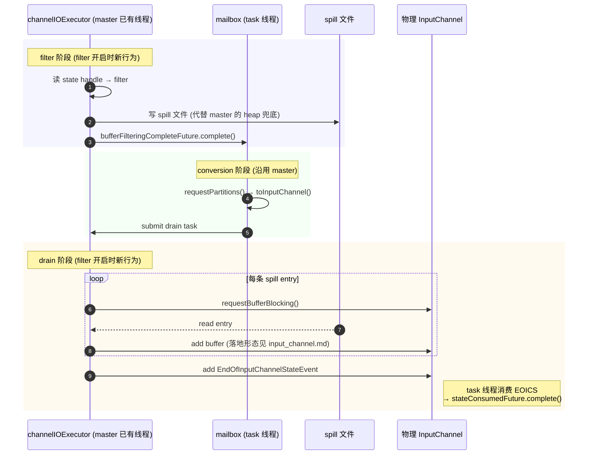
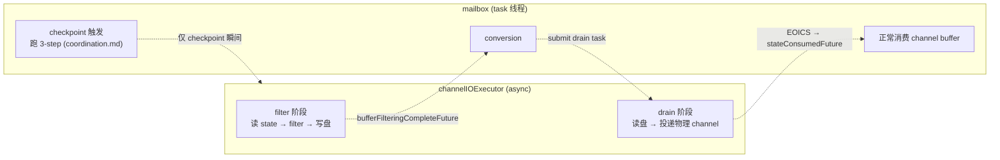

# 总体思路

> 整体方案入口。具体落地按方向拆三份：
>
> - [`input_channel.md`](./input_channel.md) — InputChannel 侧改动（task 线程消费的那侧）
> - [`unspiller.md`](./unspiller.md) — `Unspiller` 组件（`channelIOExecutor` 异步线程那侧）
> - [`coordination.md`](./coordination.md) — 两侧之间的协作（锁原则 + checkpoint 3-step 协议）
>
> 当前分支只是历史参考，相关类名不在本文档系出现。

## 1. 目标

**要解决的问题**：master 上 `checkpointing during recovery + filter` 开启时，`RecoveredInputChannel.requestBufferBlocking` 一旦 buffer pool 抽空就走 **heap 兜底**（`MemorySegmentFactory.allocateUnpooledSegment` 直接堆上分配 unpooled segment）。这条路径无上限，recovery 数据多时会把 task 的堆撑爆，存在 OOM 风险。master 源码该方法上方的 TODO 已经点名 FLINK-38544 就是要把这个 heap 兜底替换成「写盘」。

**目标**：用 **磁盘 spill** 替换 heap 兜底，把 filter 阶段的内存占用约束在常数级（一个 prefilter buffer + 一个 postfilter buffer），消除堆增长这条路径。后续讨论的所有机制都是为这个目标服务的实现选择。

**范围**：仅在 `checkpointingDuringRecoveryEnabled=true` 且 filter 实际启用时走新逻辑。功能关闭时 recovery 完全走 master 原路径，不引入任何额外代码路径或开销。

**基线**：master 上 `channelIOExecutor` 单线程 executor 已经存在，本来就跑 recovery 主体。本方案 **不引入新线程**，只在 filter 开启时改造这条已有线程的行为：把「往 channel 写」改成「先往盘写、之后再回放」。

## 2. 时间线

filter 与 drain 复用同一条 `channelIOExecutor`，conversion 走 mailbox。整体就是 master 的 recovery 流程多了一层「磁盘缓冲」。

衔接点都是 master 上已有的 future，本方案不新增 future：

- `bufferFilteringCompleteFuture`：filter 完成 → 唤起 mailbox 跑 conversion；
- conversion 完成后 mailbox 把 drain 任务投回 `channelIOExecutor`；
- drain 跑完投递 `EndOfInputChannelStateEvent`，task 线程消费到它完成 `stateConsumedFuture`。

## 3. 两条线程的职责

filter / drain 在 `channelIOExecutor` 上跑（[`unspiller.md`](./unspiller.md)）；conversion / checkpoint 触发 / 业务消费在 mailbox 上跑（[`input_channel.md`](./input_channel.md) 描述消费侧）。两条线程仅在 checkpoint 触发那一瞬间通过 `Unspiller.monitor` 协作（[`coordination.md`](./coordination.md)）。

## 4. 全局锁 —— 两条强原则

整个方案围绕**一把锁**展开：`Unspiller.monitor`。两条强原则贯穿三份子文档，落地代码必须遵守：

**原则 1**：recovery 期间，任何写入 `LocalInputChannel` / `RemoteInputChannel` 的动作，无论是 `channelIOExecutor` 投递 recovered buffer / `EndOfInputChannelStateEvent`，还是 task 线程在 checkpoint Step 1 插入 `RecoveryCheckpointBarrier`，**必须在 `Unspiller.monitor` 临界段内完成**。

**原则 2**：`Unspiller` 内部 `(currentSegmentIndex, currentOffset)` 的推进，**必须与对应的 channel add-buffer 在同一个临界段内**。

两条原则共同保证 task 线程拍盘时 (内存 + 磁盘) snapshot 完整且 disjoint —— 任何一条放宽都会出现「entry 同时落两边」或「entry 两边都漏」的不一致窗口。正确性详细推导见 [`coordination.md`](./coordination.md) §5。

### 锁的使用画像

- **`channelIOExecutor`**：高频短持，每条 entry 一次，毫秒级。
- **Task 线程**：极低频，**只在 checkpoint 触发瞬间进入一次**。

锁序固定：`Unspiller.monitor → InputChannel.receivedBuffers`。两个持有者同向，无死锁。

`channelIOExecutor` 申请 buffer park 在 `LocalBufferPool.getAvailableFuture()` 上 —— 这是 master 已有 CompletableFuture 机制（与 mailbox suspend 同源），**必须在 monitor 外**完成，否则 buffer pool 抖动会拖延 checkpoint。

## 5. Checkpoint 3-step（骨架）

由 task 线程在 mailbox 上执行；详细 step 边界条件与正确性论证见 [`coordination.md`](./coordination.md) §3-§5。

1. **Step 1**：`snap = unspiller.snapshotAndInsertBarriers()` —— 一次原子调用。Unspiller 内部进 monitor，拍 `DiskSnapshot` + 给每个 channel 末尾插 `RecoveryCheckpointBarrier`，然后退出 monitor。
2. **Step 2**：遍历每个 channel 的 `receivedBuffers`，barrier 之前的 buffer `retainBuffer` 后投到 `ChannelStateWriter.addInputData`，barrier 本身丢弃。
3. **Step 3**：`channelStateWriter.addInputDataFromSpill(checkpointId, snap)` —— writer 异步按 entry.channelInfo demux 到各 channel 的 checkpoint output。

## 6. 跨线程公共接口骨架

详细签名、字段、不变量见各子文档。

| 接口 | 提供者 | 调用方 | 详见 |
|---|---|---|---|
| `Unspiller`（构造 + `snapshotAndInsertBarriers()`） | `channelIOExecutor` | task 线程 | [`unspiller.md`](./unspiller.md) §3 |
| `DiskSnapshot` | Unspiller | `ChannelStateWriter` | [`unspiller.md`](./unspiller.md) §3 |
| 物理 channel 上 recovered buffer 投递入口 | `InputChannel`（具体形态待定 A/B/C） | `channelIOExecutor` drain | [`input_channel.md`](./input_channel.md) §3 |
| `RecoveryCheckpointBarrier` sentinel | `coordination` 命名空间 | task 线程自插自消 | [`coordination.md`](./coordination.md) §4 |
| `ChannelStateWriter.addInputDataFromSpill` | `ChannelStateWriter`（新增方法） | task 线程 Step 3 | [`coordination.md`](./coordination.md) §3 |

## 7. 这份设计带来的简化

- 没有跨 channel 的协调对象，没有「等所有 channel 都触发了才能开始拍盘」之类的 wait 集合；
- channel 的 `getNextBuffer` 主路径不引入新分支（具体到 Local 的小调整见 [`input_channel.md`](./input_channel.md) §3）；
- 没有「filter / drain 同时写一个 channel」的并发；filter 不碰 channel，drain 是单线程顺序写；
- 没有需要借用 gate lock 防 stale-enqueue race 的情况；channel 引用在 `Unspiller` 构造时一次性确定，drain 阶段不再切换。
