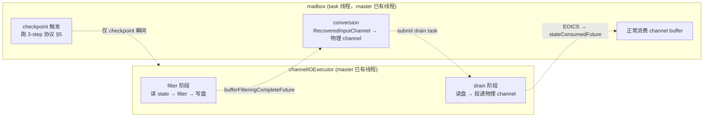
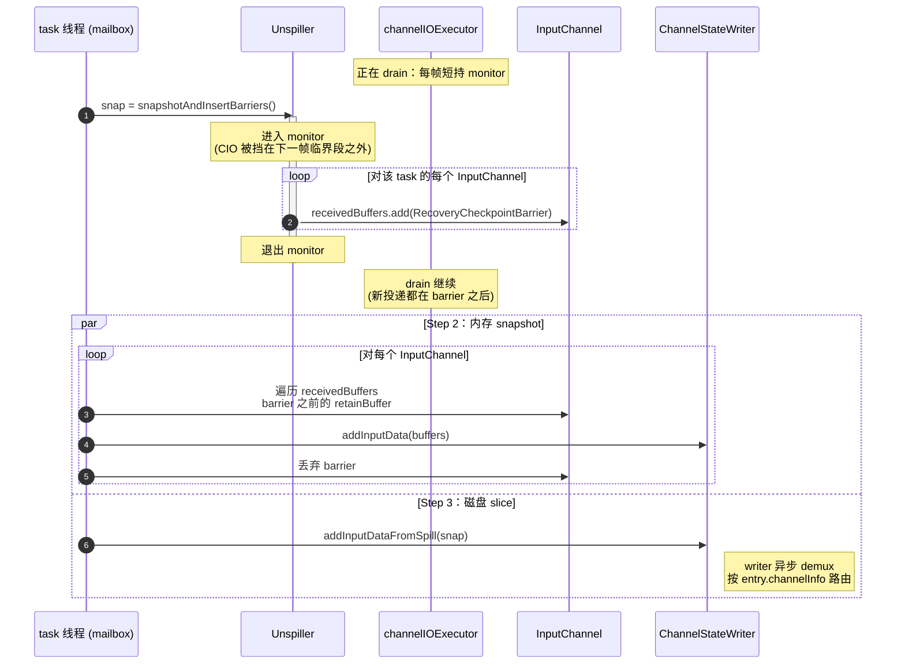

# 总体思路

> 本文给整体方案。`new_design.md` 给落地细节。所有讨论以本文 + `new_design.md` 为准；当前分支只是历史参考，相关类名不在本文出现。

## 1. 目标

**要解决的问题**：master 上 `checkpointing during recovery + filter` 开启时，`RecoveredInputChannel.requestBufferBlocking` 一旦 buffer pool 抽空就走 **heap 兜底**（`MemorySegmentFactory.allocateUnpooledSegment` 直接堆上分配 unpooled segment）。这条路径无上限，recovery 数据多时会把 task 的堆撑爆，存在 OOM 风险。master 源码里 `RecoveredInputChannel.requestBufferBlocking` 上方的 TODO 已经点名 FLINK-38544 就是要把这个 heap 兜底替换成「写盘」。

**目标**：用 **磁盘 spill** 替换 heap 兜底，把 filter 阶段的内存占用约束在常数级（一个 prefilter buffer + 一个 postfilter buffer），消除堆增长这条路径。后续讨论的所有机制（落盘格式、回放顺序、checkpoint 一致性等等）都是为这个目标服务的实现选择。

**范围**：仅在 `checkpointingDuringRecoveryEnabled=true` 且 filter 实际启用时走新逻辑。功能关闭时 recovery 完全走 master 原路径，不引入任何额外代码路径或开销。

**基线**：master 上 `channelIOExecutor` 单线程 executor 已经存在，本来就跑 recovery 主体（`SequentialChannelStateReaderImpl.readInputData` → `ChannelStateChunkReader.readChunk` → `InputChannelRecoveredStateHandler.recover` → `channel.onRecoveredStateBuffer`）。本方案 **不引入新线程**，只在 filter 开启时改造这条已有线程的行为：把「往 channel 写」改成「先往盘写、之后再回放」。

## 2. 时间线

三个阶段在 master 已有的两条线程上展开，filter 与 drain **复用同一条** `channelIOExecutor`，conversion 走 mailbox。本质就是 master 的 recovery 流程多了一层「磁盘缓冲」。


衔接点都是 master 上已有的 future，本方案不新增：

- `bufferFilteringCompleteFuture`：filter 完成 → 唤起 mailbox 跑 conversion；
- conversion 完成后 mailbox 把 drain 任务投回 `channelIOExecutor`；
- drain 跑完投递 `EndOfInputChannelStateEvent`，task 线程消费到它完成 `stateConsumedFuture`。

## 3. 两条线程的职责（master 已有，本方案沿用 + 改造）



- `channelIOExecutor` 是 master 已有的单线程 executor，本方案在 filter 开启时改造 filter / drain 两段的实现：
  - filter 阶段：`InputChannelRecoveredStateHandler.recover` 内 filter 那条分支从「写 channel」改成「写盘」；
  - drain 阶段：filter 完后顺序读盘 → 申请物理 channel buffer → `onRecoveredStateBuffer` 投递。
- mailbox 是 master 已有的 task 线程，conversion / checkpoint / 业务消费都跑在它上面，filter 开启时唯一新增的行为是 §5 的 3-step 协议。

两条线程在 recovery 期间**只有 checkpoint 触发那一瞬间**需要协作；filter / drain 全程 `channelIOExecutor` 独立工作，mailbox 上跑别的，互不干扰。

## 4. 全局锁与挂起策略

**只有一把全局锁**，挂在 drain 阶段的协调对象 `Unspiller` 上（详见 `new_design.md` §3）。这个对象本身跑在 `channelIOExecutor` 上，不是新线程。

### 锁的用法

- **`channelIOExecutor`（async 线程）**：高频持有。每写一帧数据到 channel + 推进 read 指针构成一个短临界段（毫秒级），完后立刻释放。
- **Task 线程**：极低频持有。**只在 checkpoint 触发的瞬间**进入一次，拍盘 + 往每个 channel 插 barrier，几行代码后释放。整个 recovery 期间 task 线程进这把锁的次数 = 期间发生的 checkpoint 数。

锁的语义是 `synchronized(monitor)`。锁序固定：


`channelIOExecutor` 投递 buffer 时也是「进 monitor → 进 receivedBuffers → 退两层」，与 task 线程 Step 1 同向，永远不会死锁。

### `channelIOExecutor` 的「挂起」策略

`channelIOExecutor` **不需要新的 suspend/resume API**。它的挂起在两个层面：

1. **协作挂起（针对 checkpoint）**：靠 Java monitor 互斥实现。`channelIOExecutor` 在每条数据投递之间释放锁；task 线程在 checkpoint 触发时 `synchronized(monitor) { ... }` 进来一次，自然让 `channelIOExecutor` 在下一个临界段开始前等一下。这个「等」是 ms 级，task 线程做完拍盘 + 插 barrier 立刻释放，`channelIOExecutor` 紧跟着继续。
2. **资源挂起（针对 buffer pool）**：drain 阶段每次申请 buffer 走 `LocalBufferPool.requestMemorySegmentBlocking`，内部 park 在 `getAvailableFuture()` 上。这是 master 已有的 CompletableFuture 机制（与 mailbox 的 suspend 模型同源）；buffer 一旦可用 future complete，`channelIOExecutor` 被唤醒继续。
   - 关键约束：等 buffer 必须在 **monitor 之外** park，否则 buffer pool 拖延会顺带拖延 checkpoint。

## 5. Checkpoint 触发的 3 步协议

由 task 线程在 mailbox 上执行：



正确性论证（简略，详细见 `new_design.md` §5、§9）：

- Step 1 的 `DiskSnapshot` 截取在 `channelIOExecutor` 的临界段之间，意味着「已经投递到 channel」与「还在磁盘上」的 entry 集合不相交且无遗漏；
- 释放锁后 `channelIOExecutor` 的新投递都在 barrier 之后，Step 2 不会看到；
- 释放锁后 `channelIOExecutor` 的 read pointer 只会**前进**到比 snapshot 的 `startPos` 更大的位置，Step 3 提交的 slice 是 `[startPos, end-of-disk-data]`，与已投递到 channel 的部分 disjoint。

## 6. 多线程之间必须暴露的公共接口

仅以下几个；其余都是线程内部实现细节，不跨线程暴露。

### 6.1 `Unspiller`（`channelIOExecutor` 提供给 task 线程）

只暴露**一个无参方法**。3-step 协议 Step 1 的语义是「同一个 monitor 内原子地完成磁盘拍照 + 给**每个** channel 插 barrier」，没有「只拍照不插 barrier」的合法用例 —— 拆开两个方法会让外部误以为可以分别调用，从而破坏原子性。

`Unspiller` 在构造时就拿到了这个 task 的全部 `InputChannel`（drain 阶段本来就要往这些 channel 里投递 recovered buffer，没有 channel 全集 drain 自己也跑不起来），因此 barrier 插入完全是 `Unspiller` 内部行为，调用方不需要、也不应该再传一次 channel 列表。

```java
final class Unspiller {
    /**
     * Constructor receives the full channel set of this task — the same set used
     * during drain to deliver recovered buffers. Stored once; never re-passed.
     */
    Unspiller(SpillFile spillFile, List<InputChannel> allChannels);

    /**
     * Atomically: enter the global monitor, snapshot all spill files' pending
     * entries (each entry carries channelInfo / offset / length), AND insert one
     * RecoveryCheckpointBarrier into EVERY channel's receivedBuffers.
     *
     * Caller MUST be holding no lock; this method takes the monitor itself.
     * After return, channelIOExecutor is free to resume drain; its further
     * writes land after the barrier on each channel, and its read pointer
     * advances beyond the snapshot's startPos — so the returned DiskSnapshot
     * and the channel state captured in Step 2 are disjoint and complete.
     */
    DiskSnapshot snapshotAndInsertBarriers();
}
```

### 6.2 `DiskSnapshot`（`channelIOExecutor` 的产物 → ChannelStateWriter 端消费）

```java
final class DiskSnapshot implements CloseableIterator<Chunk> {
    // 内部：List<FileSlice>，每个 FileSlice 含 fileIndex / filePath /
    //       frozen entries(channelInfo, offset, length)；以及 startPos。
    // 迭代时跳过 entryPos < startPos 的 entry（这些已进 channel，由 Step 2 覆盖）。
}
```

### 6.3 `InputChannel.onRecoveredStateBuffer(Buffer)`（`channelIOExecutor` → 物理 channel）

master 上这个方法只在 `RecoveredInputChannel` 上有。新方案把它**提到 `InputChannel` 基类**（或在 Local / Remote 各加一份，语义相同）。方法体逐字对齐 master 上 `RecoveredInputChannel.onRecoveredStateBuffer`：

```java
public void onRecoveredStateBuffer(Buffer buffer) {
    boolean wasEmpty;
    synchronized (receivedBuffers) {
        if (isReleased) { buffer.recycleBuffer(); return; }
        wasEmpty = receivedBuffers.isEmpty();
        receivedBuffers.add(buffer);
    }
    if (wasEmpty) notifyChannelNonEmpty();
}
```

这是 `channelIOExecutor` drain 阶段写物理 channel 的唯一入口。`notifyChannelNonEmpty / queueChannel / inputChannelsWithData` 链路保持 master 形态，零修改。

### 6.4 `RecoveryCheckpointBarrier`（task 线程 → 自己消费）

`receivedBuffers` 队列里的 sentinel，task 线程在 Step 2 识别并丢弃。仅 task 线程在 Step 1 内插入，`channelIOExecutor` 绝不接触；对算子业务数据流不可见。

## 7. 这份设计带来的简化

- 没有跨 channel 的协调对象，没有「等所有 channel 都触发了才能开始拍盘」之类的 wait 集合；
- 没有「读 buffer 优先级（内存先于磁盘）」之类的 channel 内部分支；channel 的 `getNextBuffer` 与 master 完全一致；
- 没有「filter / drain 同时写一个 channel」的并发；filter 不碰 channel，drain 是单线程顺序写；
- 没有需要借用 gate lock 防 stale-enqueue race 的情况；channel 的 listener 切换在 conversion 完成后才发生，drain 启动时已经稳定。
