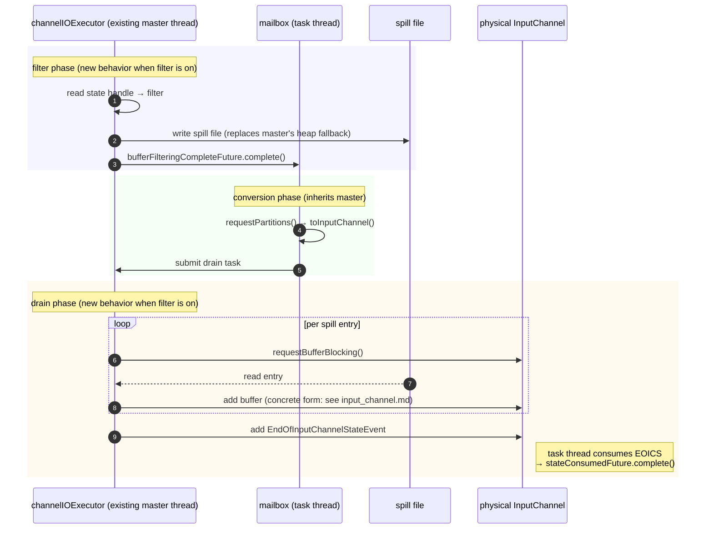
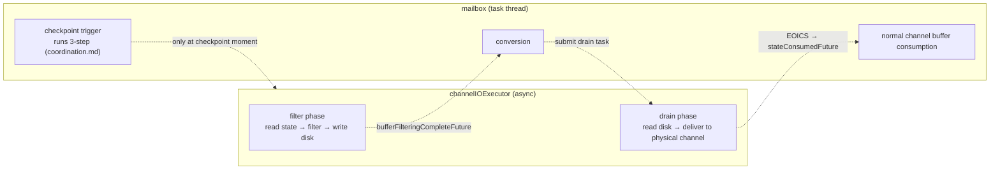

# Overview

> Entry point to the overall design. The detailed landing is split into three docs by direction:
>
> - [`input_channel.md`](./input_channel.md) — InputChannel-side changes (the task-thread consumer side)
> - [`unspiller.md`](./unspiller.md) — the `Unspiller` component (the `channelIOExecutor` async-thread side)
> - [`coordination.md`](./coordination.md) — the cooperation between the two sides (lock principles + the checkpoint 3-step protocol)
>
> The current branch is historical reference only; no class names from it appear in this doc family.

## 1. Goal

**Problem being solved**: on master, when `checkpointing during recovery + filter` is enabled, `RecoveredInputChannel.requestBufferBlocking` falls back to a **heap allocation** (`MemorySegmentFactory.allocateUnpooledSegment` directly allocates an unpooled segment on the heap) once the buffer pool is exhausted. This path is unbounded; with a large amount of recovery data it can blow up the task heap and cause OOM. The TODO above that method in master source already names FLINK-38544 as the ticket to replace this heap fallback with a "write-to-disk" path.

**Goal**: replace the heap fallback with **disk spill**, bounding the memory footprint during filter to a constant (one prefilter buffer + one postfilter buffer) and eliminating heap growth on this path. Every mechanism discussed below is an implementation choice serving this goal.

**Scope**: the new logic only applies when `checkpointingDuringRecoveryEnabled=true` and filter is actually active. When the feature is off, recovery follows the master path verbatim, with no extra code paths and no overhead.

**Baseline**: the `channelIOExecutor` single-thread executor already exists on master and already runs the recovery main loop. This design **introduces no new thread**; it only modifies the existing thread's behavior when filter is on: "write to channel" becomes "write to disk first, replay later".

## 2. Timeline

filter and drain reuse the same `channelIOExecutor`; conversion runs on the mailbox. The whole thing is master's recovery flow with one extra "disk buffer" layer.

The hand-off points all use futures that already exist on master; this design introduces no new future:

- `bufferFilteringCompleteFuture`: filter completes → wakes mailbox to run conversion;
- after conversion completes, mailbox submits the drain task back to `channelIOExecutor`;
- after drain finishes, `EndOfInputChannelStateEvent` is delivered; the task thread consuming it completes `stateConsumedFuture`.

## 3. Responsibilities of the two threads

filter / drain run on `channelIOExecutor` ([`unspiller.md`](./unspiller.md)); conversion / checkpoint trigger / normal consumption run on the mailbox ([`input_channel.md`](./input_channel.md) covers the consumer side). The two threads cooperate **only at the moment a checkpoint is triggered**, via `Unspiller.monitor` ([`coordination.md`](./coordination.md)).

## 4. The global lock — two strong principles

The whole design revolves around **one lock**: `Unspiller.monitor`. Two strong principles cut across all three sub-docs; the implementation must obey them:

**Principle 1**: during recovery, every write into a `LocalInputChannel` / `RemoteInputChannel` — whether `channelIOExecutor` delivering a recovered buffer / `EndOfInputChannelStateEvent`, or the task thread inserting a `RecoveryCheckpointBarrier` at checkpoint Step 1 — **must happen inside an `Unspiller.monitor` critical section**.

**Principle 2**: advancing `Unspiller`'s internal `(currentSegmentIndex, currentOffset)` **must happen in the same critical section as the corresponding channel add-buffer**.

The two principles together guarantee that when the task thread takes a snapshot, the (memory + disk) sets are complete and disjoint — relaxing either creates an inconsistency window where an entry "lands in both sides" or "is missed by both sides". Detailed correctness proof in [`coordination.md`](./coordination.md) §5.

### Usage profile of the lock

- **`channelIOExecutor`**: high-frequency, short-held — once per entry, millisecond scale.
- **Task thread**: extremely low-frequency, **entered exactly once per checkpoint trigger**.

Lock order is fixed: `Unspiller.monitor → InputChannel.receivedBuffers`. Both holders go in the same direction; no deadlock.

`channelIOExecutor` parks for buffer allocation on `LocalBufferPool.getAvailableFuture()` — this is master's existing CompletableFuture mechanism (same family as mailbox suspend). The park **must happen outside the monitor**; otherwise buffer-pool jitter would stall the checkpoint.

## 5. Checkpoint 3-step (skeleton)

Executed by the task thread on the mailbox; detailed step boundary conditions and correctness proof in [`coordination.md`](./coordination.md) §3-§5.

1. **Step 1**: `snap = unspiller.snapshotAndInsertBarriers()` — a single atomic call. Inside, the Unspiller enters the monitor, takes a `DiskSnapshot`, appends a `RecoveryCheckpointBarrier` to every channel's tail, and exits the monitor.
2. **Step 2**: walk each channel's `receivedBuffers`; for buffers before the barrier, `retainBuffer` them and hand them to `ChannelStateWriter.addInputData`; drop the barrier itself.
3. **Step 3**: `channelStateWriter.addInputDataFromSpill(checkpointId, snap)` — the writer asynchronously demuxes by `entry.channelInfo` into each channel's checkpoint output.

## 6. Cross-thread public interface skeleton

Detailed signatures, fields, and invariants in the sub-docs.

| Interface | Provider | Caller | See |
|---|---|---|---|
| `Unspiller` (constructor + `snapshotAndInsertBarriers()`) | `channelIOExecutor` | task thread | [`unspiller.md`](./unspiller.md) §3 |
| `DiskSnapshot` | Unspiller | `ChannelStateWriter` | [`unspiller.md`](./unspiller.md) §3 |
| Recovered-buffer delivery entry on the physical channel | `InputChannel` (concrete form A/B/C — TBD) | `channelIOExecutor` drain | [`input_channel.md`](./input_channel.md) §3 |
| `RecoveryCheckpointBarrier` sentinel | `coordination` namespace | task thread (inserts and consumes itself) | [`coordination.md`](./coordination.md) §4 |
| `ChannelStateWriter.addInputDataFromSpill` | `ChannelStateWriter` (new method) | task thread Step 3 | [`coordination.md`](./coordination.md) §3 |

## 7. Simplifications this design delivers

- No cross-channel coordinator object; no "wait until every channel has been notified before snapshotting" wait-set;
- No new branch on the `getNextBuffer` hot path of the channel (the small adjustment specific to Local is in [`input_channel.md`](./input_channel.md) §3);
- No "filter / drain writing to a channel concurrently"; filter does not touch channels, and drain is a single-threaded sequential writer;
- No borrowed gate lock for stale-enqueue races; channel references are captured once at `Unspiller` construction and never switched during drain.
