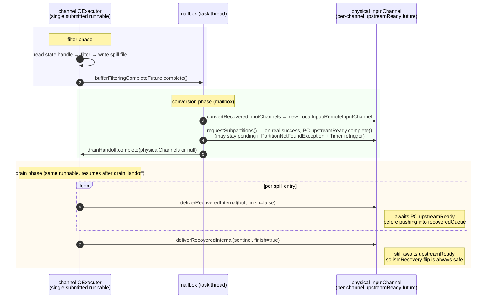

# Overview

> **Follow-up (2026-05-24):** subsequent rounds of fixes refined the recovery handoff. See
> [`../fix_rounds/`](../fix_rounds/) — in particular
> [`recovery_in_recovery_flag_unification.md §9`](../fix_rounds/recovery_in_recovery_flag_unification.md)
> for the final per-channel `upstreamReady` future design and
> [`end_of_input_event_missing_fix.md §8`](../fix_rounds/end_of_input_event_missing_fix.md)
> for why §7.4 conditional wake was superseded. This document captures the original direction;
> §2 below has been updated to match current code (`single submit + drainHandoff`).
> Naming under `simplify_approach/` (`recoveredBuffers`, `allRecoveredBuffersDelivered`,
> `finishReadRecoveredState`, …) lags the implementation (`recoveredQueue.buffers`,
> `allDelivered`, `finishRecoveredBufferDelivery`); structurally equivalent.

> Entry point to the overall design. The detailed landing is split into three docs by direction:
>
> - [`input_channel.md`](./input_channel.md) — InputChannel-side changes (the task-thread consumer side)
> - [`unspiller.md`](./unspiller.md) — the `SpillFileWriter` / `SpillFileReader` components (the `channelIOExecutor` async-thread side)
> - [`coordination.md`](./coordination.md) — the cooperation between the two sides (lock principles + the checkpoint 3-step protocol)
>
> The current branch is historical reference only; no class names from it appear in this doc family.

## 1. Goal

**Problem being solved**: on master, when `checkpointing during recovery + filter` is enabled, `RecoveredInputChannel.requestBufferBlocking` falls back to a **heap allocation** (`MemorySegmentFactory.allocateUnpooledSegment` directly allocates an unpooled segment on the heap) once the buffer pool is exhausted. This path is unbounded; with a large amount of recovery data it can blow up the task heap and cause OOM. The TODO above that method in master source already names FLINK-38544 as the ticket to replace this heap fallback with a "write-to-disk" path.

**Goal**: replace the heap fallback with **disk spill**, bounding the memory footprint during filter to a constant (one prefilter buffer + one postfilter buffer) and eliminating heap growth on this path. Every mechanism discussed below is an implementation choice serving this goal.

**Scope**: the new logic only applies when `checkpointingDuringRecoveryEnabled=true` and recovery carries channel-state buffers (regardless of rescale / filter — see [apache/flink#28107 `405faaaab1`](https://github.com/apache/flink/pull/28107/commits/405faaaab161db291dbcf7b70e76cc27e0441cb6) for why no-rescale recovery also needs the spill path). When the feature is off, recovery follows the master path verbatim, with no extra code paths and no overhead.

| feature flag | recovery 是否带 channel state buffer | spill / SpillFileReader / SpillFileWriter |
|---|---|---|
| off | any | no (master legacy path) |
| on | no (含 aligned 恢复 / 空 UC 恢复) | no (没数据可写) |
| on | yes | **yes** (rescale → filter + 写盘；no rescale → raw passthrough + 写盘) |

**Baseline**: the `channelIOExecutor` single-thread executor already exists on master and already runs the recovery main loop. This design **introduces no new thread**; it only modifies the existing thread's behavior when filter is on: "write to channel" becomes "write to disk first, replay later".

**Non-negotiable invariant — request upstream subscriptions as early as possible**: the entire reason `checkpointing during recovery` exists is to let checkpoints fire **during** recovery, not after it. That requires `requestPartitions()` (and the `requestSubpartition()` it dispatches) to run on the master schedule — right after filter completes, **before** drain starts. Any design that postpones upstream subscription until drain finishes (or until any later milestone) silently re-introduces the very latency this feature was built to remove, and is rejected up front. Every other tradeoff in this document is subordinate to this invariant.

## 2. Timeline

filter and drain reuse the same `channelIOExecutor`; conversion runs on the mailbox. The whole thing is master's recovery flow with one extra "disk buffer" layer.



The hand-off uses two futures plus one new per-channel future for upstream readiness; the original "submit a second drain task" is replaced by a `drainHandoff` future that the single runnable blocks on:

- `bufferFilteringCompleteFuture`: filter completes → wakes mailbox to run conversion;
- `drainHandoff`: mailbox completes it after `convertRecoveredInputChannels` + `internalRequestPartitions` finish; channelIOExecutor's single runnable, which had been blocking on it, resumes and starts drain;
- `PC.upstreamReady` (new, per-channel): completed by `requestSubpartitions` success path (Local: `subpartitionView` published; Remote: `partitionRequestClient` published). Every entry into `deliverRecoveredInternal` first awaits this future, guaranteeing that any buffer / sentinel reaching `recoveredQueue` is delivered with upstream already connected — so the `isInRecovery=true → false` flip is always safe (no `Queried for a buffer before requesting the subpartition.`-class race).
- after drain finishes, the channel completes `stateConsumedFuture` itself once its `recoveredBuffers` has been fully consumed.

See [`fix_rounds/`](../fix_rounds/) for the round-by-round evolution that arrived at the per-channel `upstreamReady` design (`recovery_in_recovery_flag_unification.md §9` is the final landing point).

## 3. Responsibilities of the two threads

```mermaid
flowchart LR
    subgraph CIO["channelIOExecutor (async)"]
      direction TB
      F["filter phase<br/>read state → filter → write disk"]
      D["drain phase<br/>read disk → deliver to physical channel"]
    end
    subgraph MB["mailbox (task thread)"]
      direction TB
      C["conversion"]
      CP["checkpoint trigger<br/>runs 3-step (coordination.md)"]
      CN["normal channel buffer consumption"]
    end
    F -.->|bufferFilteringCompleteFuture| C
    C -.->|drainHandoff.complete<br/>(same runnable resumes)| D
    D -.->|finishReadRecoveredState → stateConsumedFuture| CN
    CP -.->|only at checkpoint moment| CIO
```

filter / drain run on `channelIOExecutor` ([`unspiller.md`](./unspiller.md)); conversion / checkpoint trigger / normal consumption run on the mailbox ([`input_channel.md`](./input_channel.md) covers the consumer side). The two threads cooperate **only at the moment a checkpoint is triggered**, via `SpillFileReader.lock` ([`coordination.md`](./coordination.md)).

## 4. The global lock — two strong principles

The whole design revolves around **one lock**: a private `Object lock` field on `SpillFileReader`, taken via plain `synchronized (lock)` blocks (NOT the implicit `this` monitor — so the lock is a named, grep-able, `@GuardedBy`-annotated field). Two strong principles cut across all three sub-docs; the implementation must obey them:

**Principle 1**: during recovery, every channel-state mutation on `LocalInputChannel` / `RemoteInputChannel` — `channelIOExecutor` calling `onRecoveredStateBuffer()`, or the task thread inserting a `RecoveryCheckpointBarrier` at checkpoint Step 1 (also via `onRecoveredStateBuffer(barrier)`) — **must happen inside `synchronized (SpillFileReader.lock)`**. (End-of-drain `finishReadRecoveredState` is exempt — no more buffers are being added then, so the cut atomicity does not apply; see [`unspiller.md`](./unspiller.md) §4 step (D).)

**Principle 2**: advancing `SpillFileReader`'s internal `(currentSegmentIndex, currentOffset)` **must happen in the same critical section as the corresponding channel add-buffer**.

The two principles together guarantee that when the task thread takes a snapshot, the (memory + disk) sets are complete and disjoint — relaxing either creates an inconsistency window where an entry "lands in both sides" or "is missed by both sides". The `RecoveryCheckpointBarrier` is the channel-side cut and `(currentSegmentIndex, currentOffset)` is the disk-side cut; the two principles ensure both cuts are observed at the same instant. Detailed correctness proof in [`coordination.md`](./coordination.md) §5.

### Usage profile of the lock

- **`channelIOExecutor`**: high-frequency, short-held — once per entry, millisecond scale.
- **Task thread**: extremely low-frequency, **entered exactly once per checkpoint trigger**.

Lock order is fixed: `SpillFileReader.lock` is always taken first; any nested locking is the channel's own (e.g. `RemoteInputChannel`'s internal `synchronized(receivedBuffers)` inside `onRecoveredStateBuffer`). Both holders go in the same direction; no deadlock.

`channelIOExecutor` parks for buffer allocation inside `BufferManager.requestBufferBlocking`, on the channel's own `bufferQueue` (Java `Object.wait/notifyAll`, woken by `BufferPool`'s `BufferListener` callback). The park **must happen outside `SpillFileReader.lock`**; otherwise buffer-pool jitter would stall the checkpoint.

## 5. Checkpoint 3-step (skeleton)

Executed by the task thread on the mailbox; detailed step boundary conditions and correctness proof in [`coordination.md`](./coordination.md) §3 / §5.

1. **Step 1**: `snap = recoveryCheckpointTrigger.snapshotAndInsertBarriers()` — single atomic call. Inside, `SpillFileReader` enters `synchronized (lock)`, takes a `DiskSnapshot`, calls `ch.onRecoveredStateBuffer(barrier)` on every channel, and exits the block.
2. **Step 2**: embedded inside each `channel.checkpointStarted(barrier)` (master's existing per-channel entry, reached via `input.checkpointStarted`). If the channel is still in recovery, walk its `recoveredBuffers` up to the barrier and persist; otherwise run master's existing `receivedBuffers` persistence. The two branches are mutually exclusive — see [`coordination.md`](./coordination.md) §3.3.
3. **Step 3**: `channelStateWriter.addInputDataFromSpill(checkpointId, snap)` — writer asynchronously demuxes by `entry.channelInfo` into each channel's checkpoint output.

## 6. Cross-thread Java interfaces

Every cross-thread API in this design is funneled through three Java interfaces. They are declared here in full; the other documents reference them but do not redeclare them. Per-method semantics (lock pre-conditions, when / how / why) live in [`coordination.md`](./coordination.md) §2.

### 6.1 `RecoveryCheckpointTrigger` — task thread → unspilling thread

Implemented by `SpillFileReader`; the task thread holds the reference typed as the interface.

```java
package org.apache.flink.runtime.checkpoint.channel;

@Internal
public interface RecoveryCheckpointTrigger {

    /** Step 1 of the recovery-checkpoint protocol. Atomically:
     *    (1) enters SpillFileReader.lock,
     *    (2) snapshots every SpillFileSegment and captures
     *        (currentSegmentIndex, currentOffset) as DiskSnapshot.startPos,
     *    (3) calls onRecoveredStateBuffer(new RecoveryCheckpointBarrier())
     *        on every channel of the task,
     *    (4) leaves the lock.
     *
     *  Caller (task thread) MUST NOT hold SpillFileReader.lock — the implementation
     *  takes the lock itself. Returns the DiskSnapshot for the caller to feed
     *  into ChannelStateWriter.addInputDataFromSpill at Step 3. */
    DiskSnapshot snapshotAndInsertBarriers();
}
```

### 6.2 `RecoverableInputChannel` — unspilling thread → physical channels

Implemented by `RecoveredInputChannel`, `LocalInputChannel`, `RemoteInputChannel`. Drain holds channel references typed as the interface (via `SpillFileReader.channelByInfo`); it never casts down. Method names mirror master's existing `RecoveredInputChannel` API.

```java
package org.apache.flink.runtime.io.network.partition.consumer;

@Internal
public interface RecoverableInputChannel {

    /** Append a recovered buffer (or a RecoveryCheckpointBarrier sentinel) to
     *  this channel's recoveredBuffers queue. If the channel has been released,
     *  the buffer is recycled silently. Wakes the consumer via the existing
     *  notifyChannelNonEmpty chain if the queue was empty before this call.
     *
     *  Caller (drain or task-thread Step 1) MUST hold SpillFileReader.lock. */
    void onRecoveredStateBuffer(Buffer buffer);

    /** Signal that the spiller / drain producer has finished adding recovered
     *  buffers into this channel; flips allRecoveredBuffersDelivered from false to true
     *  exactly once. Producer-side completion only — the consumer may still
     *  have leftover buffers in recoveredBuffers. The channel completes
     *  stateConsumedFuture once both this flag is true AND recoveredBuffers is
     *  empty.
     *
     *  Caller (drain, end-of-drain) does NOT need to hold SpillFileReader.lock:
     *  no more buffers are being added at this point, so the (queue, offset)
     *  atomicity that Principle 1 protects does not apply. The flag is published
     *  through the channel's internal monitor that this method takes. */
    void finishReadRecoveredState();
}
```

### 6.3 `BufferRequester` — unspilling thread → buffer pool

Two-method interface that funnels every buffer allocation drain needs. Lives in the same package as `SpillFileReader`, so `SpillFileReader` depends only on this interface — the cross-package access to `RecoveredInputChannel`'s release primitive lives inside the single implementation `RecoveredChannelBufferRequester`.

```java
package org.apache.flink.runtime.checkpoint.channel;

@Internal
public interface BufferRequester {

    /** Block until a buffer is available from the source channel's pool.
     *  Implementations are expected to delegate to
     *  RecoveredInputChannel.requestBufferBlocking() (master existing method,
     *  with the heap fallback removed). Internally parks on the per-channel
     *  BufferManager.bufferQueue (Object.wait / notifyAll), woken by
     *  BufferPool's BufferListener callback.
     *
     *  Caller MUST NOT hold SpillFileReader.lock. */
    Buffer requestBufferBlocking(InputChannelInfo channelInfo)
            throws InterruptedException, IOException;

    /** Called once at end of drain. Releases the exclusive buffers held by
     *  every source channel served by this requester. Implementations are
     *  expected to iterate the source channels and call
     *  RecoveredInputChannel.releaseAllResources() (master existing method;
     *  needs to be promoted from package-private to public to allow this
     *  cross-package call from the implementation). Single-threaded — no
     *  lock required. */
    void releaseExclusiveBuffers() throws IOException;
}
```

The single implementation:

```java
package org.apache.flink.runtime.checkpoint.channel;

final class RecoveredChannelBufferRequester implements BufferRequester {

    private final Map<InputChannelInfo, RecoveredInputChannel> channelMap;

    RecoveredChannelBufferRequester(Map<InputChannelInfo, RecoveredInputChannel> map) {
        this.channelMap = map;
    }

    @Override
    public Buffer requestBufferBlocking(InputChannelInfo info)
            throws InterruptedException, IOException {
        return channelMap.get(info).requestBufferBlocking();
    }

    @Override
    public void releaseExclusiveBuffers() throws IOException {
        for (RecoveredInputChannel ch : channelMap.values()) {
            ch.releaseAllResources();
        }
    }
}
```

### 6.4 Non-interface cross-thread artifacts

A few cross-thread artifacts are not themselves Java interfaces but pass through the interfaces above:

| Artifact | Where | Used by |
|---|---|---|
| `DiskSnapshot` | Returned by `RecoveryCheckpointTrigger.snapshotAndInsertBarriers()` | task thread Step 3 → `ChannelStateWriter.addInputDataFromSpill` |
| `RecoveryCheckpointBarrier` | A sentinel `Buffer` carrying the cpId of the triggering checkpoint; task thread passes it through `RecoverableInputChannel.onRecoveredStateBuffer(...)` at Step 1; channel impl treats the payload opaquely but Step 2 matches on cpId | task thread (inserts in Step 1, consumes in Step 2) |
| `ChannelStateWriter.addInputDataFromSpill` | New method on `ChannelStateWriter` | task thread Step 3 |

## 7. Simplifications this design delivers

- No cross-channel coordinator object; no "wait until every channel has been notified before snapshotting" wait-set;
- The `getNextBuffer` change is small and self-contained: a single `inRecovery` predicate over `allRecoveredBuffersDelivered` and `recoveredBuffers`, fully described in [`input_channel.md`](./input_channel.md) §3; existing callers and the wake-up chain are untouched;
- No "filter / drain writing to a channel concurrently"; filter does not touch channels, and drain is a single-threaded sequential writer;
- No borrowed gate lock for stale-enqueue races; channel references are captured once at `SpillFileReader` construction and never switched during drain.
