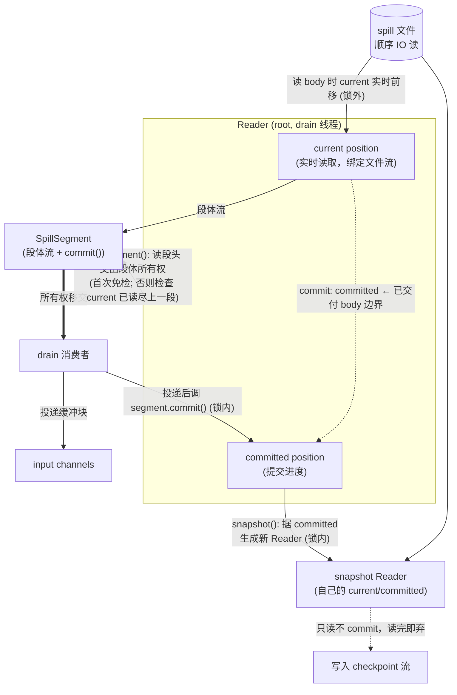

# Spill 读取器需求规格（FetchedChannelStateReader）

> 本文档只描述**对外契约**与**核心功能需求**，刻意不包含任何当前内部实现细节。
> 目的：作为推翻现有实现、重新设计的依据。实现方式不受本文档约束，只要满足以下需求即可。

## 1. 背景与定位

恢复（recovery）期间，channel state 被写入磁盘上的一组 spill 文件。`FetchedChannelStateReader` 负责把这些已落盘的数据**重新读出来**，按"段（segment）"为单位交给两类消费方：

1. **drain 线程**：把段数据交付回输入通道（恢复缓冲队列）。
2. **checkpoint 快照**：在 drain 进行中的某一刻，对"尚未交付的剩余数据"做一份快照，写入 checkpoint 流。

读取器是这两类消费的统一数据来源。

## 2. 数据模型

- 一份 channel state 由**一个或多个 spill 文件**组成（写入时可能因大小限制滚动到多个文件）。
- 文件内的数据是**按段顺序排列**的：每个段属于某一个具体的输入通道（channel），段与段首尾相接。
- 段是读取的最小交付单位。段的边界、所属通道、长度等定位信息，都可从落盘数据中确定。
- 段体（body）的字节内容对读取器是**不透明的**：读取器只负责把段体原样吐出，记录的框架（record framing）由消费方自己的反序列化器处理。

## 3. 核心功能需求

### F1. 一次性顺序读取
- 一个读取器实例从被定位的起点开始，**从头到尾读取一遍**当前需要读的全部数据。
- 数据**可能跨多个文件**：读完一个文件就接着读下一个文件，整体表现为一条连续的顺序数据流。
- 读取器不承担"随机访问"职责——它的唯一职责就是顺序地、一次性地把段一个个吐出来。
- 非异常情况下，每个读取器实例对**同一个文件只打开一次、且只顺序读取一次**，不重复打开、不重复读。

### F2. 段的顺序遍历
- 读取器（**Reader**）对外逐段产出：消费方调 `nextSegment()` 逐个取出段、读取段体。它不复用 Java `Iterator` 契约（我们的"读完才能前进、所有权移交、提交分离"不符合 `hasNext/next` 语义），而是按场景自定义接口（见 §8）。
- 取出的顺序严格等同于数据在文件中的物理排列顺序。

### F3. 快照派生
- 必须支持在读取进行中的任意提交点，派生出一份**独立的快照读取器**。
- 快照读取器从"当前已提交的进度位置"开始，独立地向后顺序读取剩余的全部段。
- 快照读取器与原读取器互不影响：各自维护自己的读取进度、各自独立结束。
- 派生快照的进度起点，必须精确反映**最后一次提交所记录的位置**（见 I3、C4）。

## 4. 对外接口契约

### I1. 段的属性（消费方可获取）
对每个取出的段，消费方可获取：
- **所属通道**：该段数据属于哪个输入通道。
- **段体数据流**：一个有界的字节流，读到本段长度处即结束（EOF），**绝不会越界读到下一段或下一个文件**。
- **段体长度**：本段段体的字节数，等于段体数据流在 EOF 前可读出的字节总数。

### I2. 消费与提交是两个独立步骤
这是**强契约**，不可合并为一步：

- **消费（读取段体）** 与 **提交（推进读取进度）** 是分离的两个动作。
- 存在合法的中间态：段体已经被读出（fetch 完成），但尚未被提交（消费方还没真正"确认交付")。
- 之所以分离：消费方需要在**不同的临界区**完成这两件事——读取段体在锁外进行（磁盘 IO 不占锁），提交进度在锁内进行（与快照派生保持原子）。

### I3. 提交语义
- 提交动作把"当前段已读出的字节数"确认为"已交付进度"，据此推进读取器的内部进度游标。
- 提交支持**部分提交**：一个段体可以只读了一部分就提交，提交记录的是"到目前为止实际读出/交付了多少"。
- 提交后，后续派生的快照必须从这个被提交的位置精确续读（不重发已提交部分，不丢失未提交部分）。

### I4. 生命周期
- 读取器持有底层 spill 数据的一份生命周期占用，关闭时释放。
- 段来源（source）单次使用，用完必须关闭；关闭释放其占用的文件资源。

## 5. 强约束（不变式）

以下为**必须强制保证**的不变式，违反即视为调用方 bug，应当 fail-loud（抛异常），不得静默容忍或降级：

### C1. 单线程读取
- 单个读取器/段来源实例的读取是**单线程**的，不支持并发读取同一实例。
- （快照派生出的独立读取器是另一个实例，可由另一线程驱动，但每个实例自身仍是单线程。）

### C2. 不允许回退
- 读取位置只能向前推进，**永不回退**。一旦某段被读过/跳过，不能再回到它之前的位置。

### C3. 不允许跳读
- 必须**逐段顺序消费**：上一个段的段体没有读完之前，不允许推进到下一个段。
- 试图在当前段体未读尽时取下一段，视为契约违反，必须 fail-loud。

### C4. 提交先于推进
- 进度的推进由**提交**驱动：先消费段体、再提交位移，提交后进度才更新。
- "获取段 → 读段体 → 提交"必须按此顺序；不允许先推进游标再补读。

### C5. 数据完整性 fail-loud
- 若底层文件在段声明的长度耗尽之前就结束（截断 / 损坏），必须抛异常，**不得**把残缺数据当作正常结束静默返回。

## 6. 两个读取器的并发协作与"先消费后提交"

本节单独解释：为什么会有两个读取器、它们靠什么协作、以及为什么"消费"和"提交"必须拆成两步（I2/I3 的根本原因）。这是整个设计中并发正确性的核心，**重写时必须原样保住这套语义**。

### 6.1 谁在读、谁在快照

恢复期间有两条线程同时活动，对应两个读取器：

- **drain 线程**：持有 **root 读取器**，从头到尾顺序把段交付（deliver）回各输入通道的恢复缓冲队列。这是主线，会一直跑到所有段交付完。
- **checkpoint 线程**：当恢复进行中触发一次 checkpoint 时，它需要把"**尚未交付的剩余数据**"持久化进 checkpoint 流。它通过 root 读取器**派生一个 snapshot 读取器**（见 F3），从当前进度向后独立读完剩余段。

两者读的是同一份底层 spill 数据，但是两个独立读取实例、两条独立的顺序读取。

### 6.2 为什么要分"消费"和"提交"两步（核心）

关键问题：checkpoint 在任意时刻都可能触发，它派生的 snapshot 必须精确地从"**已经交付了多少**"这个边界往后读——多读会重复（已交付的数据又被写进 checkpoint），少读会丢数据（未交付的被漏掉）。

而"把一个段体交付进通道"这个动作本身需要时间（读磁盘、可能拆成多个缓冲块逐块交付），不是瞬间完成。于是出现一个**关键中间态**：

> 段体的某些字节已经从磁盘读出来了（已 fetch），但还没真正确认交付进通道（还没 deliver 完成）。

如果"读出"就等于"提交进度"，那么在这个中间态里，进度游标会**领先于实际交付**——此刻若 checkpoint 派生 snapshot，就会把"已记为提交、但其实还没交付进通道"的数据漏掉（snapshot 从领先的位置往后读，跳过了这段）。

因此必须拆成两步：

- **消费（读段体、交付进通道）**：可以慢慢做，在锁外做（磁盘 IO 不占锁）。
- **提交（推进进度游标）**：只在"确认某批字节已真正交付进通道"之后，才推进游标。

**进度游标永远只反映"已确认交付"的边界，绝不反映"已读出但未交付"。** 这就是 I3"提交支持部分提交、记录实际交付了多少"的根本原因，也是 C4"提交先于推进"的根本原因。

### 6.3 锁如何保证一致性

两条线程通过一把共享锁协作。锁的职责是把下面两组动作各自变成**原子**的，并互斥：

- **交付 + 提交（drain 线程）**：每交付一批字节进通道，就在**同一临界区内**把进度游标推进到这批字节之后。"交付"和"提交"对外是一个原子步——不存在"交付了但游标没动"或"游标动了但没交付"被另一线程观察到的窗口。
- **派生快照 + 插入屏障（checkpoint 线程）**：在**同一临界区内**完成"读取当前进度游标 → 派生 snapshot → 向各通道插入 recovery checkpoint barrier"。

锁的互斥保证：checkpoint 线程派生 snapshot 时，看到的进度游标，一定是 drain 线程**某一次完整"交付+提交"之后**的稳定值——绝不会撞见 drain 线程"交付到一半、游标未更新"的中间态。于是 snapshot 的起点 = 那一刻已确认交付的精确边界，既不重复也不遗漏。

**锁外**：真正的磁盘读取、缓冲分配等耗时操作都在锁外进行，锁只圈住"交付+提交"和"派生快照+插屏障"这两组短临界区，避免磁盘 IO 占锁。

### 6.4 对实现的约束（不限定实现方式）

重写时无论内部怎么实现，必须保证：

1. 进度游标的语义始终是"已确认交付的边界"，不是"已读出的位置"。
2. "交付一批 + 提交该批进度"对外原子，二者之间不留可观测窗口。
3. 派生 snapshot 时读取的进度，与某次提交的结果一致（不撞中间态）。
4. snapshot 读取器从该进度精确续读剩余段，不重复、不遗漏已交付/未交付的分界。
5. 耗时 IO 不得在持锁期间进行。

## 7. 边界与异常预期

- **空数据**：没有任何段时，`nextSegment()` 首次即返回 `Optional.empty()`，正常结束，不报错。
- **跨文件段衔接**：段不跨文件边界；一个文件读完后从下一个文件起始继续。读取器需正确处理"当前文件读尽 → 切换到下一个文件"的衔接。
- **快照与提交的原子性**：派生快照必须能反映"某次提交完成时刻"的精确进度，期间不允许有读取进度在快照和提交之间被错位推进的窗口。

## 8. 期望的状态表示与角色划分

### 8.1 角色划分

对外只有一个 **Reader**（它就是我们自己的"迭代器"——不是 Java `Iterator`）。Reader 拆成**接口 + 实现**：caller 只依赖接口 `FetchedChannelStateReader`（契约面最小：`nextSegment()` / `snapshot()` / `close()` / 静态 `emptyReader()`），实现细节（文件流、两份进度、有界段体流）全在 `FetchedChannelStateReaderImpl` 里。不再拆出独立的 Cursor / Source 角色。段类型 `SpillSegment` 是 Reader 接口内的嵌套接口（`FetchedChannelStateReader.SpillSegment`），语义上"段属于 reader"。

| 角色 | 职责 | 持有什么 |
|------|------|----------|
| **Reader（接口）** | 对外契约：`nextSegment()` 逐段读、`snapshot()` 派生、`close()`、静态 `emptyReader()` | —（接口） |
| **ReaderImpl（实现）** | 读取器本体：顺序 IO、维护两份进度、`commit` 时更新提交进度 | 文件流 + **current position**（实时读取进度）+ **committed position**（提交进度）+ 一份生命周期占用 |
| **段（SpillSegment，嵌套接口）** | `nextSegment()` 的产出物：暴露所属通道、段体输入流、`length()`、`commit()`。所有权一旦交出，Reader 不再过问其读取 | 段体（有界输入流） |
| **消费者（Consumer）** | 外部调用者：drain 消费者 / snapshot 消费者。逐段取出、读段体；drain 消费者还负责 commit | 段体的所有权（拿走后自己读） |

### 8.2 接口形态（不复用 Java Iterator）

我们的场景有三条硬约束与 `Iterator` 契约冲突：① 一段必须读尽才能取下一段；② 段体所有权移交给消费者、消费者锁外读；③ 消费与提交分离。强套 `hasNext/next` 会让"hasNext 该不该有副作用"永远扯不清。因此**抛弃 Java Iterator，自定义 Reader 接口**（实现见 `FetchedChannelStateReaderImpl`）：

```
Reader
  static Reader emptyReader()
      返回一个无段的 Reader（共享一份空 channel state，无 spill 文件），
      首次 nextSegment() 即 empty。用于"没有可快照数据"的场景（见 §8.3、§9.2）。
  Optional<SpillSegment> nextSegment()
      前进到下一段并产出；无更多段时返回 Optional.empty()（前进与探测合一，
      不存在独立的 hasNext）。
      入口约束（首次调用免）：上一段的 body 必须已读尽，否则 fail-loud（C3）。
      它只推进段边界、读段头、产出段对象；不读段体、不动 current 的段内偏移。
  Reader snapshot()
      据当前 reader 的 committed position 生成一个新 Reader（见 §8.3）。
  close()

SpillSegment
  InputChannelInfo channelInfo()   段所属通道
  InputStream      body()          有界段体流，所有权交消费者，锁外读
  int              length()        本段对外交付的 body 字节数（snapshot 续读时即剩余量）
  void             commit()        锁内：把 committed 推进到"本段已读出的 body 字节"边界
```

**关键语义**：

- **`nextSegment()` 不动 current 的段内偏移**——它推进的是**段边界**（current 指向下一段段头），段体的读取（current 段内偏移前移）只发生在消费者读 `body()` 时。别把这两个动作混为一谈。
- **段体所有权移交后，Reader 彻底不管**它读到哪。约束 ③ 的检查落在**下一次 `nextSegment()` 入口**：检查上一段 body 是否已读尽（实现上看上一段 body view 的剩余字节是否为 0；因 body 读取与 current.readOffset 同步推进，这等价于"current 已到上一段段尾"）。**首次 `nextSegment()` 免检**（root / snapshot 都一样，前面没有"上一段"）。
- **`commit()` 挂在段上**：drain 消费者投递完一批后，调 `segment.commit()`。它把 committed 的 file/段起始拷自 current，但 **readOffset 钉到"本段已读出/已交付的 body 字节数"**（含 snapshot 起步时已 skip 的 prefix），即"已交付边界"——而非 current 的实时 readOffset（current 可能已 fill 进 buffer 但那批尚未 deliver，领先于已交付边界）。
- 空数据时，首次 `nextSegment()` 直接 `Optional.empty()`。
- **不提供 `hasNext` / `hasRemaining` 之类的预探测**：唯一的前进入口就是 `nextSegment()`。需要"这份 snapshot 空不空"判断的地方（如 writer 短路）一律取消——空 Reader 照常走流程，首次 `nextSegment()` 即 empty 后正常关闭，不做提前短路。

### 8.3 三个整型量与两份 Position

每份进度用一个 **Position** 表示，由三个整型量定位：

1. **文件索引**：当前所在文件。
2. **段起始偏移**：当前段头（header）在文件内的起始位置。
3. **段内读取偏移**：在文件内已物理读到的位置（snapshot 起步时，段内前面已交付的那段要 skip 丢弃）。

Reader 内部保存**两个 Position**，语义不同、互不重复：

| Position | 语义 | 何时推进 |
|----------|------|----------|
| **current** | 实时读取进度：current 当前物理读到哪了（绑定文件流） | 读段头 / 消费者读 body / 首次定位 skip 时实时推进，锁外 |
| **committed** | 提交进度：已确认交付进 input channel 的边界 | 仅 drain 在锁内 `commit()` 时，由 current 的 file/段起始 + "本段已交付 body 字节"算出 |

二者的差值，正是"已从磁盘读出、但尚未确认交付"的中间态（见 §6.2）：current 领先，committed 只在 commit 时追上。这不是重复存储，而是两个不同语义各存一份。

**快照如何工作**：

- `snapshot()` 在锁内据当前 reader 的 **committed position** 生成一个新 Reader（构造时把 committed 拷给新 Reader 的 current 作起点）。锁保证读到的 committed 是某次完整 commit 后的稳定值。
- 新 Reader 的 committed 可能落在某段**中间**（drain 做了部分 commit）。它的**首次** `nextSegment()` 会：先把 current 回退到该段段头（committed 的 readOffset 在段中，但段头在 segmentStartOffset），读段头，再 **skip 丢弃已交付的 prefix**，让 body 从未交付的剩余处开始。这是**唯一**会 skip 丢字节的地方；之后每次 `nextSegment()` 都不 skip（上一段 body 已被读尽，流自然停在下一段段头）。
- snapshot Reader **自己也有 current / committed 两个 position**，current 顺序读时实时推进；但它**不投递、不 commit**，committed 字段从不被使用，不写回 root、不影响 root。读完即弃。

## 9. 当前问题

历史实现把进度在**同一条链路里重复存了好几份**：reader、迭代器、内部 position 各存一份本应相同的进度，各自维护、互相漂移，是结构混乱的根源。根因是把读取逻辑硬塞进 Java `Iterator` 的 `hasNext/next` 契约（而我们的场景并不符合该契约），并让进度散落在多个对象上。重新设计按 §8 收敛：**抛弃 Java Iterator，把 `nextSegment()` 直接挂在 Reader 上**（Reader 拆成接口 + `Impl`，caller 只依赖接口）；**Reader 内部只保存两个 Position——current（实时读取，绑定文件流）与 committed（提交进度）**，`commit()` 就是据 current 把 committed 推进到"已交付边界"的一次同步，不再有第三份副本。

## 9.1 角色关系与所有权



要点：

- **进度只有两份，都在 Reader 内**：current（实时读取，唯一实时来源，绑定文件流）与 committed（提交进度），没有第三份副本。
- **段体所有权一交出（粗箭头）就归消费者**，Reader 不再跟踪它读到哪——只在下次 `nextSegment()` 入口检查 current 已把上一段读尽（首次免检）。
- **`commit()` 挂在段上**：drain 消费者调 `segment.commit()`，据 current 的 file/段起始把 committed 推进到"本段已交付 body 字节"边界（不是 current 的实时 readOffset）。
- **snapshot 是另一个独立 Reader**（自己的 current/committed），据 root 的 committed 起步，只读不回写。

## 9.2 drain 结束后的快照

drain 线程跑完所有段后会 **close root reader**（释放文件资源）。但触发 checkpoint 的快照请求可能**晚于** drain 结束才到来——此时若再 `root.snapshot()` 会撞到"reader 已关闭"。

约定：drain 跑完时在锁内置一个 `drainFinished` 标志（与快照请求的临界区互斥）。快照请求在锁内先看这个标志：

- 未结束 → 正常 `root.snapshot()` 派生。
- 已结束 → 不碰已关闭的 root，直接返回 **`Reader.emptyReader()`**（一个无段的空 Reader）。已交付完毕，本就没有剩余数据可快照；空 Reader 让上层消费链路无需特判（首次 `nextSegment()` 即 empty）。

`emptyReader()` 共享一份静态的空 channel state（无文件），但每次返回**新的** Reader 实例（Reader 有独立生命周期，必须各自 close）；`NO_OP` 触发器也复用它。

## 10. 明确的非目标

- 不需要随机访问 / 按任意 offset 跳转读取。
- 不需要并发读取同一实例。
- 不需要重复读取（同一读取器实例不需要支持"再读一遍")；如需再读，由调用方另行派生/新建。
- 不关心段体内部的记录边界与编解码——那是消费方反序列化器的职责。
