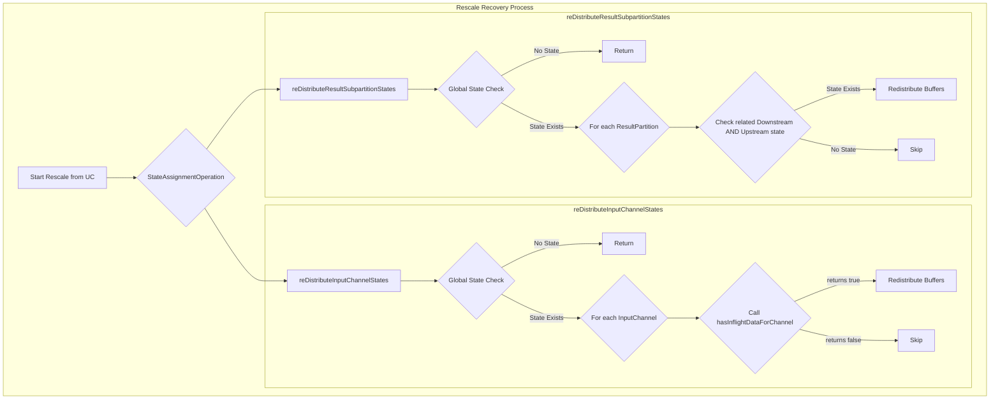

<!--
Licensed to the Apache Software Foundation (ASF) under one
or more contributor license agreements.  See the NOTICE file
distributed with this work for additional information
regarding copyright ownership.  The ASF licenses this file
to you under the Apache License, Version 2.0 (the
"License"); you may not use this file except in compliance
with the License.  You may obtain a copy of the License at
  http://www.apache.org/licenses/LICENSE-2.0
Unless required by applicable law or agreed to in writing,
software distributed under the License is distributed on an
"AS IS" BASIS, WITHOUT WARRANTIES OR CONDITIONS OF ANY
KIND, either express or implied.  See the License for the
specific language governing permissions and limitations
under the License.
-->
# 技术方案设计

## 1. 介绍

本文档为 **FLINK-38267** 的技术设计方案，旨在解决 Flink 作业在扩缩容并从非对齐检查点（UC）恢复时，因对 in-flight buffer 状态的检查逻辑不精确而导致的恢复失败问题。

根据最新的需求，核心问题是在 `StateAssignmentOperation` 中，恢复逻辑对是否存在需要重分配的 buffer 进行了全局判断。当一个任务同时连接了支持 UC 和不支持 UC 的 exchange 时，这种全局判断会错误地为不支持 UC 的 exchange（如 `forward`）也触发重分配逻辑，从而导致 `UnsupportedOperationException`。

本方案将废弃全局检查，转而在处理每一个 channel 或 partition 时，进行精确的、局部的状态检查。

## 2. 架构与技术栈

-   **模块:** `flink-runtime`
-   **主要类:** `org.apache.flink.runtime.checkpoint.StateAssignmentOperation`
-   **技术栈:** Java, Apache Flink

## 3. 核心设计

### 3.1. 修改 `StateAssignmentOperation`

我们将修改 `distributeInputRescale` 和 `distributeOutputRescale` 两个核心方法（在较新版本中可能重命名为 `reDistributeInputChannelStates` 和 `reDistributeResultSubpartitionStates`，以实际代码为准）。

#### 3.1.1. `distributeInputRescale` (下游输入缓冲区重分配)

-   **当前问题:** 方法开始时会有一个类似 `!stateAssignment.hasInputState && !stateAssignment.hasUpstreamOutputStates()` 的全局检查，但在后续循环中，隐式地依赖这个全局结果，对所有 channel 都一视同仁。
-   **解决方案:**
    1.  **保留**方法入口处的全局 `has...State` 检查，作为快速路径优化。如果整个任务都没有 in-flight state，可以直接返回。
    2.  在通过了全局检查后，当遍历每一个 `InputChannel` 准备为其分配状态时，执行以下精确的局部检查：
        a.  获取该 `InputChannel` 对应的上游 `ResultPartitionID`。
        b.  检查**上游任务**的状态快照（`TaskStateSnapshot`）中**是否包含**与该 `ResultPartitionID` 匹配的 `OutputStateHandle`。
        c.  检查**当前任务**的状态快照中**是否包含**与该 `InputChannel` 所在 `InputGateID` 匹配的 `InputStateHandle`。
    3.  只有当 **b** 和 **c** 两项检查中至少有一个为 `true` 时，才认为该 `InputChannel` 存在需要恢复的 in-flight 数据，并为其执行重分配逻辑。否则，直接跳过。
    4.  此逻辑将被封装在一个新的私有方法 `hasInflightDataForChannel` 中，以保持代码清晰。

#### 3.1.2. `distributeOutputRescale` (上游输出缓冲区重分配)

-   **当前问题:** 与输入端类似，该方法也依赖于全局状态检查。
-   **解决方案:**
    1.  **保留**方法入口处的全局检查作为优化。
    2.  在通过全局检查后，当遍历每一个 `ResultPartition` 准备为其分配状态时，执行以下精确的局部检查：
        a.  获取该 `ResultPartition` 对应的下游 `InputGateID`。
        b.  检查**下游任务**的状态快照中**是否包含**与该 `InputGateID` 匹配的 `InputStateHandle`。
        c.  检查**当前任务**的状态快照中**是否包含**与该 `ResultPartition` 的 `ResultPartitionID` 匹配的 `OutputStateHandle`。
    3.  只有当 **b** 和 **c** 两项检查中至少有一个为 `true` 时，才认为该 `ResultPartition` 存在需要恢复的 in-flight 数据，并为其执行重分配逻辑。

### 3.2. Mermaid 流程图

## 4. 测试策略

新增一个集成测试（ITCase） `UnalignedCheckpointRescaleWithMixedExchangesITCase`。该测试类将包含 **4个独立的测试 job**，每个 job 对应一个测试方法（`@Test`）。

-   **核心场景:**
    1.  **多输出场景:** `Source -> (keyBy -> Map1, forward -> Map2)`。
    2.  **多输入场景:** `(Source1 -> rebalance, Source2 -> forward) -> Map`。
    3.  **`rescale` 分区器场景:** `Source -> (keyBy -> Map1, rescale -> Map2)`。
    4.  **混合复杂度场景:** `(Source1 -> rebalance, Source2 -> forward) -> MultiInputMultiOutputTask -> (keyBy -> Sink1, forward -> Sink2)`。
-   **执行流程:**
    -   启用 Unaligned Checkpoint。
    -   运行作业，触发 checkpoint。
    -   停止作业并修改并行度。
    -   从 checkpoint 恢复。
-   **断言:**
    -   作业成功恢复，没有抛出 `UnsupportedOperationException`。
    -   通过可预测的数据源和 sink 验证数据恢复的正确性（不丢不重）。
