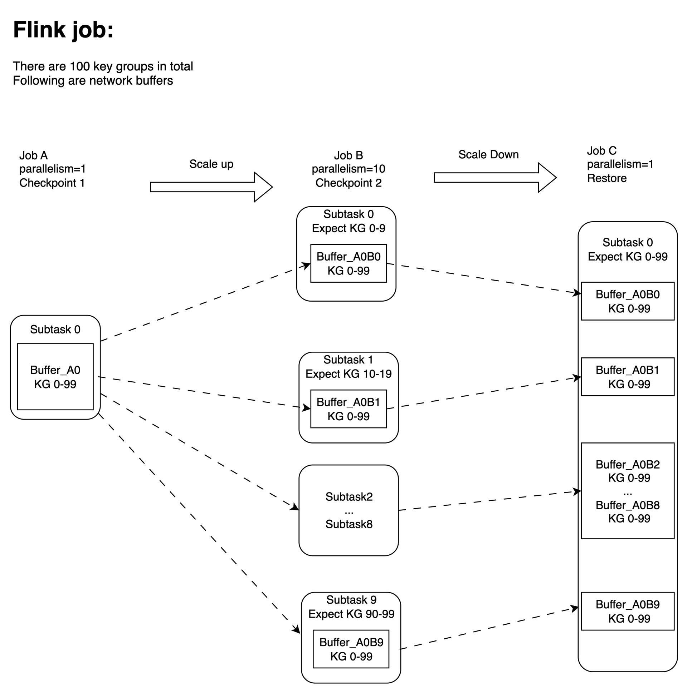
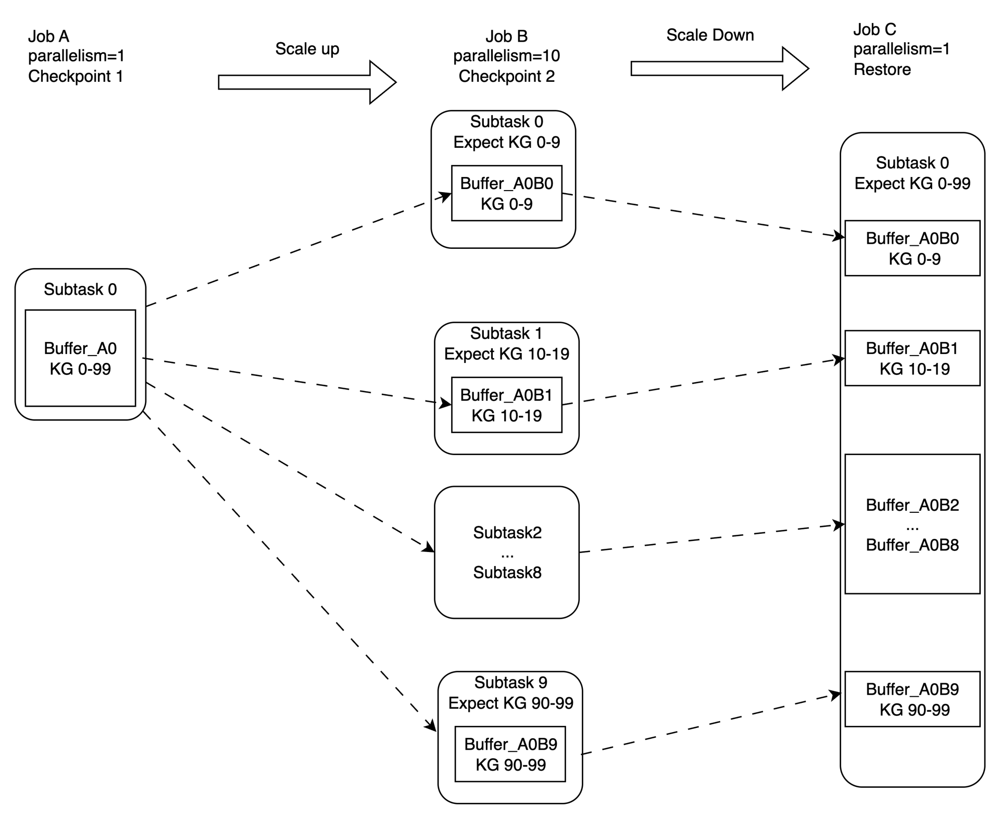
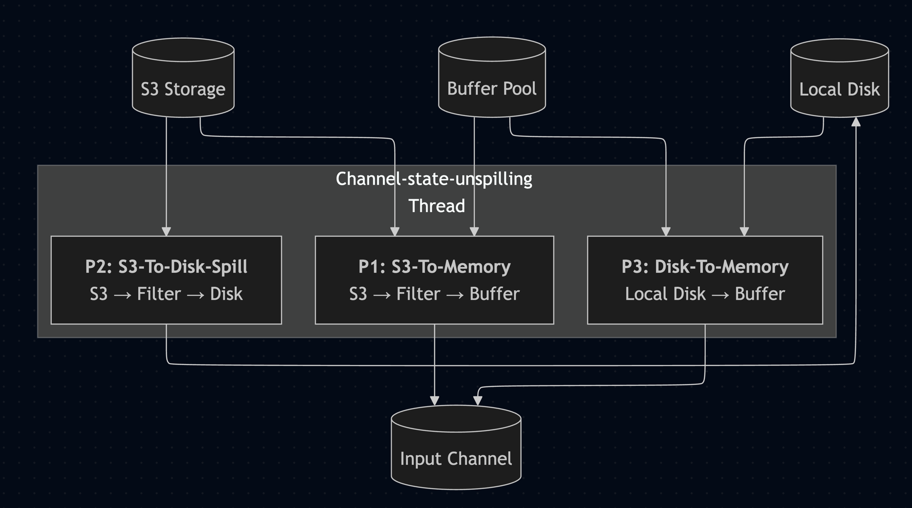
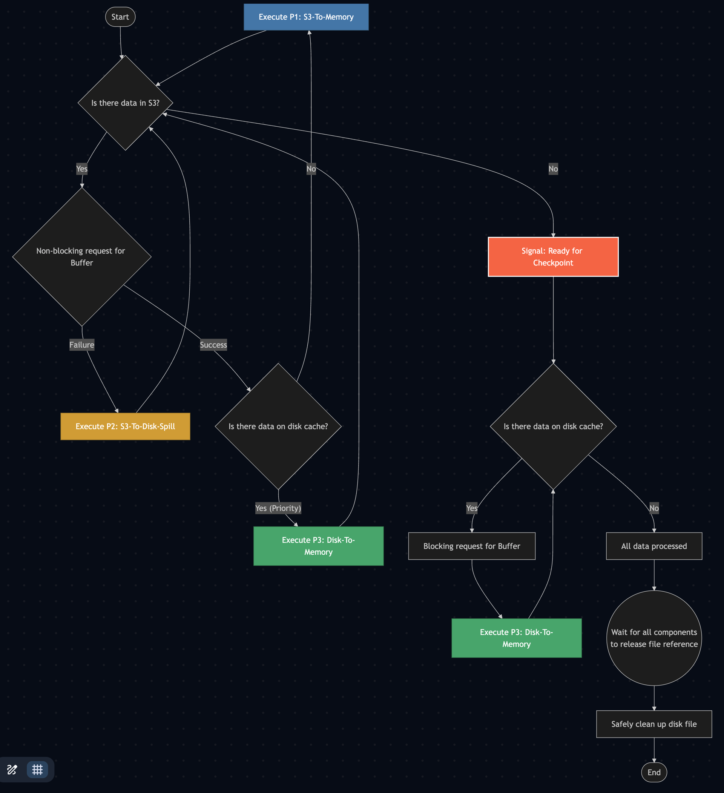
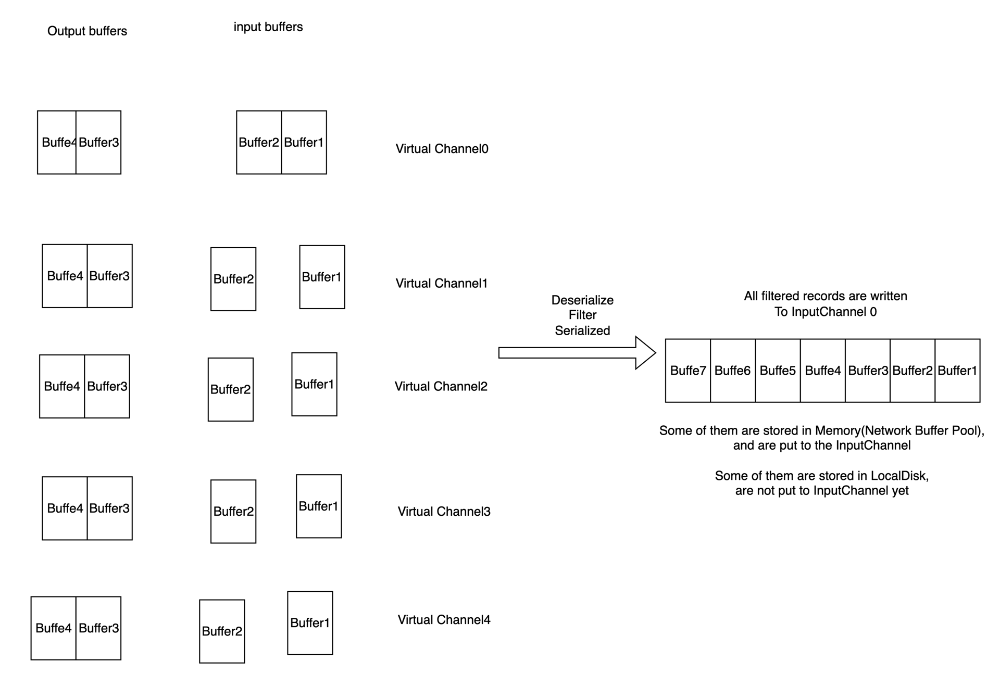

# FLIP-547: Support Checkpoint During Recovery

## 文档信息

| 项目 | 内容 |
|------|------|
| **JIRA** | [FLINK-35761](https://issues.apache.org/jira/browse/FLINK-35761) |
| **讨论线程** | https://lists.apache.org/thread/qc11rjp6cbp6g3sksfgwq81l0ll0x7fx |
| **投票线程** | https://lists.apache.org/thread/jqn997hlj3lrq5q5x44yof05k9zokxrm |
| **Wiki** | https://cwiki.apache.org/confluence/display/FLINK/FLIP-547%3A+Support+checkpoint+during+recovery |

---

## 1. Motivation

### 1.1 Why recovery phase is slow? May last for several hours

When unaligned checkpoint is enabled, and flink job recovers from unaligned checkpoint, Flink currently cannot trigger checkpoints during the recovery phase, meaning jobs have to process all restored channel state after failure or rescaling before any checkpoint is triggered. If this recovery is slow—due to state-heavy operators (e.g., slow state operation), slow UDFs, or complex joins, etc—jobs stall that lasted hours even as work continues internally.

### 1.2 Impact

These delays not only degrade user experience and make it hard to distinguish bottlenecked processing from blocked recovery, but also block upstream systems(sources, external sinks, transactional resources), sometimes leading to cascading failures or timeouts.

Furthermore, job restarts or scaling events always revert to the last checkpoint, causing loss of already restored progress and making long-running or large-scale jobs less reliable. This problem is worsened by repeated rescaling, resulting in extensive recovery cycles and higher risk of progress loss.

### 1.3 Benefits

Checkpointing during recovery would resolve these issues by allowing jobs to record progress and keep restored state across scaling or restart events. This improves transparency, enables safer operational tooling and scaling, and enhances reliability for demanding jobs and workloads.

It is also crucial for correctness—supporting processing guarantees like exactly-once semantics, since in-flight records and channel state can be properly tracked throughout recovery. Adopting this feature will make Flink more robust and effective for diverse use cases in the open-source community.

---

## 2. Core challenge

While the existing unaligned checkpoint logic correctly provides exactly-once guarantees under normal conditions, it was not designed to be used during recovery. Applying the existing unaligned checkpoint logic directly in the recovery phase would violate the exactly-once semantics, which is precisely why this capability is not yet supported.

All designs may revolve around how to ensure ExactlyOnce, especially when the job undergoes multiple rescaling.

### 2.1 Introducing the existing unaligned checkpoint logic

Currently, [RemoteInputChannel](https://github.com/apache/flink/blob/d335b24abfc9f36e2f7ce61e22ca26ec1d8d8f02/flink-runtime/src/main/java/org/apache/flink/runtime/io/network/partition/consumer/RemoteInputChannel.java#L709) and [PipelinedSubpartition](https://github.com/apache/flink/blob/d335b24abfc9f36e2f7ce61e22ca26ec1d8d8f02/flink-runtime/src/main/java/org/apache/flink/runtime/io/network/partition/PipelinedSubpartition.java#L230) will snapshot all in-flight buffers during checkpointing. However, it doesn't apply to checkpointing during recovery.

Following is an example:

**Job A: parallelism = 1**

The checkpoint 1 only has 1 buffer: Buffer_A0, the key group range is 0-99

Assuming the Buffer_A0 is at downstream task RemoteInputChannel

**Job B: parallelism = 10 (scaling up from 1 to 10)**

After scaling up, the Buffer_A0 will be restored for each subtask

Each subtask filter records by expected key group range, for example:
- subtask0 expects key group range 0-9
- subtask1 expects key group range 10-19
- etc

The checkpoint2 will generate 10 replicas of Buffer_A0

**Job C: scaling down from 10 to 1**

10 replicas of Buffer_A0 will be restored at subtask0

### 2.2 Why Job B works well?

The potential issue in Job B: 10 subtasks of JobB received the Buffer_A0, which includes all records of key group range 0-99. All records will be processed 10 times if no any handling logic.

The RecordFilter logic is introduced for this situation. For example:
- Subtask0 expects key group range 0-9, it will filter only the records with key group range 0-9 from Buffer_A0 and process only these filtered records.
- Rest of subtasks are similar

The filter logic is executed during processing data, so some unprocessed buffers still includes records with key group range 0-99, resulting in unprocessed buffers are snapshotted via checkpoint by all subtasks. These buffers includes same records, so the data is duplicated in JobC.

### 2.3 Why not working during the recovery phase?

❌ There are 2 issues for Job C:

1. **Correctness is not guaranteed**: Duplicated data will be processed at Subtask0
   - All of records are within the key group range for subtask0 of Job C, so filter doesn't work

2. **Poor performance is caused by Data inflation**: The number of network buffers increased 10 times after a scale up and a scale down
   - It will be increased 100 times if scale up and down happen again

---

## 3. Public Interfaces

Introducing new config options:

| 配置项 | 说明 | 默认值 |
|--------|------|--------|
| `execution.checkpointing.unaligned.recover-output-on-downstream.enabled` | Whether recovering output buffers on downstream task directly. | `false` |
| `execution.checkpointing.unaligned.during-recovery.enabled` | Whether the checkpoint is allowed during recovery. This feature requires `execution.checkpointing.unaligned.recover-output-on-downstream.enabled` is `true`. | `false` |

**Note**: New changes will be disabled by default until they are stable and then enabled by default. Alternatively, the configuration option will be removed in the future, and new changes will be considered the default policy after unaligned checkpoints are enabled.

---

## 4. Proposed core Changes

To provide context for the new changes, I've outlined some existing logic in the sub-document: "Some existing logic to help understand the changes." This covers: allocating Channel States, the current restore process and record filter logic.

### 4.1 Introducing approach: re-uploading all filtered records

Filters all records from InputChannel using the specific filtering strategy(e.g., key group range). The filtered records are rewritten/reorganized into new buffers. Data processing and checkpointing logic will use the new (filtered) buffers.

**Example**

**Job A: parallelism = 1**

The checkpoint 1 only has 1 buffer: Buffer_A0

The key group range is 0-99, each key group has 1 record

Assuming it is a buffer at downstream task RemoteInputChannel

**Job B: parallelism = 10 (scaling up from 1 to 10)**

Job B starts checkpoint 2 without any data processing:
- Subtask 0 only re-organize 10 records within KeyGroupRange 0-9 to a new buffer: Buffer_A0B0, and upload it to checkpoint
- Subtask 1 only re-organize 10 records within KeyGroupRange 10-19 to a new buffer: Buffer_A0B1, and upload it to checkpoint
- …
- Subtask 9 only re-organize 10 records within KeyGroupRange 90-99 to a new buffer: Buffer_A0B9, and upload it to checkpoint

✅ **Job C is started from checkpoint 2, which recovers exactly 100 records.**

### 4.2 Recover output buffers of upstream task on downstream task side directly

#### 4.2.1 Existing logic

Currently, all input buffers are restored on the downstream task side, all output buffers are restored on the upstream task side. Then, all buffers needs to be sent from the upstream task to the downstream task later.

#### 4.2.2 Benefits for new changes

If both of all input and output buffers are restored on the downstream task side, it has some benefits:
- Sending output buffer from upstream task to the downstream task is no longer needed.
- The upstream task(output buffer) side doesn't deserialize records generally, it will be easy to filter records and re-upload records if recovering output buffers on downstream task(input buffer) side directly.

#### 4.2.3 Efforts

Upstream task side has allocation strategy for output buffers. For example, assigned a recovered output buffers to one or more ResultSubpartitions.

Moving these allocation logics from Upstream task side to JobMaster side, and JobMaster will send the state handlers to downstream task. Then, output buffers is recovered on downstream task side directly.

**Core Principle:**

Regardless output buffers are restored from upstream or downstream tasks, the buffer allocation strategy is not changed. This strategy does not affect the input channel and virtual channel to which the buffer is currently sent.

For example, if an output buffer is read from upstream task, and is sent to the InputChannel5 of downstream Subtask3 for the existing strategy. When the new change is applied, the Job Manager will directly send the state handler to the downstream Subtask3. The subtask3 will read the buffer and directly add it to the InputChannel5.

**Downside:**

JobMaster workload: Some logics is moved from TaskManager side to JobMaster side

Note: buffer is not read at JM side, it only assign state handlers based on ResultSubpartitionInfo, subtask Id and some other metadata.

Therefore, the workload is low.

### 4.3 Change the overall restore process

The restore process is changed, especially Task lifecycle. The ExecutionState of Task is switched from INITIALIZING to RUNNING earlier to trigger checkpoint.

#### 4.3.1 JobMaster

- [No change] JM restore state from metadata
- [No change] JM allocate channel state handlers for each subtask(TDD)
- **Output buffer allocation logic:**
  - Buffer allocation logic: moving all output buffer allocation logics from upstream task side to JM side
  - Re-organized these state handlers of output buffers and send them to downstream tasks (Currently, they are sent to upstream tasks side)

#### 4.3.2 Task INITIALIZING

- Request upstream partitions in the beginning
- Allowing receiving event from upstream tasks, like: checkpoint barrier
- We do not allow to receive data in the beginning to ensure that all output buffers come after input buffers
- Task ExecutionState is switched from ExecutionState#INITIALIZING to ExecutionState.RUNNING
- Only initializing task without processing data, so it is expected to be very fast.

#### 4.3.3 Task RUNNING

- Checkpoint can be triggered after the ExecutionState of all tasks is RUNNING
- Reading, assigning and filtering recovered input & output buffers to Virtual InputChannels
  - It is executed in async thread
- [No change] When rescale happens, filter logic uses RescalingStreamTaskNetworkInput instead of StreamTaskNetworkInput, and put filtered buffers into Real InputChannels
- [No change] When no-rescale, put all recovered buffers into Real InputChannels directly.
- Task thread will start consume filtered buffers via StreamTaskNetworkInput
- Start consume new data(new buffers) after all recovered buffers or filtered buffer are put into Real InputChannels

### 4.4 What if aligned snapshot is triggered?

For example savepoint or aligned checkpoint after disabling unaligned checkpoints. If aligned snapshot is triggered, the aligned barrier will be handled after all recovered buffers are consumed.

### 4.5 When and how to filter recovered buffers?

Filter records and re-organized buffers in async thread(channel-state-unspilling thread), and only put re-organized buffers to Real Input Channel(RemoteInputChannel or LocalInputChannel), so task thread do not need to execute filter logic when processing data or checkpoint.

Task starts processing data once the first re-organized buffer is generated, so that task is able to process data as early as possible.

Re-organized buffers is unable to put into InputChannel when the network buffer pool is insufficient, resulting in the loss of part of the network buffer when a checkpoint occurs. In order to the checkpoint could be completed even if network buffer Pool is insufficient, a feasible solution is that introducing the Local Disk to store the filtered buffer:
- Writing the re-organized buffers in local disk first for this case
- Uploading re-organized buffers from disk to checkpoint storage during checkpointing

#### 4.5.1 Data flow

The reader thread executes one of three core processes (P1, P2, P3) based on system state and buffer availability.

| 路径 | 流向 | 说明 |
|------|------|------|
| **P1: S3-To-Memory (The Memory Path)** | S3 → Filter → Buffer | This is the most efficient path. Ideally, we hope only has this path. When a memory buffer is available, data is read from S3, filtered, and placed directly into the buffer before being sent to the Input Channel. |
| **P2: S3-To-Disk-Spill (The Spill Path)** | S3 → Filter → Disk | This path is taken for backpressure handling. When no memory buffers are immediately available, data is still read from S3 and filtered, but the result is written ("spilled") to the local disk. This ensures the filtering work, which is required for checkpoints, always makes progress. |
| **P3: Disk-To-Memory (The Replay Path)** | Local Disk → Buffer | This path replays data that was previously spilled. When a memory buffer becomes available, the thread prioritizes reading the already-filtered data from the local disk and sending it to the Input Channel. |

#### 4.5.2 Processing flow

This flowchart details the decision-making logic of the Channel-state-unspilling Thread. The design is split into two distinct, irreversible phases to ensure maximum efficiency and correctness.

The thread name can be renamed from Channel-state-unspilling to Channel-state-handling

**Phase 1: S3 Active Loop**

This is the main operational mode as long as there is still data to be processed from S3. The thread always uses a non-blocking request to ask for a buffer. It never waits.
- If a buffer is acquired, it first checks if there is any data on the disk. If so, it executes P3 (Disk-To-Memory). If the disk is empty, it executes P1 (S3-To-Memory).
- If the buffer request fails, the thread remains productive by executing P2 (S3-To-Disk-Spill), ensuring that data is continuously being filtered and prepared for checkpointing.

Of course, we hope buffer is enough, it could avoid spill any data to local disk.

**Note:** Checkpoint will be blocked if checkpoint is triggered in phase1, but we have to wait for all filtered buffers to snapshot.

**Phase 2: Disk-Only Cleanup Loop**

This phase begins only after all data from S3 has been processed.
- **State Transition:** When the system determines S3 is empty, it means ready for Checkpoint. (All of network buffers and local disk buffers should be uploaded during checkpoint)
- **Focused Cleanup:** The thread now enters a simpler, self-contained loop. Its only remaining task is to clear the disk cache.

In this phase, it uses a blocking request to get a buffer. The thread will wait indefinitely because there are no other tasks to perform. Once a buffer is acquired, it executes P3 and continues this loop until the disk is empty.

#### 4.5.3 How does filter logic works

The filter logic need to be handled via Virtual Channel, and filtered buffers can be handled by real InputChannel directly(even all filtered buffers could be always added to InputChannel 0 if no risk)

When buffer is sufficient, the filter logic could use NetworkBuffer, otherwise, we could implement a FileBasedBuffer. Read ChannelState from S3 to local FileBasedBuffer, and then filter.

**Note:** buffer is insufficient means Task thread is slow to process data, so the FileBasedBuffer performance is acceptable.

### 4.6 Block and unblock upstream task

It is necessary to ensure that newly generated buffers are consumed after recovered buffers, so the upstream task is blocked in the beginning(It is similar with back pressure mechanism). Unblock the upstream task until all input buffers and output buffers on downstream task are put into InputChannel.

**Note:** The newly generated buffers do not need to filter, they can be put to InputChannel directly. All buffers in InputChannel can be handled as normal buffers (including data processing and checkpointing).

---

## 5. Compatibility, Deprecation, and Migration Plan

It is nothing in this part.

---

## 6. Test Plan

In addition to unit testing, we need to introduce new ITCase or improve existing ITCase to verify the correctness of the data. Especially, when multiple scales happen.

---

## 7. Rejected Alternatives

Incremental checkpoint for channel state approach is rejected due to the complexity of the implementation, which involves offset management, reference counting, and metadata consistency. Get more from sub-document: Rejected Alternatives: Incremental checkpoint for channel state.
