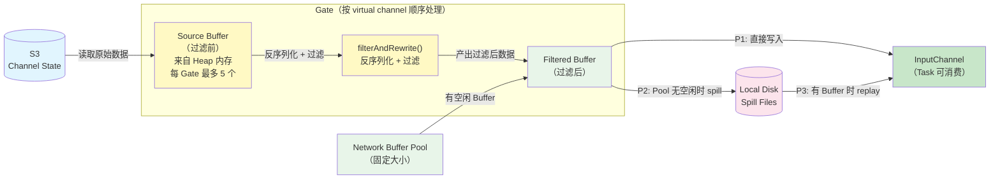
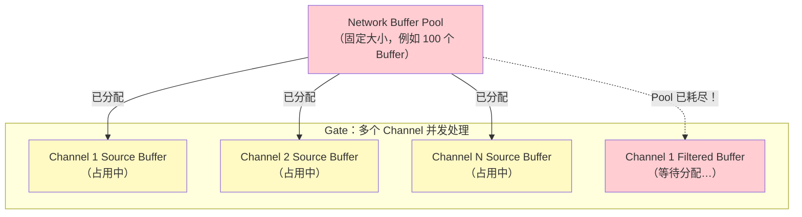
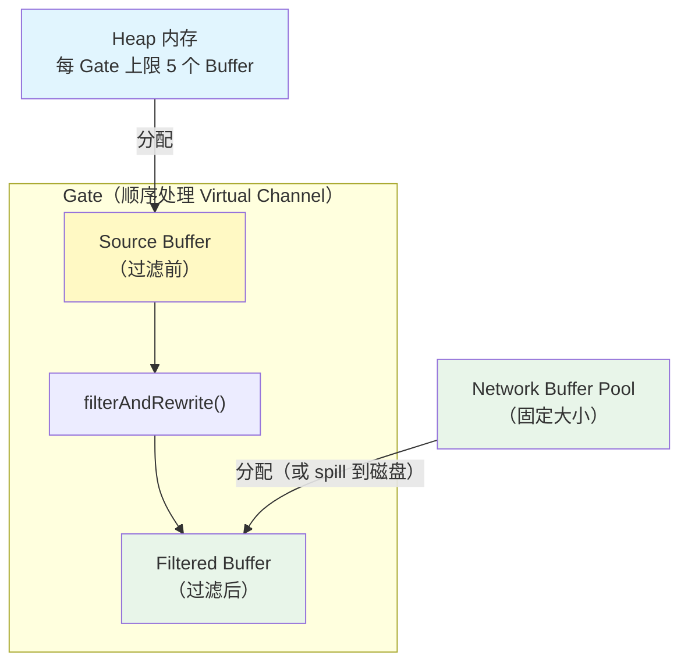

# Task 5: Data Flow Paths — 两阶段 Buffer 模型

## 1. 概述

Channel state 恢复过程涉及两种不同的 Buffer：

| Buffer 类型 | 含义 | 来源 | 消费者 |
|------------|------|------|--------|
| **Source Buffer（过滤前 Buffer）** | 从 S3 读取的原始 channel state 数据 | Heap 内存 | 仅过滤线程 |
| **Filtered Buffer（过滤后 Buffer）** | 经过 `filterAndRewrite()` 后可直接交给 Task 的数据 | Network Buffer Pool 或磁盘 | Task 线程 + Checkpoint |

**不需要过滤的场景**：没有 Source Buffer 这一层，所有 Buffer 统一按 Filtered Buffer 处理（直接从 S3 读入 Network Buffer 或 spill 到磁盘）。

**本文重点讨论需要过滤的场景**，因为过滤引入了两层 Buffer 的资源竞争问题。

---

## 2. 需要过滤场景的完整数据流

### 两层 Buffer 的处理流程

1. **Source Buffer（过滤前）**：从 S3 读取原始 buffer 数据，使用 **Heap 内存**分配，供 `filterAndRewrite()` 消费后立即释放
2. **Filtered Buffer（过滤后）**：`filterAndRewrite()` 产出的结果，走 P1/P2/P3 三条路径之一进入 InputChannel

---

## 3. 死锁问题分析

### 3.1 问题场景

如果 Source Buffer 和 Filtered Buffer 都从同一个 Network Buffer Pool 申请，会产生死锁：

**死锁形成过程：**

1. 一个 Gate 下有多个 Virtual Channel，每个 Channel 都需要先申请 Source Buffer 读取 S3 原始数据
2. Source Buffer 在整个 `filterAndRewrite()` 期间被持有，过滤完成后才能释放
3. `filterAndRewrite()` 内部需要申请 Filtered Buffer 来存放过滤结果
4. 如果多个 Channel 的 Source Buffer 把 Pool 耗尽 → Filtered Buffer 申请阻塞
5. Source Buffer 要等过滤完成才释放 → 过滤要等 Filtered Buffer 才能完成
6. **循环等待 → 死锁**

### 3.2 死锁的根本原因

| 条件 | 说明 |
|------|------|
| **资源竞争** | Source Buffer 和 Filtered Buffer 竞争同一个有限资源池 |
| **持有并等待** | Source Buffer 被持有的同时，还在等待 Filtered Buffer |
| **不可抢占** | 已分配的 Source Buffer 不能被强制回收 |
| **循环等待** | Source Buffer 等过滤完成 → 过滤等 Filtered Buffer → Filtered Buffer 等 Pool 释放 → Pool 被 Source Buffer 占满 |

---

## 4. 解决方案：内存隔离 + 并发控制

### 4.1 核心设计

通过两个机制彻底消除死锁：

**机制一：内存来源隔离** — Source Buffer 使用 Heap 内存，Filtered Buffer 使用 Network Buffer Pool，两者不竞争同一资源。

**机制二：并发控制** — Gate 内部按 Virtual Channel 顺序处理（Channel 1 处理完再处理 Channel 2），避免多个 Channel 同时持有 Source Buffer。

### 4.2 Source Buffer：Heap 内存 + 数量限制

| 设计要素 | 说明 |
|---------|------|
| **内存来源** | Heap 内存（`MemorySegmentFactory.allocateUnpooledSegment`） |
| **数量上限** | 每个 Gate 最多 5 个 Heap Buffer |
| **生命周期** | 仅在 `filterAndRewrite()` 期间存活，处理完立即释放 |
| **处理顺序** | Gate 内按 Virtual Channel 顺序处理，一个 Channel 处理完再处理下一个 |

**为什么限制每 Gate 5 个：**
- 防止 Heap 内存无限增长导致 OOM
- 每个 Buffer 约 32KB，5 个 = 160KB/Gate，内存开销可控
- 顺序处理 Channel 意味着同一时刻最多只有 1 个 Channel 在使用这些 Buffer，5 个足够单 Channel 的处理流水线

**为什么按 Virtual Channel 顺序处理：**
- 如果多个 Channel 并发处理，每个 Channel 都会持有 Source Buffer，总量 = Channel 数 × Buffer 数，可能耗尽 Heap 限额
- 顺序处理确保同一时刻只有一个 Channel 占用 Source Buffer，用完即释放，下一个 Channel 复用
- 这也简化了实现，避免了多 Channel 并发带来的复杂同步问题

### 4.3 Filtered Buffer：原有逻辑 + Spill 兜底

Filtered Buffer 是过滤后可直接交给 Task 处理的数据，走原有的三条路径：

| 路径 | 条件 | 行为 |
|------|------|------|
| **P1 Memory Path** | Network Buffer Pool 有空闲 Buffer 且磁盘无数据 | 过滤结果直接写入 Network Buffer → InputChannel |
| **P2 Spill Path** | Network Buffer Pool 无空闲 Buffer | 过滤结果 spill 到本地磁盘（复用 `FileBasedBuffer`） |
| **P3 Replay Path** | Network Buffer Pool 有空闲 Buffer 且磁盘有数据 | 从磁盘读取已过滤数据 → Network Buffer → InputChannel |

**P2 Spill 使用 `FileBasedBuffer`**：复用现有的 `FileBasedBuffer` 实现，将过滤后的 Buffer 数据写入本地磁盘文件。当 Network Buffer 可用时，从文件加载回内存。

---

## 5. 为什么这个方案能解决死锁

| 死锁条件 | 是否满足 | 原因 |
|---------|---------|------|
| **资源竞争** | **不满足** | Source Buffer 用 Heap，Filtered Buffer 用 Pool，两者隔离 |
| **持有并等待** | **不满足** | Source Buffer 不占用 Pool 资源，不会阻止 Filtered Buffer 分配 |
| **循环等待** | **不满足** | 单向依赖：Heap → Filter → Pool/Disk，不存在环 |

同时通过两层保护控制 Heap 内存风险：

1. **数量限制**（每 Gate 最多 5 个 Heap Buffer）→ 内存使用量可预测（≤ 5 × 32KB = 160KB/Gate）
2. **顺序处理**（按 Virtual Channel 逐个处理）→ 同一时刻只有一个 Channel 的 Source Buffer 存活

---

## 6. 三条路径的详细说明

### P1: S3-To-Memory（Memory Path）

- **完整流程**: S3 → Heap Buffer(Source) → filterAndRewrite() → Network Buffer(Filtered) → InputChannel
- **触发条件**: Network Buffer Pool 有空闲 Buffer **且** 磁盘无待 replay 数据
- **说明**: 最高效路径。Source Buffer 从 Heap 分配，过滤结果直接写入 Network Buffer 交给 Task

### P2: S3-To-Disk-Spill（Spill Path）

- **完整流程**: S3 → Heap Buffer(Source) → filterAndRewrite() → Spill to Disk(Filtered)
- **触发条件**: Network Buffer Pool 无空闲 Buffer
- **说明**: 反压处理。过滤不阻塞（Source Buffer 来自 Heap，不受 Pool 限制），过滤结果 spill 到磁盘。复用 `FileBasedBuffer` 实现磁盘读写

### P3: Disk-To-Memory（Replay Path）

- **完整流程**: Disk → Network Buffer(Filtered) → InputChannel
- **触发条件**: Network Buffer Pool 有空闲 Buffer **且** 磁盘有已过滤数据
- **说明**: 将之前 spill 的数据加载回 Network Buffer。磁盘有数据时 P3 优先于 P1，保证数据顺序

### Key Constraint

**P2 和 P3 始终配对。** P2 spill 的数据必须经过 P3 才能进入 InputChannel。磁盘有数据时 P3 优先于 P1，保证数据顺序。

---

## 7. 不需要过滤的场景

当不需要过滤时（如非 rescale 场景），不存在 Source Buffer 这一层。所有 Buffer 统一按 Filtered Buffer 处理：

- 从 S3 读取的数据直接视为"过滤后"数据
- 走 P1/P2/P3 三条路径（Network Buffer Pool 或 Spill 到磁盘）
- 不涉及 Heap 内存分配，不存在死锁风险
